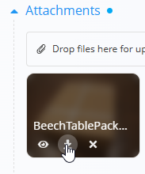

# Attachments

The **Attachments** section is available at the top of most documents and records throughout the system.

Use this section to upload and store files related to the document, such as:

- Delivery notes
- Transport documents
- Contracts
- Photos
- Certificates
- Scanned records
- Other supporting files

Attached files remain linked to the document and can be reviewed or downloaded at any time.

The number of dots displayed next to the **Attachments** heading indicates how many files are currently attached to the document.

### Upload attachments

Files can be uploaded in two ways:

- Drag and drop files into the upload area
- Click the upload area to open the file selection dialog

After uploading, attachments appear in the list below the upload area.

### Attachment actions

Hover over an uploaded file to display the available actions.

Depending on the file type, the following actions may be available:

- **Preview** - opens a preview of the file. This action is available for image files.
- **Download** - downloads the file to your device.
- **Delete** - after confirmation, removes the file from the document.