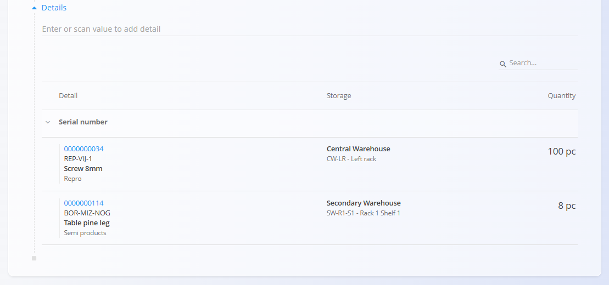
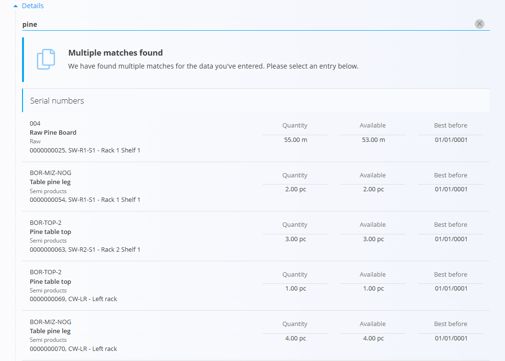
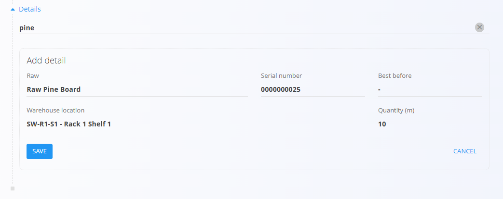
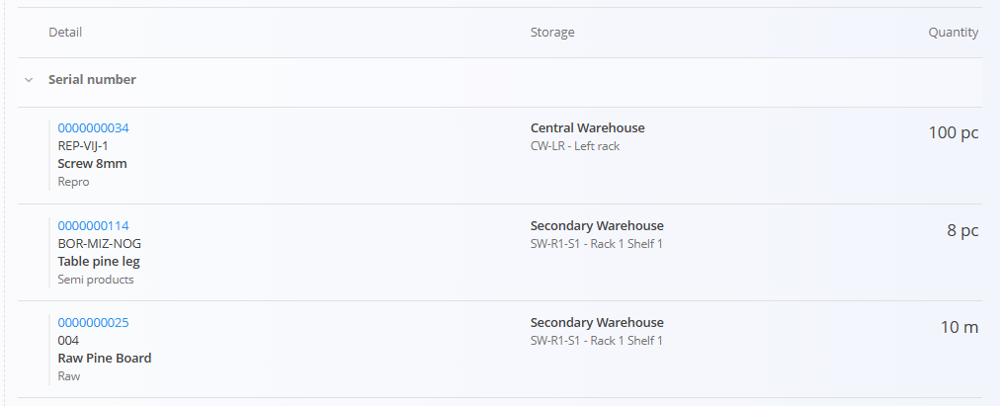

# Document details

The **Document details** section contains the individual lines that make up a document.

Depending on the document type, details may represent:

* Goods
* Services

Most logistics, production, maintenance, and sales documents use the Document details section to record materials and quantities.

## Add a detail

New details can be added by typing or scanning a value into the input field above the details list.

Supported search values typically include:

* Material code
* Material name
* Barcode (EAN)
* Serial number

The available search options depend on the document type and system configuration.

### Select a matching result

If multiple matching records are found, the system displays a list of available results.

Select the correct record from the list.

### Confirm the detail

After selecting a result, the system automatically fills in any available information, such as:

* Material
* Serial number
* Warehouse location
* Best-before date
* Quantity

The displayed fields depend on the selected material and document type. You can edit the quantity if needed.

Click **Save** to add the detail to the document or click **Cancel** to discard it.

### Added details

Once saved, the detail appears in the details list.

## Detail information

Depending on the document type, details may include information such as:

* Material
* Quantity
* Unit of measure
* Warehouse location
* Serial number
* Batch number
* Best-before date
* Price
* Amount

Not all documents use the same fields.

## Edit a detail

Existing details can usually be edited by selecting the detail line.

The available fields depend on the document type and the current document status.

## Delete a detail

Detail lines can usually be removed while the document is in **Draft** status.

To delete a detail, select the line and click the **Delete** button.

Availability depends on the document type and configuration.

## Additional behavior

Depending on the document type, the system may automatically:

* Validate stock availability
* Validate serial numbers
* Calculate prices
* Calculate taxes
* Suggest warehouse locations
* Restrict duplicate entries

Document-specific rules are described in the corresponding document documentation.
