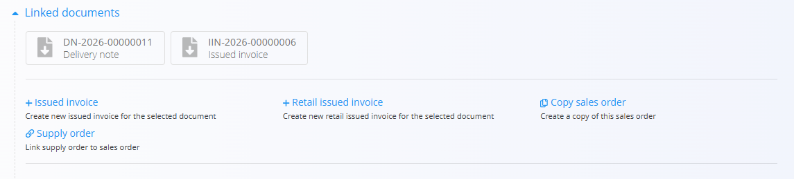

# Linked documents

The **Linked documents** section displays documents related to the current document and allows creating new documents as part of the same business process.

Linked documents provide traceability between operational, logistics, maintenance, production, and financial documents throughout the system.

## Purpose of linked documents

Linked documents help users:

* Follow the progress of a business process
* Navigate between related documents
* Create downstream documents directly from existing documents
* Maintain traceability across the entire document lifecycle

For example:

* **Offer → Sales order → Delivery note → Issued invoice**
* **Supply order → Receive → Received invoice**
* **Maintenance schedule → Maintenance order**
* **Production order → Receive → Issue**

The available linked documents depend on the current document type and status.

## Create and link documents

The Linked documents section can be used to either create new related documents or link existing documents.

### Create a new document

Many document types provide actions for creating downstream documents directly from the current document.

When a new document is created:

- The document is automatically linked to the source document
- Relevant data is copied from the source document
- Traceability between documents is preserved

Examples:

- Sales order → Issued invoice
- Sales order → Delivery note
- Supply order → Receive

### Link an existing document

Some document types also allow linking documents that already exist in the system.

When linking an existing document:

- No new document is created
- The relationship between the documents is recorded
- Both documents become visible in each other's Linked documents section

This can be useful when related documents were created independently but should still be connected for traceability purposes.

## Document traceability

The Linked documents section provides visibility into the complete lifecycle of a process.

Users can navigate both to source documents and to documents that were generated from the current document.

This creates a complete audit trail and allows tracking the history of transactions, materials, maintenance activities, production processes, and financial documents across the system.

## Related information

For examples of linked documents available for a specific document type, refer to the documentation of that document.
