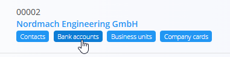

<!-- app_route: /management/contacts/companies -->
<!-- app_label: Business directory -->
<!-- app_navigation_hint: Open **Business directory**, then open **Bank accounts** for the relevant entry. -->
<!-- canonical_source_url: https://github.com/Tom-PIT/Connected.Docs/blob/main/en/Common/Management/BankAccounts.md -->
<!-- canonical_source_title: Bank accounts -->

# Bank accounts

**Bank accounts** belong to a specific **customer** or **vendor** and are managed inside the [**Business directory**](BusinessDirectory.md). They define the financial account information used later in documents such as issued invoices or payments. 

Each account is linked to a **Bank**, selected from the predefined [**Banks**](Banks.md) code list.

To open Bank accounts, click the tag under each Business directory entry. This will display the list of bank accounts associated with that company or individual.

## Schema

| Field | Description |
|-------|-------------|
| [**Bank**](Banks.md) | The financial institution providing the account. Selected from the **Banks** code list (mandatory). |
| **IBAN** | Full international bank account number (mandatory). |
| **Active** | Indicates whether the account can be used on documents. |
| **Use mask** | Formats the IBAN visually (spaces and grouping) without changing its value. |

## List view

The Bank accounts list displays all accounts linked to the selected Business directory entry.

Use the filters on the left (Enabled / Disabled) to show only active or inactive accounts.

## Actions

### Add a new bank account

To create a new bank account, follow these steps:

1. Click on the [action button](../UI/ActionButton.md) to open the form to add a new bank account.

   

2. Fill in all required fields. Optional fields can be completed if relevant. For more details on the fields, see the [**Schema**](#schema) section above.

3. Click **Add** to save the new account, or **Cancel** to return to the list view.

### Edit an existing bank account

To edit an existing bank account, follow these steps:

1. Open the Business directory entry.  
2. Click the **Bank accounts** tag.  
3. Select an account from the list.  
4. Update the IBAN, activity status, or mask option.  
5. Click **Save**.

### Delete a bank account

To delete a bank account, follow these steps:

1. Open the Business directory entry.  
2. Click the **Bank accounts** tag.  
3. Select an account by clicking its number on the list. 
4. Click the **Delete** button. A confirmation dialog will appear, if confirmed the account will be deleted.

A bank account can be deleted in the Edit page, but only if it is not referenced in other documents (e.g., issued invoices or payments).

