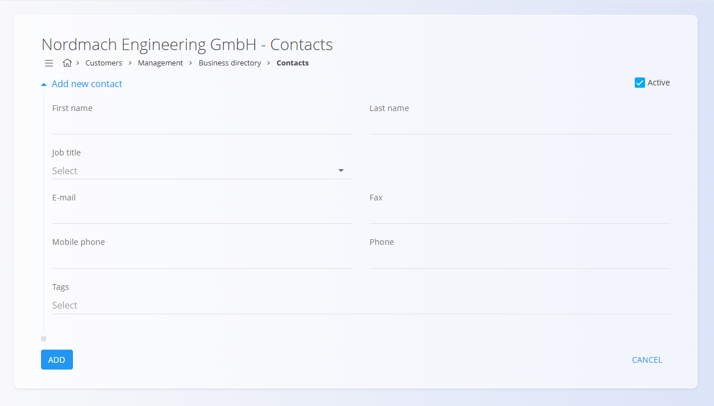

<!-- app_route: /management/contacts/companies -->
<!-- app_label: Business directory -->
<!-- app_navigation_hint: Open **Business directory**, then open **Contacts** for the relevant entry. -->
<!-- canonical_source_url: https://tom-pit.github.io/Connected.Docs/en/Common/Management/Contacts/ -->
<!-- canonical_source_title: Contacts -->

# Contacts

Contacts belong to a specific **customer** or **vendor** and are managed inside the [**Business directory**](BusinessDirectory.md). They store the people associated with the company — such as account managers, procurement contacts, technicians, or billing representatives.

Each contact includes a **Job title**, selected from the predefined [**Job titles**](JobTitles.md) code list.

**Contacts** appear as a tag under each **Business directory** entry. Click the tag to open the list of contacts associated with that company or individual.

 

## Schema

| Field | Description |
|-------|-------------|
| **First name** | Contact’s given name (mandatory). |
| **Last name** | Contact’s family name (mandatory). |
| **Job title** | Role or position, selected from the [**Job titles**](JobTitles.md) code list. |
| **E-mail** | Primary email address. |
| **Phone** | Landline or office number. |
| **Mobile phone** | Mobile or direct number. |
| **Fax** | Optional fax number. |
| **Tags** | Classification tags used to group or filter contacts. |
| **Active** | Indicates whether the contact can be selected in documents. |

## List view

The Contacts list displays all contacts linked to the selected Business directory entry.

Use the filters on the left (**Enabled / Disabled**) to show only active or inactive contacts.

## Actions

### Add a new contact

To create a new contact, follow these steps:

1. Click on the [action button](../UI/ActionButton.md) in the bottom-right corner.

2. Fill in all required fields. Optional fields can be completed if relevant. For more details on the fields, see the [**Schema**](#schema) section above. 
3. Click **Add** to create the new contact or **Cancel** to return to the list view.

### Edit an existing contact

To edit an existing contact, follow these steps:

1. Open the **Business directory** entry.  
2. Click the **Contacts** tag.  
3. Select a contact from the list.  
4. Update any field (name, email, phone, job title, tags, etc.).  
5. Click **Save** to apply the changes or **Cancel** to discard them.

### Delete an existing contact

To delete a contact, follow these steps:

1. Open the **Business directory** entry.
2. Click the **Contacts** tag.
3. Select a contact from the list by clicking its name on the list.
4. Click the **Delete** button. A confirmation dialog will appear, if confirmed the contact will be deleted.

A contact can only be deleted if it is not referenced in other documents.

