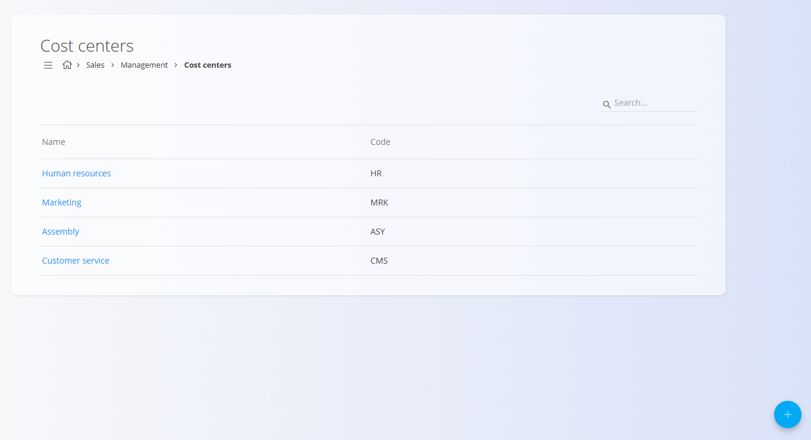

<!-- app_route: /management/common-types/cost-centers -->
<!-- app_label: Cost centers -->
<!-- canonical_source_url: https://github.com/Tom-PIT/Connected.Docs/blob/main/en/Common/Management/CostCenters.md -->
<!-- canonical_source_title: Cost centers -->

# Cost centers

The **Cost centers** code list identifies departments or functions that create expenses but not revenue, such as HR or support teams. Even though these units don’t generate profit, they play a vital role in keeping the company running. By defining cost centers and assigning costs to them, the system provides transparency into how expenses are distributed across the company.

This page is available in the **Sales** and **Supply** domains, to access it go to **Management / Cost centers** in the [navigation](../../Common/UI/Navigation.md).

## Schema

| Field | Description |
|-------|-------------|
| **Code** | Short internal identifier for the cost center (mandatory). For example, **HR** for Human Resources. |
| **Name** | Full descriptive name of the cost center (mandatory). |

## Management

### List view

The list view displays all registered cost centers along with their **name** and **code**.

You can use the **Search** bar to filter cost centers by name or code.

## Actions

### Add a new cost center

To create a new cost center, follow these steps:

1. Click on the [action button](../UI/ActionButton.md) to open the creation form and add a new cost center.
2. Fill in all required fields. Optional fields can be completed if relevant. For more details on the fields, see the [**Schema**](#schema) section above.
3. Click **Add** to create the new cost center or **Cancel** to return to the list view.

### Edit a cost center

To edit an existing cost center, follow these steps:

1. Open the **Cost centers** list.
2. Click any entry in the list to open its edit screen, where you can adjust the **code** or **name**.
3. Click **Save** to apply the changes or **Cancel** to discard them.

### Delete a cost center	

To delete a cost center, follow these steps:

1. Open the **Cost centers** list.
2. Click any entry in the list to open its edit screen.
3. Click **Delete** on the edit screen to open a confirmation dialog.If confirmed, the record is permanently removed; otherwise, the system keeps it unchanged.

> [!NOTE]  
> A cost center can be deleted only if it is not referenced by documents or other system entities.

