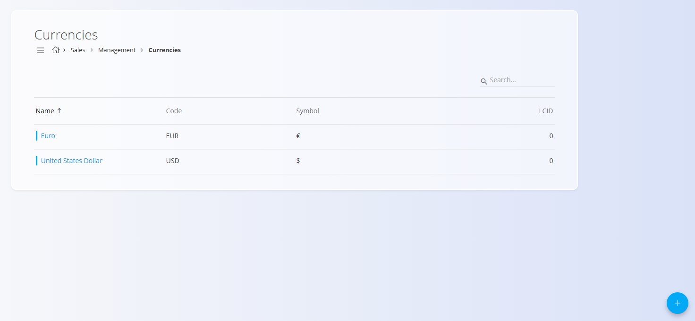

<!-- app_route: /management/common-types/currencies -->
<!-- app_label: Currencies -->
<!-- canonical_source_url: https://github.com/Tom-PIT/Connected.Docs/blob/main/en/Common/Management/Currencies.md -->
<!-- canonical_source_title: Currencies -->

# Currencies

The **Currencies** code list defines all monetary units that can be used across the system. Each currency includes its international code, symbol, and formatting rules, ensuring that prices, totals, and financial documents are displayed consistently and correctly. This list serves as the foundation for representing amounts in sales, purchasing, and reporting processes.

This page is available in the **Sales** and **Supply** domains, to access it go to **Management / Currencies** in the [navigation](../../Common/UI/Navigation.md).

> [!NOTE]  
> **Prerequisites**  
> A currency must be configured before it can be used in price lists, documents, or financial calculations.

## Schema

| Field | Description |
|-------|-------------|
| **Name** | Full name of the currency, e.g., *Euro*, *United States Dollar* (mandatory). |
| **Code** | International three-letter currency code, e.g., *EUR*, *USD* (mandatory). |
| **Symbol** | Currency symbol used in totals and price displays, e.g., *€*, *$* (mandatory). |
| **Symbol position** | Whether the symbol appears **before** or **after** the amount (mandatory). |
| **LCID** | Locale identifier used to standardize number and currency formatting. |
| **Active** | Indicates whether the currency is currently available for use in the system. |

## Management

### List view

The list displays all configured currencies along with their code, symbol, LCID.

Each record includes a status indicator to the left of its name:
- **Blue** indicates the currency is active
- **Gray** indicates the currency is inactive

You can use the **Search** bar to quickly filter payment methods by their code or name.

## Actions

### Add a new currency

To create a new currency entry, follow these steps:

1. Click on the [action button](../UI/ActionButton.md) to open the form for adding a new currency.
2. Fill in all required fields. Optional fields can be completed if relevant. 
3. Click **Add** to save the new currency or **Cancel** to return to the list view.

> [!NOTE]
> For more details on the fields, see the [**Schema**](#schema) section above. 

## Edit an existing currency

To edit an existing currency, follow these steps:

1. Click a currency in the list to open its edit screen.
2. Make the necessary changes.
3. Click **Save** to confirm changes or **Cancel** to discard them.

## Delete an existing currency

To delete a currency, follow these steps:

1. Click the currency's **Name** in the list. The interface switches to edit mode, displaying the existing values for modification.
2. Click **Delete** in the edit screen to open a confirmation dialog. If confirmed, the entry is permanently removed; otherwise, the system keeps the record unchanged.

> [!NOTE]  
> A currency can be deleted only if it is **not referenced** by price lists, documents, or other financial records.

