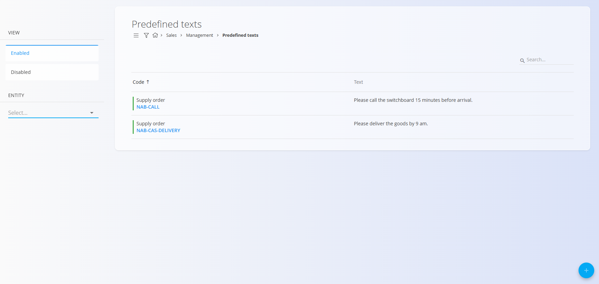
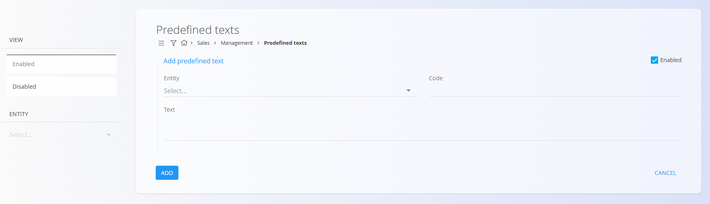
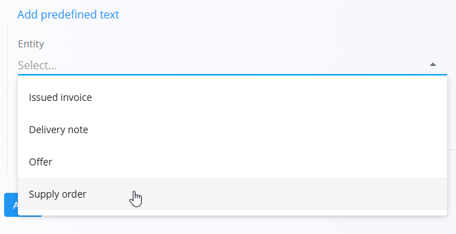

<!-- app_route: /management/common-types/predefined-texts -->
<!-- app_label: Predefined texts -->
<!-- canonical_source_url: https://tom-pit.github.io/Connected.Docs/en/Common/Management/PredefinedTexts/ -->
<!-- canonical_source_title: Predefined texts -->

# Predefined texts

The **Predefined texts** code list stores ready-to-use text snippets that can be inserted into various commercial documents—such as delivery notes, issued invoices, offers, or supply orders. These texts help users add frequently repeated instructions, remarks, or customer-specific notes quickly and consistently.

This page is available in the **Sales** and **Supply** domains, to access it go to **Management / Predefined texts** in the [navigation](../../Common/UI/Navigation.md).

## Schema

| Field | Description |
|-------|-------------|
| **Entity** | Document type to which the predefined text applies (mandatory):  • [**Delivery note**](../../Domains/Sales/Documents/DeliveryNotes.md)  • [**Issued invoice**](../../Domains/Sales/Documents/IssuedInvoices.md)  • [**Offer**](../../Domains/Sales/Documents/Offers.md)  • [**Supply order**](../../Domains/Supply/Documents/SupplyOrders.md) |
| **Code** | Short identifier used to reference the predefined text (mandatory). |
| **Text** | Full text content that will be inserted into the selected document type (mandatory). |
| **Enabled** | Indicates whether the predefined text is active and available for use. |

## Management

### List view

The list displays all predefined texts together with the **entity**, **code**, and **text**. You can filter the list by **Enabled/Disabled** status or by **Entity**.

Each record includes a status indicator to the left of its name:
- **Blue** indicates the predefined text is active
- **Gray** indicates the predefined text is inactive

A **Search** bar is available to quickly find records by code or text content.

## Actions

### Add new predefined text

To create a new predefined text, follow these steps:

1. Click the [action button](../UI/ActionButton.md) to open the form to create a new predefined text.
2. Fill in all required fields. Optional fields can be completed if relevant. For more details on the fields, see the [**Schema**](#schema) section above.
3. Click **Add** to save the new predefined text or **Cancel** to return to the list view.

Entity options:

### Edit an existing predefined text

To edit an existing predefined text, follow these steps:

1. Click any record in the list to open its edit screen.
2. Modify the entity, code, or text.
3. Click **Save** to apply the changes, or **Cancel** to discard them.

### Delete a predefined text

To delete a predefined text, follow these steps:

1. Click any record in the list to open its edit screen.
2. Click **Delete**, and confirm the action in the pop-up dialog. If confirmed, the record is permanently removed; otherwise, the system keeps it unchanged.

> [!NOTE]  
> A predefined text can be deleted only if it is not referenced by dependent documents.

