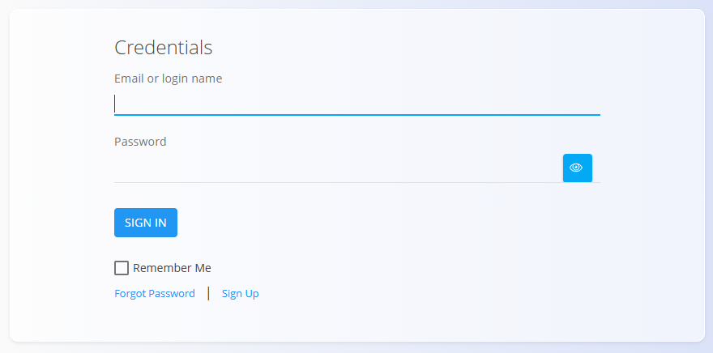
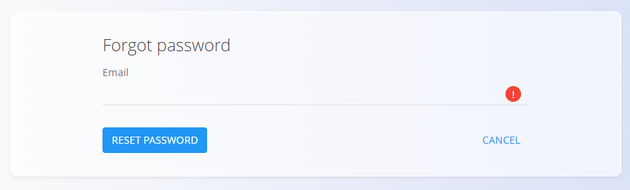
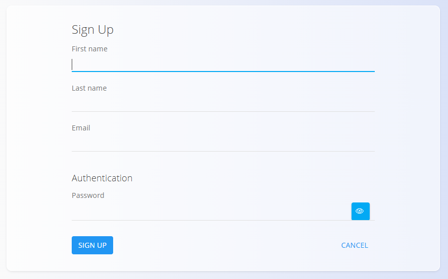

<!-- app_route: /login -->
<!-- app_label: Login -->
<!-- canonical_source_url: https://github.com/Tom-PIT/Connected.Docs/blob/main/en/Common/UI/Login.md -->
<!-- canonical_source_title: Login -->

# Login

The **Login** screen is used to access the application using your user credentials.

## Credentials

To sign in, enter:

- **Email or login name**
- **Password**

Click **Sign in** to access the application.

### Additional options

- **Remember me** – Keeps the user signed in on the current device
- **Forgot password** – Opens the password reset screen
- **Sign up** – Opens the registration screen (if permitted)

## Password reset

If you forgot your password, click **Forgot password**.

Enter your **email address** and click **Reset password**. You will receive instructions to set a new password.

## Registration

If registration is enabled, users can create a new account.

To register, enter:

- **First name**
- **Last name**
- **Email**
- **Password**

Click **Sign up** to create your account.

> [!NOTE]
> The availability of registration depends on the system configuration.