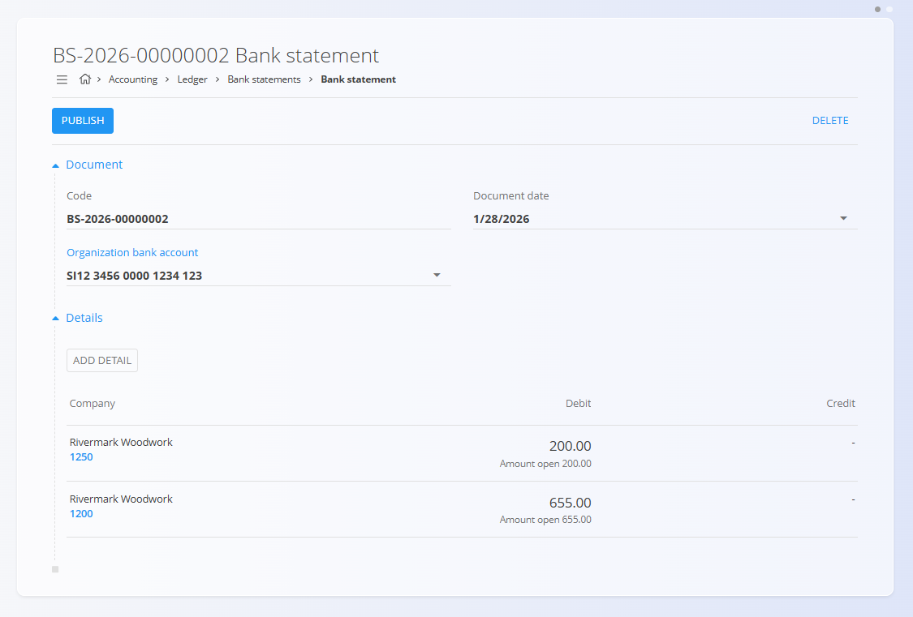
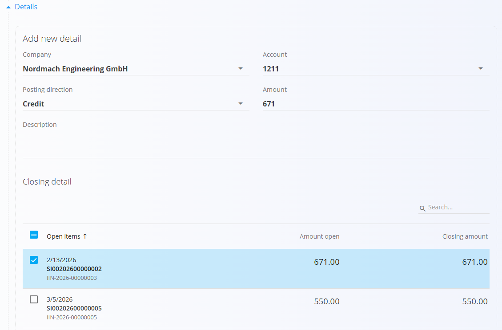

<!-- app_route: /accounting/ledger/bank-statements -->
<!-- app_label: Bank Statements -->
<!-- canonical_source_url: https://tom-pit.github.io/Connected.Docs/en/Domains/Accounting/Documents/BankStatements/ -->
<!-- canonical_source_title: Bank Statements -->

# Bank statements

Bank statements are used to record movements on an organization’s bank accounts. Each bank statement represents a set of incoming and outgoing bank transactions for a specific date and bank account.

To access this screen, go to **Accounting / Ledger / Bank statements** in the [navigation](../../../Common/UI/Navigation.md).

> [!NOTE]
> When a bank statement is published, the system automatically creates a corresponding journal entry. This journal entry can be viewed under **Connected documents** on the bank statement.

## Schema

<strong>Document</strong>

| Field                         | Description                                        |
| ----------------------------- | -------------------------------------------------- |
| [**Code**](../../../Common/UI/DocumentCodes.md)                      | System-generated identifier of the bank statement. |
| **Document date**             | Date of the bank statement.                        |
| [**Organization bank account**](../../Sales/Management/OrganizationBankAccounts.md) | Bank account to which the statement applies.       |

<strong>Details</strong>

| Field                 | Description                                          |
| --------------------- | ---------------------------------------------------- |
| [**Company**](../../../Common/Management/BusinessDirectory.md)           | Business entity related to the bank movement.           |
| [**Account**](../Management/Ledger/ChartOfAccounts.md)           | Ledger account used for the posting.                 |
| **Posting direction** | Indicates whether the movement is a Debit or Credit. |
| **Amount**            | Monetary value of the bank movement.                 |
| **Description**       | Description of the bank transaction.                 |

## Management

### List view

The list view displays all bank statements.

Available filters:

* **View**

  * Draft
  * Committed

Committed bank statements are visually marked to indicate that they have been posted to the ledger.

### Document states

Bank statements can be in one of the following states:

* **Draft** – The statement is editable and bank movements can be added or modified.
* **Committed** – The statement is published and its related journal entry has been created.

## Actions

Click the [action button](../../../Common/UI/ActionButton.md) to access available actions:
* **New** – Create a new bank statement.
* **Import** – Import bank statements from external files in XML format.

### Create a bank statement

1. Click the [action button](../../../Common/UI/ActionButton.md) to create a new bank statement.
2. Select the [**Organization bank account**](../../Sales/Management/OrganizationBankAccounts.md).
3. Set the **Document date**.

   

### Add a bank movement

1. In the **Details** section, click **Add detail**.
2. Select the [**Company**](../../../Common/Management/BusinessDirectory.md) related to the transaction.
3. Review the list of **Open items** displayed in the **Closing item** section.
4. Select one or more transactions to settle.
5. Verify the **Closing amount** for the selected transactions.
6. Click **Add** to insert the movement.

> [!TIP]
> Selecting a company displays its open transactions, allowing the bank movement to be matched against existing receivables or payables.

### Manual posting

If the movement is not related to an existing open transaction:

1. Select the appropriate [**Account**](../Management/Ledger/ChartOfAccounts.md).
2. Choose the **Posting direction** (**Debit** or **Credit**).
3. Enter the **Amount** and optional **Description**.
4. Click **Add**.

### Publish a bank statement

After all bank movements have been entered:

* Click **Publish** to commit the bank statement.
* A journal entry is generated automatically.
* The bank statement moves from Draft to Committed status.

> [!NOTE]
> Bank statements record movements on the bank account only. When publishing a bank statement, the system **automatically generates a balanced journal entry** by adding the required counter-posting (Debit or Credit) so that the entry complies with double-entry accounting rules.

## Connected documents

Each committed bank statement has a linked journal entry.

The linked journal entry:

* Contains the debit and credit postings derived from the bank movements.
* Can be accessed from the **Connected documents** section of the bank statement.

This linkage ensures traceability between bank activity and ledger postings.

## Delete a bank statement

Draft bank statements can be deleted from the edit screen by clicking the **Delete** button.

A confirmation dialog will appear:
**Are you sure you want to delete this record?**
If confirmed, the bank statement is permanently removed; otherwise, the system keeps it unchanged.