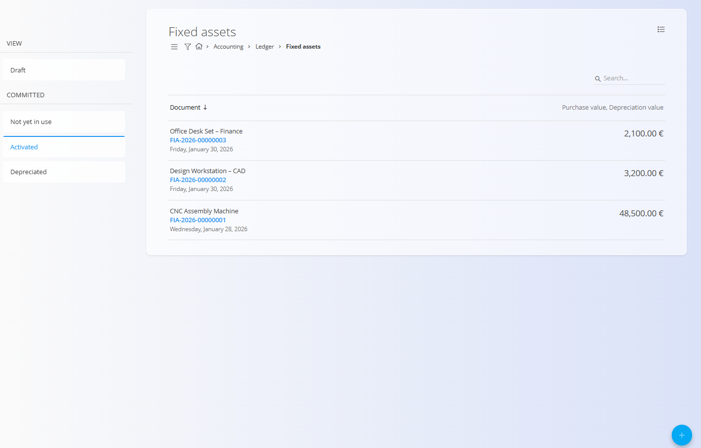
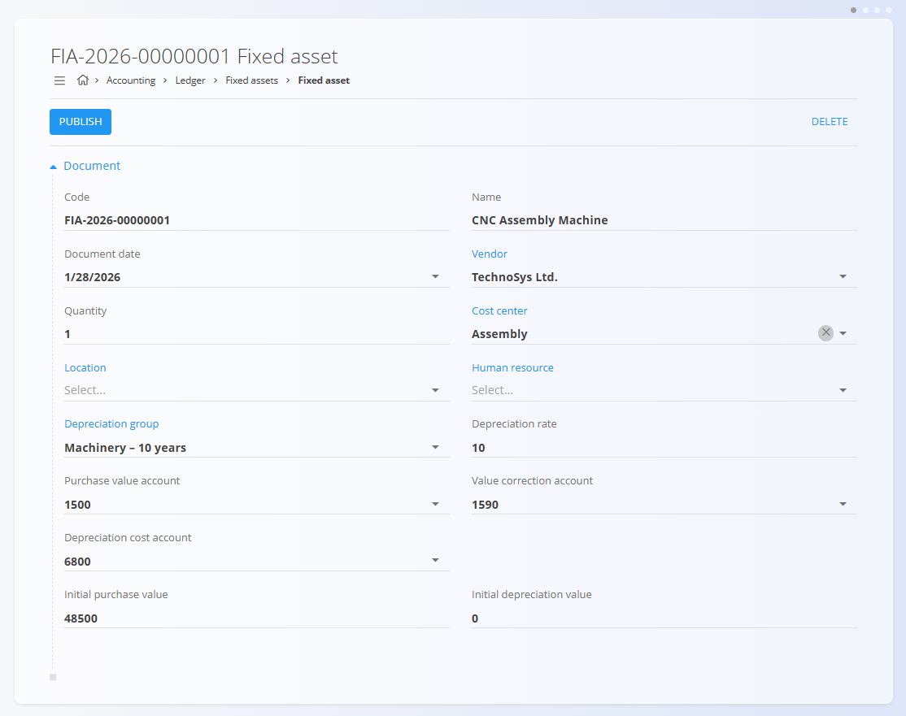
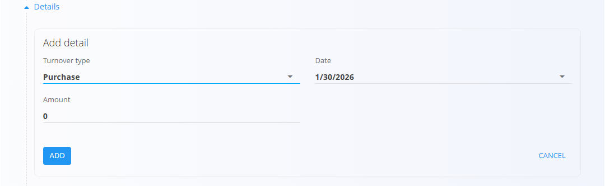
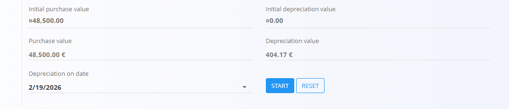

<!-- app_route: /accounting/ledger/fixed-assets -->
<!-- app_label: Fixed assets -->
<!-- canonical_source_url: https://tom-pit.github.io/Connected.Docs/en/Domains/Accounting/Documents/FixedAssets/ -->
<!-- canonical_source_title: Fixed assets -->

# Fixed assets
Fixed assets are used to track long-term assets owned by the organization, such as machinery, equipment, furniture, and IT hardware. Each fixed asset represents a single asset or a group of identical assets that are capitalized and depreciated over time.

To access this screen, go to **Accounting / Ledger / Fixed assets** in the [navigation](../../../Common/UI/Navigation.md).

> [!NOTE]
> Fixed assets are closely linked to [**depreciation groups**](../Management/Ledger/DepreciationGroups.md) and [**ledger accounts**](../Management/Ledger/ChartOfAccounts.md). Posting behavior and depreciation calculations depend on the configuration of depreciation groups and ledger settings.

## Schema

<strong>Document</strong>

| Field | Description |
|------|-------------|
| [**Code**](../../../Common/UI/DocumentCodes.md) | System-generated identifier of the fixed asset. |
| **Name** | Name of the asset (for example, CNC Assembly Machine). |
| **Document date** | Date when the asset record was created. |
| **Vendor** | Supplier from whom the asset was purchased. |
| **Quantity** | Number of identical assets represented by the record. |
| [**Cost center**](../../../Common/Management/CostCenters.md) | Cost center responsible for the asset. |
| [**Location**](../Management/Ledger/LedgerLocations.md) | Physical or organizational location of the asset. |
| [**Human resource**](../../Production/Management/HumanResources.md) | Person responsible for the asset, if applicable. |
| [**Depreciation group**](../Management/Ledger/DepreciationGroups.md) | Depreciation rules applied to the asset. |
| **Depreciation rate** | Annual depreciation rate, derived from the depreciation group. |
| **Purchase value account** | Ledger account used to record the asset’s purchase value. |
| **Value correction account** | Ledger account used for accumulated depreciation. |
| **Depreciation cost account** | Ledger account used for depreciation expenses. |
| **Initial purchase value** | Starting value of the asset at capitalization. |
| **Initial depreciation value** | Starting accumulated depreciation value, if any. |

<strong>Details</strong>

| Field | Description |
|------|-------------|
| **Turnover type** | Type of asset-related transaction:: **Purchase** or **Activation**). |
| **Date** | Date of the transaction. |
| **Amount** | Monetary value associated with the transaction. |

## Management
### Document states
Fixed assets move through the following states:

* **Draft** – The asset is being defined and can be freely edited.
* **Not yet in use** – The asset has been published but is not yet active.
* **Activated** – The asset is in use and eligible for depreciation.
* **Depreciated** – The asset has reached the end of its depreciation lifecycle.

### List view
The list view displays all fixed assets.

Available filters:

* **View**
  * Draft
  * Not yet in use
  * Activated
  * Depreciated

The current state of each asset reflects its lifecycle stage.

## Actions

### Create a fixed asset
1. Click the [action button](../../../Common/UI/ActionButton.md) to create a new fixed asset.
2. Fill in the required **Document** fields.
3. Assign a **Depreciation group** and verify the related accounts.
4. Click **Publish**.

After publishing, the asset moves from **Draft** to **Not yet in use**.

### Add asset details
In the **Details** section, asset-related events can be recorded.

#### Purchase
Use **Purchase** to record the acquisition of the asset:

* Set **Turnover type** to Purchase
* Enter the **Date**
* Enter the **Amount**

This allows recording purchase information separately from activation.

#### Activation
To make the asset active:

* Add a new detail
* Select **Activation** as the turnover type
* Set the activation **Date**
* Click **Add**

Once activated, the asset moves to the **Activated** state.

> [!NOTE]
> Depreciation calculations are only applicable after an asset has been activated.

### Depreciation on date
The **Depreciation on date** section allows selecting a date and starting or stopping depreciation calculations.

* **Start** begins depreciation tracking from the selected date.
* **Reset** stops depreciation tracking.

> [!NOTE]
> When a future date is selected, the system may display a calculated depreciation value. This value represents a projected depreciation amount based on the configured depreciation group and rate.
