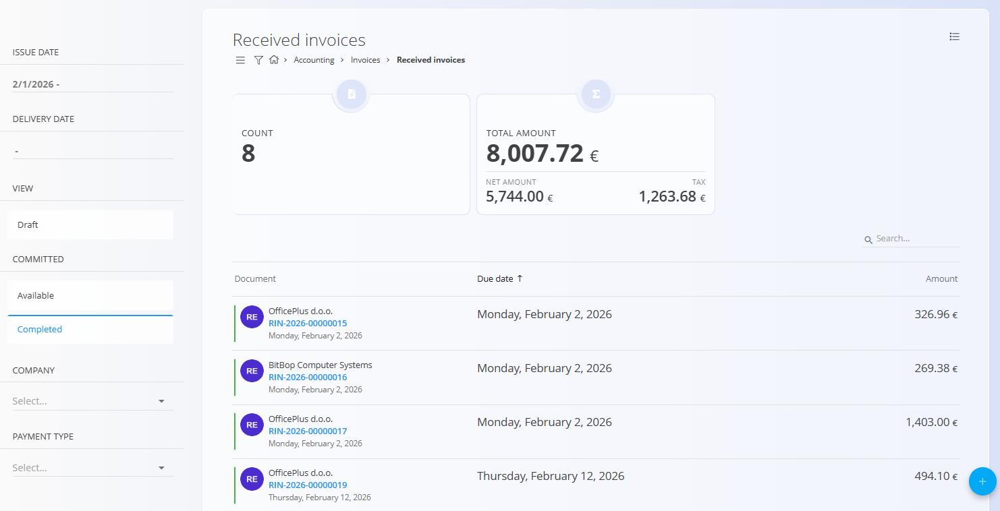
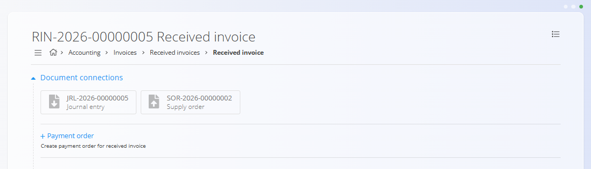

<!-- app_route: /accounting/documents/received-invoices -->
<!-- app_label: Received invoices -->
<!-- canonical_source_url: https://github.com/Tom-PIT/Connected.Docs/blob/main/en/Domains/Accounting/Documents/ReceivedInvoices.md -->
<!-- canonical_source_title: Received invoices -->

# Received invoices

**Received invoices** are financial documents representing invoices received from vendors for purchased goods or services. They are used to record supplier invoices, generate accounting postings, and initiate outgoing payments.

To access this screen, go to **Accounting / Invoices / Received invoices** in the [navigation](../../../Common/UI/Navigation.md).

> [!NOTE]
> Received invoices are typically linked to one or more **Supply orders**. Linking supply orders allows the system to prefill details and propose accounting postings based on received goods.
>
> To post detail lines on a received invoice, an [**Expense**](../../Supply/Management/Expenses.md) must be selected for each line. This determines the ledger account, tax rate, and posting logic used when the document is confirmed.

### Received invoice lifecycle

When we receive an invoice from a vendor, it follows this flow:

1. A new received invoice document is created as a **Draft**.
2. One or more [**Supply orders**](../../Supply/Documents/SupplyOrders.md) are linked using **Document connections**.
3. Invoice header information and total amount are entered.
4. Suggested postings are reviewed and created.
5. The invoice is **Published**, which posts it to the ledger.
6. The document moves to **Committed** status.
7. A **Journal entry** is created in the background (see [**Double-entry accountancy**](DoubleEntryAccountancy.md)).
8. A [**Payment order**](../../Accounting/Documents/PaymentOrders.md) can be created from the received invoice.

## Schema

<strong>Document</strong>

| Field             | Description                                                 |
| ----------------- | ----------------------------------------------------------- |
| **Internal code** | System-generated identifier of the received invoice.        |
| **External code** | Vendor’s invoice reference number (mandatory).                          |
| **Vendor**        | Supplier issuing the invoice (mandatory). Taken from [**Business directory**](../../../Common/Management/BusinessDirectory.md). |
| [**Bank account**](../../../Common/Management/BankAccounts.md) | Vendor’s bank account used for payment (mandatory). |
| **Issue date**    | Date shown on the vendor invoice.                           |
| **Delivery date** | Date when goods or services were delivered.                 |
| **Received date** | Date the invoice was received.                              |
| **Due date**      | Payment due date (mandatory).                               |
| **Amount**        | Total net amount of the invoice.                            |
| [**Currency**](../../../Common/Management/Currencies.md)      | Currency of the invoice.                                    |
| **Reference**     | Payment reference provided by the vendor (mandatory).                   |
| **Payment type**  | Payment mechanism used for settlement (e.g. Payment order). |
| [**Cost center**](../../../Common/Management/CostCenters.md)   | Optional cost center assignment.                            |
| [**Account**](../Management/Ledger/ChartOfAccounts.md)       | Ledger account used for posting (mandatory).                            |
| [**Template**](../Management/Ledger/JournalEntryTemplates.md)      | Posting template applied to the invoice.                    |

<strong>Details</strong>

| Field           | Description                                         |
| --------------- | --------------------------------------------------- |
| [**Expense**](../../Supply/Management/Expenses.md)     | Expense or inventory category applied to the line.  |
| [**Account**](../Management/Ledger/ChartOfAccounts.md)     | Ledger account used for the line.                   |
| [**Tax rate**](../../../Common/Management/TaxRates.md)    | Applied tax rate.                                   |
| **Amount**      | Net amount of the line.                             |
| **Amount tax**  | Calculated tax amount.                              |
| **Prepayment**  | Indicates whether the line represents a prepayment. |
| **Self taxing** | Indicates self-taxing logic for the line.           |
| **Deduct tax**  | Indicates whether tax is deductible.                |

## Management

### List view

The list view shows all received invoices and summary indicators. There are columns for **document code**, **due date**, and **amount**, which can be sorted by clicking the column header. The search field allows filtering by vendor name or date.

Available filters:

* **Issue date**
* **Delivery date**
* **View**
  * Draft
  * Available
  * Completed
* **Company**
* **Payment type**

The list also displays aggregated indicators such as document count and total amount for the current filter.

### Document states

Received invoices move through the following states:

* **Draft** – The document is editable and not yet posted.
* **Available** – The document is published but contains amount mismatches.
* **Completed** – The document is published and all amounts match.

The document state determines available actions and follow-up documents.

#### Amount mismatches

Mismatches typically mean the header amount does not equal the sum of detail lines (net and/or tax). This can happen when tax was intended to be included but isn’t (or vice versa), or header/lines were entered too high/low.
  
To resolve: 
- Use the menu to **Revert** the document to Draft and adjust the header amount or detail lines accordingly (preferred). 
- In an Available document, only the **Details** section can be edited to fix the mismatch.

## Actions

### Create a received invoice

To create a received invoice, use the creation workflow explained in **[How to create received invoice](ReceivedInvoicesCreate.md)**.

### Return to draft

If changes are required after publishing:

1. Open the document.
2. Open the menu in the top-left corner.
3. Select **Revert** to move the document back to Draft.

This allows editing of posting dates or accounts before re-publishing.

### Create a payment order

For committed invoices, the **Document connections** section provides an option to create a payment order based on the received invoice.

For details about document relationships, traceability, and creating related documents, see [**Linked documents**](../../../Common/Concepts/LinkedDocuments.md).

## Delete a received invoice

Draft documents can be deleted on the edit screen, but only if they contain **no details**.

If the draft still includes items in the **Details** section:

1. Click the expense blue field in the **Details** section to open the **Edit detail** screen.  
2. Click **Delete** inside the Edit detail window to remove the detail.  
3. Repeat this for all remaining details.

Once the document contains no details, you can click **Delete** to remove the draft.

For information about working with document details, see [**Document details**](../../../Common/Concepts/DocumentDetails.md).

> [!NOTE]
> - Only **draft** documents can be deleted.  
> - Once a document is published, you can no longer delete it; instead, use **Revert** in the menu.  
> - If any payments have been recorded, the document cannot be deleted until those payments are removed and the document is returned to draft.

## Menu

This page includes menu actions in two places.

Menu actions are available through the **Menu** button located in the top-right corner of the list or document page.

### List menu

The list menu provides actions for the currently displayed list.

Available actions:

- **Open mass processing**
- **Import e-invoice**

### Document menu

The document menu provides actions for the currently opened document.

Available actions:

- **Revert**

For details about menu actions, see [**Menu actions**](../../../Common/Concepts/MenuActions.md).

