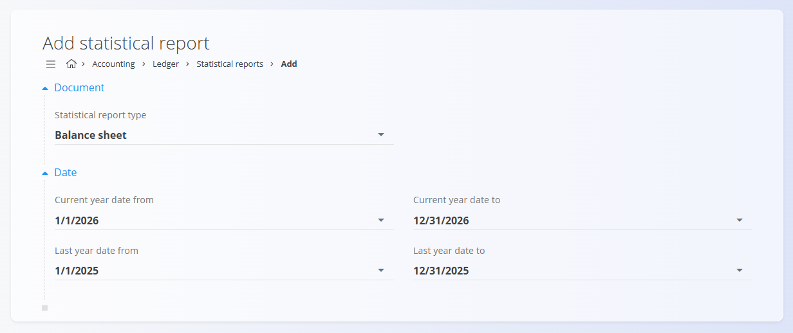

<!-- app_route: /accounting/ledger/statistical-reports -->
<!-- app_label: Statistical reports -->
<!-- canonical_source_url: https://github.com/Tom-PIT/Connected.Docs/blob/main/en/Domains/Accounting/Documents/StatisticalReports.md -->
<!-- canonical_source_title: Statistical reports -->

# Statistical reports

Statistical reports provide an overview of financial data aggregated by **AOP positions**, allowing comparison between the **current period** and a **previous period** (usually the previous year). These reports are typically used for balance sheets, income statements, and other statutory or internal financial reports.

To access this screen, go to **Accounting / Ledger / Statistical reports** in the [navigation](../../../Common/UI/Navigation.md).

> [!NOTE]
> - Statistical reports are **read-only** after generation.
> - Data is derived automatically from posted accounting entries.
> - If underlying accounting data changes, a **new statistical report** must be generated to reflect updated values.

## Schema

| Field | Description |
|------|-------------|
| **Statistical report type** | Select the report type: **Balance sheet** or **Income statement**. |
| **Date** | Select the current year and last year's date ranges to display values. |

## Statistical reports list

The list displays all generated statistical reports.

Each entry shows:
- **Report type** (**Balance sheet** or **Income statement**)
- **Document code**
- **Report date**

Click a report in the list to open its detailed view.

## Add statistical report

To generate a new statistical report, click **Add statistical report**.

Select the type of report to generate (for example, **Balance sheet**) and define the comparison periods:
- **Current year date from / to** – the primary reporting period
- **Last year date from / to** – the comparison period

These date ranges determine which accounting entries are included in the calculation.

Click **Add** to generate the report or **Cancel** to discard changes.

## Statistical report view

Opening a statistical report shows a detailed breakdown by **AOP**.

For each AOP position, the report displays:
- **AOP code**
- **AOP name**
- **Current amount** – calculated from the selected current period
- **Previous amount** – calculated from the comparison period

The values are automatically aggregated based on accounting entries and their assigned AOPs.

> [!NOTE]
> AOP definitions are country-specific. The example shown corresponds to Slovenia.  
> For other countries, similar AOP structures are used, adapted to local reporting regulations.