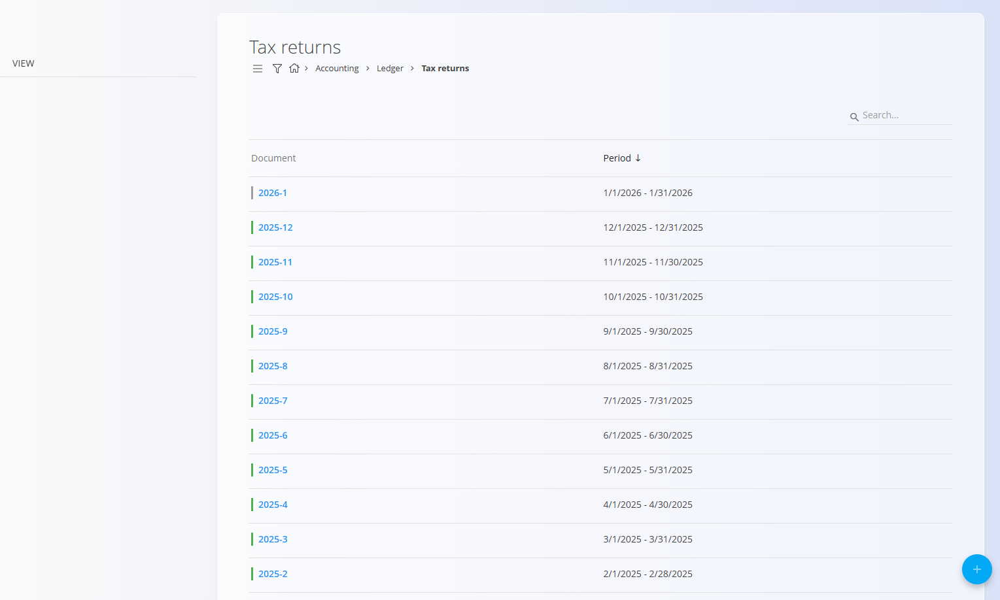
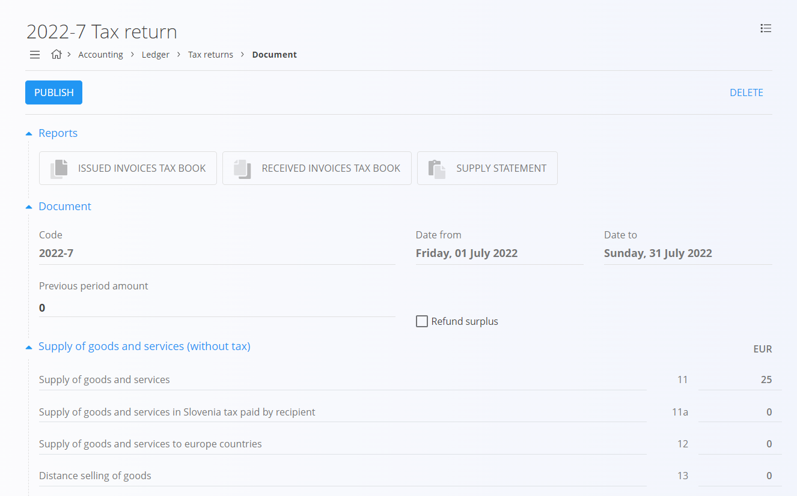

<!-- app_route: /accounting/ledger/tax-returns -->
<!-- app_label: Tax returns -->
<!-- canonical_source_url: https://github.com/Tom-PIT/Connected.Docs/blob/main/en/Domains/Accounting/Documents/TaxReturns.md -->
<!-- canonical_source_title: Tax returns -->

# Tax returns

Tax returns provide an aggregated overview of VAT-related data for a specific period.  
They are used to **review, verify, and export** information required for submitting official tax returns to tax authorities.

To access this screen, go to **Accounting / Ledger / Tax returns** in the [navigation](../../../Common/UI/Navigation.md).

> [!NOTE]  
> - This screen is **informative**. Values are calculated automatically from posted accounting documents (issued invoices, received invoices, credit notes, debit notes). Fields cannot be edited manually.
>
> - **Jurisdiction differences**: Field names, section grouping, VAT rates, and XML schemas may vary by country. Verify local requirements before generating reports or exports.

## Real-life usage

In practice, this screen is used at the end of a tax period (usually monthly) to:

- Review VAT charged on issued invoices
- Review deductible VAT from received invoices
- Verify the final tax obligation or excess tax
- Export reports (PDF or XML) for submission to tax authorities

The amounts shown here represent the **net VAT position** for the selected period:
- VAT charged on sales  
- minus VAT deductible on purchases

## Schema

<strong>Document</strong>

| Field | Description |
|------|-------------|
| **Code** | Identifier of the tax return period (for example, `2025-12`). |
| **Date from** | Start date of the tax period. |
| **Date to** | End date of the tax period. |
| **Previous period amount** | VAT surplus or obligation carried over from the previous period. |
| **Refund surplus** | Indicates whether excess tax should be refunded or carried forward. |

<strong>Supply of goods and services (without tax)</strong>

| Field | Description |
|------|-------------|
| **Supply of goods and services** | Total taxable supplies without VAT. |
| **Supply in Slovenia (tax paid by recipient)** | Domestic reverse-charge transactions. |
| **Supply to Europe countries** | Intra-EU supplies. |
| **Distance selling of goods** | Distance sales to EU customers. |
| **Assembly and installation in EU** | Installation-related EU supplies. |
| **Exempt supplies without right to deduct tax** | VAT-exempt supplies with no deduction right. |

<strong>Tax charged</strong>

| Field | Description |
|------|-------------|
| **Domestic by rate** | VAT charged domestically, grouped by tax rate. |
| **Acquisition of goods from EU by rate** | VAT on intra-EU acquisitions. |
| **Received services from EU by rate** | VAT on EU service purchases. |
| **Self-taxation by rate** | Reverse-charge VAT entries. |
| **Self-taxation of imports** | VAT calculated on imports. |

<strong>Purchase of goods and services</strong>

| Field | Description |
|------|-------------|
| **Purchase of goods and services** | Total purchases excluding VAT. |
| **Purchases in Slovenia (tax paid by recipient)** | Domestic reverse-charge purchases. |
| **Acquisitions from EU** | Intra-EU purchases. |
| **Received services from EU** | Services purchased from EU suppliers. |
| **Tax-exempt purchases** | VAT-exempt received goods and services. |
| **Purchase value of real estate** | Real estate purchases. |
| **Purchase value of other fixed assets** | Capital asset purchases. |

<strong>Tax deduction</strong>

| Field | Description |
|------|-------------|
| **Deductible tax by rate** | VAT deductible on purchases, grouped by rate. |
| **Flat-rate compensation (8%)** | Special flat-rate deduction cases. |

<strong>Final calculation</strong>

| Field | Description |
|------|-------------|
| **Obligation tax** | VAT amount payable to the tax authority. |
| **Excess tax** | VAT surplus that can be refunded or carried forward. |

## List view

The list view displays all created tax returns. Click a row to open the detailed view of a specific tax return.

Published tax returns are marked in green, draft ones in gray.

## Reports and exports

At the top of an open tax return document, quick-access report actions are available.

Available exports include:
- **Issued invoices tax book**
- **Received invoices tax book**
- **Supply statement** (PDF / XML)

These exports are typically used for:
- Internal review
- Archiving
- Submission to tax authorities

## Actions

### Create a tax return

A new tax return is created for a specific period.

1. Open **Accounting / Ledger / Tax returns**
2. Click **+** in the bottom-right corner
3. Review the automatically calculated period and values
4. Click **PUBLISH** to finalize the tax return

> [!NOTE]  
> A new tax return can only be created if the **previous tax return has already been finalized**.

### Delete a tax return

Only **unpublished (draft)** tax returns can be deleted.

1. Open a tax return that is still in draft status
2. Click **Delete**
3. Confirm the action

Once published, a tax return can no longer be deleted.

## Menu

The menu provides additional actions available on this page.

Available actions:

- **Export to PDF or XML**

For details about menu actions, see [**Menu actions**](../../../Common/Concepts/MenuActions.md).

