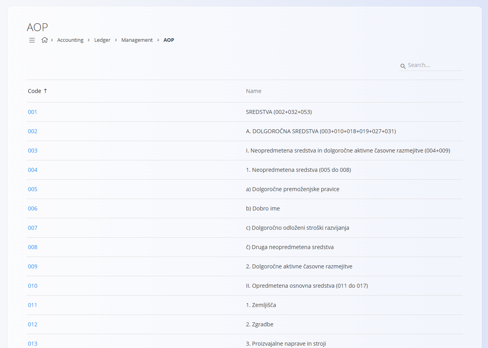

<!-- app_route: /management/ledger/aop -->
<!-- app_label: AOP -->
<!-- canonical_source_url: https://tom-pit.github.io/Connected.Docs/en/Domains/Accounting/Management/Ledger/AOP/ -->
<!-- canonical_source_title: AOP -->

# AOP

The **AOP** screen displays a predefined list of statutory reporting positions used for financial statements and regulatory reporting.

AOP positions represent standardized reporting items defined by national accounting regulations. They are used as reference data in financial statements and other statutory reports. The example shown here is specific to **Slovenia**, where AOP (*Analitični obračun poslovanja*) positions are prescribed by local legislation and used in official financial reporting.

To access this screen, go to **Accounting / Ledger / Management / AOP** in the [navigation](../../../../Common/UI/Navigation.md).

> [!IMPORTANT]
> AOP positions are statutory reporting elements. They are provided for reference only and cannot be changed by users.

## Country-specific structure

AOP is **country-specific**:

- each country defines its own structure and codes,
- naming and hierarchy depend on local accounting standards,
- the list is provided by the system and maintained centrally.

For other countries, a similar list is used, adapted to local legal and reporting requirements.

## Usage

AOP entries are used as **reference values** in accounting and reporting views. Users can browse and search the list but cannot modify it.

## Editing and deletion of AOP positions

Editing and deletion are **not supported**.