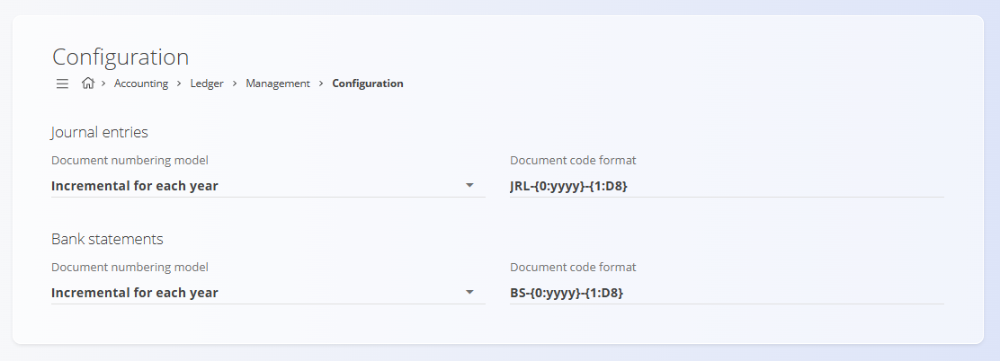

<!-- app_route: /management/ledger/configuration -->
<!-- app_label: Configuration -->
<!-- canonical_source_url: https://github.com/Tom-PIT/Connected.Docs/blob/main/en/Domains/Accounting/Management/Ledger/LedgerConfiguration.md -->
<!-- canonical_source_title: Configuration -->

# Configuration

Configure **Ledger** settings affecting document numbering. Any changes are saved automatically.

To access this page, go to **Accounting / Ledger / Management / Configuration** in the [navigation](../../../../Common/UI/Navigation.md).

## Document numbering settings

Choose the numbering model and format for journal entries and bank statements.

| Field | Description |
|------|-------------|
| **Document numbering model** | • **Incremental for each year:** numbering restarts at the beginning of each year.   • **Incremental:** a single continuous sequence without yearly reset. |
| **Document code format** | Pattern defining the document code structure. |

> [!NOTE]
> The numbering model and format apply immediately after changes are made. Existing documents are not renumbered.
