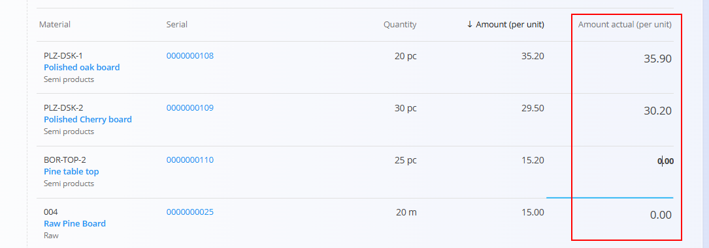
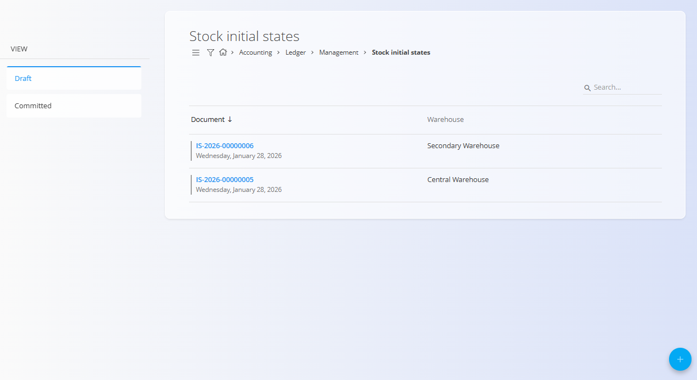
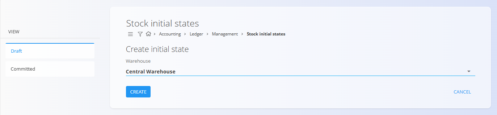

<!-- app_route: /management/ledger/stock/initial-states -->
<!-- app_label: Stock initial states -->
<!-- canonical_source_url: https://tom-pit.github.io/Connected.Docs/en/Domains/Accounting/Management/Ledger/StockInitialStates/ -->
<!-- canonical_source_title: Stock initial states -->

# Stock initial states

The **Stock initial states** screen is used to define the opening inventory quantities and values for a warehouse. It establishes the starting point for inventory valuation when beginning to use the system or when enabling financial stock integration.

Stock initial states are **document-based** and directly related to accounting. When published, they initialize the financial value of stock in the ledger, forming the opening balance for inventory accounts.

To access this screen, go to **Accounting / Ledger / Management / Stock initial states** in the [navigation](../../../../Common/UI/Navigation.md).

## Schema

| Field     | Description                                                             |
| --------- | ----------------------------------------------------------------------- |
| **Code**    | Automatically generated identifier of the stock initial state document. |
| **Warehouse** | Warehouse for which the initial stock is being defined.                 |
| **Created**   | Creation date of the document.                                          |
| **Material**  | Material or item held in stock.                                     |
| **Serial**    | Serial number of the item, when serial tracking is enabled.         |
| **Quantity**  | Physical quantity of the item in stock.                             |
| **Amount (per unit)** | System-calculated unit value, displayed for reference.              |
| **Amount actual (per unit)** | Editable field used to enter the opening accounting value per unit. |

### Amount fields

- **Amount (per unit)** shows the system-derived unit value, if available. During initialization, this value may be zero or based on default material valuation settings.
- **Amount actual (per unit)** is used to manually enter the opening inventory valuation (unit value). For materials with multiple serial numbers, the same unit value is typically entered for all serials of the same material.

## List view

The list view displays one draft or committed initial state per warehouse. The list supports search and filtering.

Each row shows:
- **Code**
- **Warehouse**
- **Created**

The list can be filtered by document status (**Draft** or **Committed**)

## Actions

### Add an initial stock state

To add a new stock initial state:
1. Click the [action button](../../../../Common/UI/ActionButton.md).
2. Select a **Warehouse**.

   

3. Click **Create**.

The system creates a new draft document for the selected warehouse.

")

### Edit an initial stock state

Click a document in the draft list to open it in edit mode. Enter or update **Amount actual (per unit)** on details and review header fields.

Click **Save** to apply changes or **Cancel** to discard them.

### Publish an initial stock state

When all required values are entered, click **Publish** to initialize inventory value in the ledger and create opening balances for inventory accounts. Publishing locks the document against further changes.

> [!NOTE]
> Publishing requires **financial stock** to be enabled in the ledger. If financial stock is not enabled, the system prevents publishing and displays an error message.
>
> To enable financial stock, go to **System / Configuration / Ledger settings** and activate the **Financial stock enabled** option.

### Delete an initial stock state

Draft initial states can be deleted from the edit screen.

> [!NOTE]
> Once published, deletion is not allowed to preserve inventory and accounting integrity.

## Usage

This screen is typically used once during system initialization or when inventory accounting is enabled for the first time.

Initial states are not regular stock movements and should be created before posting purchase receipts, issues, or production movements. The accuracy of entered values directly affects inventory valuation and cost of goods sold.

