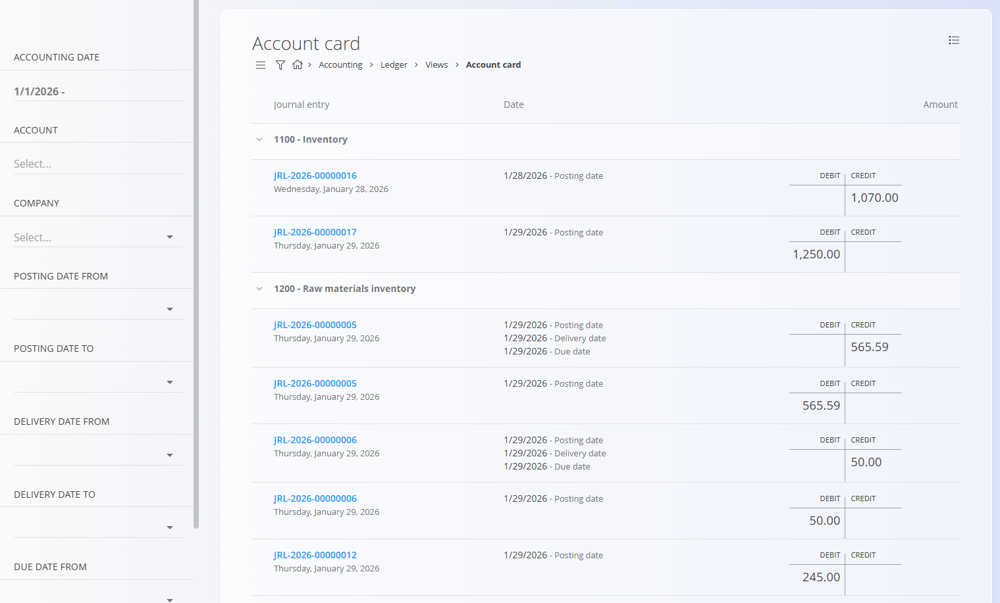

<!-- app_route: /accounting/ledger/views/account-card -->
<!-- app_label: Account card -->
<!-- canonical_source_url: https://tom-pit.github.io/Connected.Docs/en/Domains/Accounting/Views/AccountCard/ -->
<!-- canonical_source_title: Account card -->

# Account card

The **Account card** view provides a detailed overview of **debit and credit movements per account**, based on posted journal entries. It is a **read-only analytical view** and does not create or modify documents.

To access this view, go to **Accounting / Ledger / Views / Account card** in the [navigation](../../../Common/UI/Navigation.md)).

### Purpose of this view

The Account card is used to:

- Review debit and credit movements for one or more accounts
- Analyze balances over a selected time period
- Trace postings back to their originating **journal entries**
- Support reconciliation and audit activities

This view reflects data from **committed journal entries** only.

## Layout and structure

The view is organized by **account**, with journal entries listed chronologically under each account.

For each journal entry, the following information is shown:

- **Journal entry code**
- **Posting date** (and related dates where applicable)
- **Debit** and **Credit** amounts

Clicking on a **blue journal entry code** opens the related **Journal entry** document.

### Filters

The filters on the left side allow you to narrow down the results:

- **Accounting date** - Limits journal entries to a specific accounting date range.
- **Account** - Shows movements for one or more selected accounts.
- **Company** - Filters postings related to a specific company.
- **Posting date from / to** - Filters by posting date range.
- **Delivery date from / to** - Filters by delivery date, when applicable.
- **Due date from / to** - Filters by due date, when applicable.

Filters can be combined to focus on specific periods, accounts, or business partners.

### Exporting data

Use the menu in the top-right corner to export the data as a PDF.

## Interpretation of values

- **Debit** and **Credit** columns represent the posting direction for each journal entry line.
- Entries are grouped under their respective **accounts**.
- A journal entry may appear multiple times if it affects multiple accounts.

> [!NOTE]  
> - Only **committed** journal entries are shown in this view.  
> - Draft or unbalanced journal entries are not included.  
> - The Account card is intended for **analysis and verification only** and does not support editing or posting actions.

For editing or correcting postings, open the related [**Journal entry**](../Documents/DoubleEntryAccountancy.md) directly.

## Menu

The menu provides additional actions available on this page.

Available actions:

- **Export to PDF**

For details about menu actions, see [**Menu actions**](../../../Common/Concepts/MenuActions.md).
