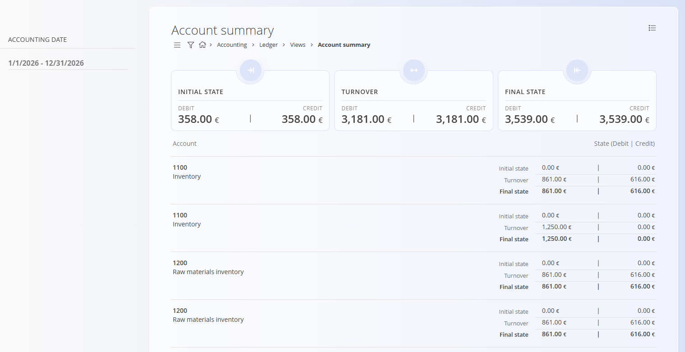

<!-- app_route: /accounting/ledger/account-summary-days -->
<!-- app_label: Account summary -->
<!-- canonical_source_url: https://tom-pit.github.io/Connected.Docs/en/Domains/Accounting/Views/AccountSummary/ -->
<!-- canonical_source_title: Account summary -->

# Account summary

The **Account summary** view provides an aggregated overview of **initial state, turnover, and final state per account** for a selected accounting period. It is a **read-only analytical view** based on posted journal entries and does not create or modify documents.

> [!NOTE]
> - Values are calculated exclusively from **committed journal entries**.
> - Debit and credit columns are always shown separately to reflect double-entry accounting.
> - This view is typically used for **period-end checks**, **trial balance validation**, and **high-level financial analysis** before drilling down into detailed movements (for example, via the [**Account card**](AccountCard.md) view).

To access this view, go to **Accounting / Ledger / Views / Account summary** in the [navigation](../../../Common/UI/Navigation.md).

## Overview

For each account, the view displays:

- **Initial state** – Opening debit and credit balances at the start of the selected period  
- **Turnover** – Total debit and credit movements within the period  
- **Final state** – Closing debit and credit balances at the end of the period  

The totals shown at the top summarize all listed accounts for the selected filters.

## Filters

The filters on the left side allow you to narrow down the results:

- **Accounting date** – Defines the period used to calculate initial state, turnover, and final state.
- **Account** – Limits the summary to one or more selected accounts.
- **Company** – Shows balances related to a specific company.

## 
