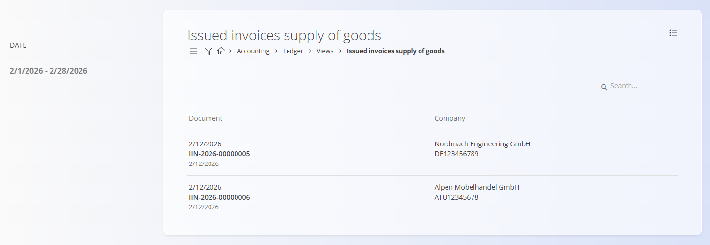

<!-- app_route: /accounting/ledger/issued-invoices-supply-of-goods -->
<!-- app_label: Issued invoices supply of goods -->
<!-- canonical_source_url: https://tom-pit.github.io/Connected.Docs/en/Domains/Accounting/Views/IssuedInvoicesSupplyOfGoods/ -->
<!-- canonical_source_title: Issued invoices supply of goods -->

# Issued invoices supply of goods

The **Issued invoices supply of goods** view provides an overview of issued invoices related to the supply of goods under specific tax reporting conditions.

This is a **read-only analytical view** intended for monitoring and reconciliation purposes. Data cannot be edited from this screen.

To access this view, go to **Accounting / Ledger / Views / Issued invoices supply of goods** in the [navigation](../../../Common/UI/Navigation.md).

> [!NOTE]  
> This view is intended for reporting and verification. It does not replace official VAT declarations but supports internal control and reconciliation.

## Purpose

This view allows users to:

- Review issued invoices that qualify for supply-of-goods reporting
- Verify customer information (including VAT ID, where applicable)
- Support VAT and cross-border reporting processes
- Reconcile issued invoices with tax and ledger records

Invoices appear in this list based on the configured tax treatment and reporting criteria.

## Filters

The filter panel allows narrowing down results:

- **Date (from – to)** – Displays invoices within the selected period.

## Columns

Each row represents one issued invoice and includes:

- **Document** – Invoice code and document date.
- **Company** – Customer name and VAT identification number (if defined).

## Menu

The menu provides additional actions available on this page.

Available actions:

- **Export to PDF**

For details about menu actions, see [**Menu actions**](../../../Common/Concepts/MenuActions.md).