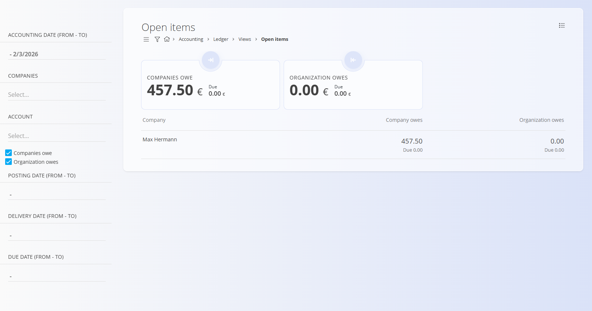

<!-- app_route: /accounting/ledger/views/open-items -->
<!-- app_label: Open items -->
<!-- canonical_source_url: https://tom-pit.github.io/Connected.Docs/en/Domains/Accounting/Views/OpenItems/ -->
<!-- canonical_source_title: Open items -->

# Open items

The **Open items** view provides an overview of accounting entries originating from invoices that have **not yet been fully settled**. It is a **read-only analytical view** used to monitor outstanding receivables and payables and track overdue amounts.

To access this view, go to **Accounting / Ledger / Views / Open items** in the [navigation](../../../Common/UI/Navigation.md).

> [!NOTE]
> This view is read-only. Open items cannot be edited directly and must be resolved through payments, settlements, or corrective accounting entries.

> [!IMPORTANT]
> The accuracy of this view depends on correct posting, settlement, and reconciliation of invoices and payments.

## Purpose of this view

The Open items view is used to:

- Monitor unpaid customer invoices (receivables)
- Monitor unpaid supplier invoices (payables)
- Track due and overdue amounts
- Support cash-flow analysis and follow-up actions

This view reflects data from **committed journal entries** only. Each line represents aggregated open accounting items per company.

## Layout and structure

The view is grouped by **company**. For each company, the following information is shown:

- **Company** – Customer or supplier name
- **Company owes** – Outstanding amount owed by the company to the organization
- **Organization owes** – Outstanding amount owed by the organization to the company
- **Due** – Portion of the amount that is overdue

Amounts are shown in the document currency and reflect the current open balance.

## Summary indicators

At the top of the screen, two summary cards provide a quick overview:

- **Companies owe** – Total amount that customers owe to the organization (open receivables)
- **Organization owes** – Total amount that the organization owes to suppliers (open payables)

Each card also shows the **Due** amount, representing items that have passed their due date.

## Filters

The left sidebar allows filtering open items using multiple criteria:

- **Accounting date (from – to)** – Filters items based on the accounting date of journal entries
- **Companies** – Filters by customer or supplier
- **Account** – Filters by general ledger account
- **Companies owe / Organization owes** – Toggle receivables and/or payables
- **Posting date (from – to)** – Filters by posting date of journal entries
- **Delivery date (from – to)** – Filters based on the delivery date from the originating document
- **Due date (from – to)** – Filters items by due date

Filters can be combined to focus on specific periods, accounts, or business partners.

## Data sources

Open items are generated from posted accounting entries, typically originating from:

- Sales invoices
- Purchase invoices
- Credit notes
- Partial payments and settlements

When an invoice is fully paid or settled, it is automatically removed from this view.

## Menu

The menu provides additional actions available on this page.

Available actions:

- **Export to PDF**

For details about menu actions, see [**Menu actions**](../../../Common/Concepts/MenuActions.md).