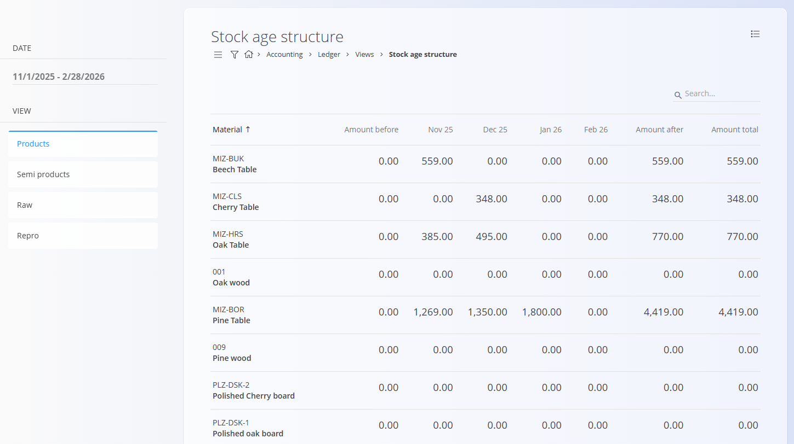

<!-- app_route: /accounting/ledger/views/stock-age-structure -->
<!-- app_label: Stock age structure -->
<!-- canonical_source_url: https://tom-pit.github.io/Connected.Docs/en/Domains/Accounting/Views/StockAgeStructure/ -->
<!-- canonical_source_title: Stock age structure -->

# Stock age structure

The **Stock age structure** view provides a time-based overview of the **financial value of inventory**, showing how stock values are distributed across past periods. It is a **read-only analytical view** based on posted inventory and accounting data and does not create or modify documents.

This view is typically used together with other ledger views (such as [**Stock**](LedgerStock.md) or [**Postings**](Postings.md)) to investigate the reasons behind inventory value changes.

> [!NOTE]
> - All values are calculated from **committed inventory and accounting postings**.
> - The report is intended for **inventory aging analysis**, **valuation review**, and **financial reporting support**.

To access this view, go to **Accounting / Ledger / Views / Stock age structure** in the [navigation](../../../Common/UI/Navigation.md).

## Overview

For each material, the view displays how the inventory value is distributed over time within the selected period.

The columns represent:

- **Amount before** – Financial inventory value *before* the selected date range (value at the end of the period immediately preceding the start date).
- **Month / year columns** (for example, *Nov 25*, *Dec 25*, *Jan 26*) – Financial inventory value movements for each individual month within the selected range.
- **Amount after** – Financial inventory value *after* the selected ending month.
- **Amount total** – Current total financial inventory value for the material.

This structure allows you to understand how long inventory has been held and how its value has evolved over time.

## Filters

The filters on the left side allow you to narrow down the results:

- **Date** – Defines the time range used to calculate the aging structure.
- **View** – Filters by material category:
  - Products
  - Semi products
  - Raw
  - Repro

## Menu

The menu provides additional actions available on this page.

Available actions:

- **Export to CSV**

For details about menu actions, see [**Menu actions**](../../../Common/Concepts/MenuActions.md).
