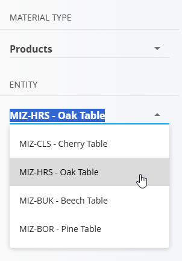
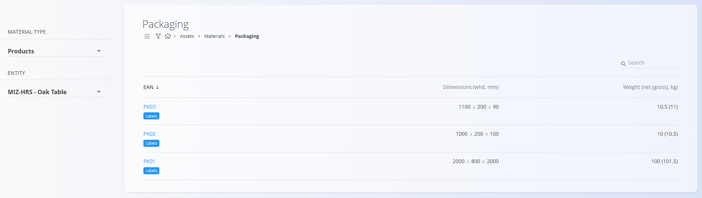
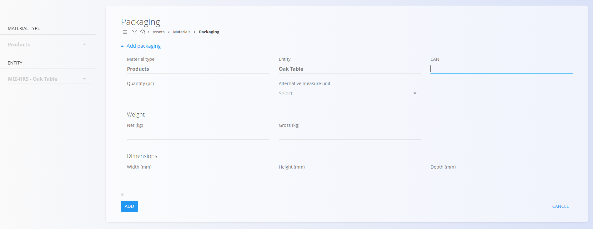
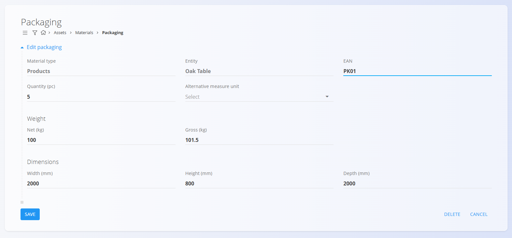
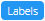
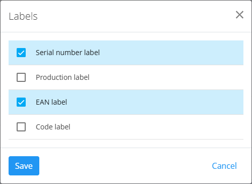

<!-- app_route: /management/materials/packaging -->
<!-- app_label: Packaging -->
<!-- canonical_source_url: https://github.com/Tom-PIT/Connected.Docs/blob/main/en/Domains/Assets/Materials/Packaging.md -->
<!-- canonical_source_title: Packaging -->

# Packaging

Packaging defines how a material is packaged, including quantity, weight, dimensions, and optional alternative measure units. Packaging information is essential for logistics, shipping, and inventory management. It applies to:

- [**Products**](Products.md)  
- [**Semi products**](SemiProducts.md)  
- [**Repro materials**](ReproMaterials.md)  
- [**Raw materials**](RawMaterials.md)

> [!NOTE]
Packaging details for each specific material type can also be defined in the material sections.

> [!TIP]
> For a full demonstration, see the **[Packaging](https://www.youtube.com/watch?v=-0T_l14bg5s)** video tutorial.

To access packaging configuration, go to: **Assets / Materials / Packaging** in the [navigation](../../../Common/UI/Navigation.md).

## Schema

| Field | Description |
|-------|-------------|
| **Material type** | The material category this packaging is assigned to (e.g., Products, Semi products, Repro materials, Raw materials). |
| **Entity** | The specific material record selected within the chosen material type. |
| **EAN** | Unique packaging identifier. Also used for labeling. |
| **Quantity (pc)** | Number of items included inside one package. |
| **Alternative measure unit** | (Optional) Alternative unit of measure for packaging content. |
| **Net weight (kg)** | Weight excluding packaging. |
| **Gross weight (kg)** | Weight including packaging. |
| **Width (mm)** | Width dimension in millimeters. |
| **Height (mm)** | Height dimension in millimeters. |
| **Depth (mm)** | Depth dimension in millimeters. |

## Management

To assign packaging to a material, you must first select the **Material type** (e.g., Products, Semi products) and then the specific **Entity** on the left side of the screen.

### List view

The interface displays a list of packaging records for the selected **Material type** and **Entity**. 

The list shows:

- **EAN**
- **Dimensions** (width × height × depth)
- **Weight** (net and gross)
- A **Labels** tag

A search field is available in the upper-right corner.

## Actions

### Add a packaging entry

On the **Packaging** screen, click the [action button](../../../Common/UI/ActionButton.md) to add a new packaging item.

The form includes fields such as:

- **EAN**
- **Quantity (pc)**
- **Alternative measure unit**
- **Weight** (net and gross)
- **Dimensions** (width, height, depth)

After entering the required information, click **Add** to save or **Cancel** to return.

## Edit a packaging entry

To edit an existing packaging entry, click the **EAN** value in the list.

The edit screen allows you to modify all fields. After editing, click **Save** or **Cancel**.

### Labels

Each packaging entry includes a **Labels** tag, used to define which label types can be generated for that packaging.

In the list view, click the **Labels** button under a packaging item:

This opens the label selection dialog:

Available label types:

- **Serial number label**
- **Production label**
- **EAN label**
- **Code label**

Select the desired label types and click **Save**.

## Delete a packaging entry
  
Click **Delete** on the edit screen to open a confirmation dialog: 

**Are you sure you want to delete this record?**  

If confirmed, the packaging is permanently removed; otherwise, the system keeps the record unchanged.

> [!NOTE]
>A packaging record can be deleted only if it is not referenced by other system entities.
