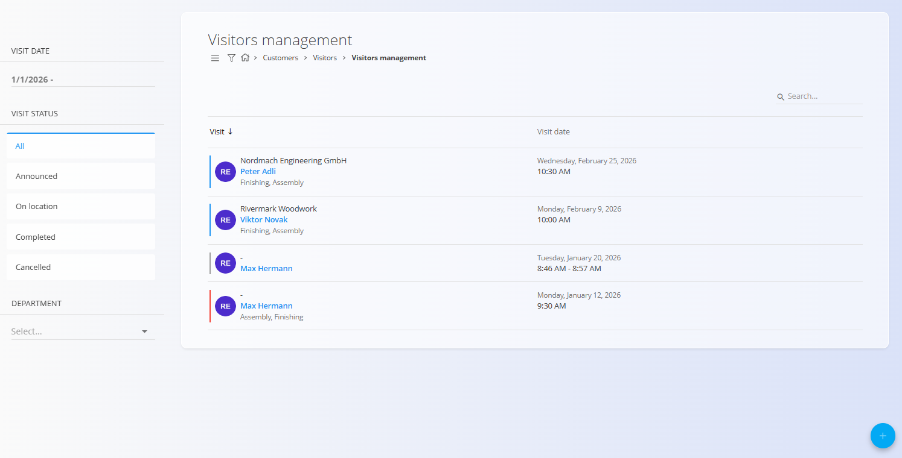

<!-- app_route: /customers/visitors/management -->
<!-- app_label: Visitors management -->
<!-- canonical_source_url: https://github.com/Tom-PIT/Connected.Docs/blob/main/en/Customers/Visitors/VisitorsManagement.md -->
<!-- canonical_source_title: Visitors management -->

# Visitors management

The **Visitors management** screen is used to create and track visit records, including visitor details, planned and actual arrival times, visit status, and the locations being visited.

Each visit follows a clear lifecycle, from announcement to completion or cancellation.

To access Visitors management, navigate to **Customer Support / Visitors / Visitors management** in the [navigation](../../../Common/UI/Navigation.md).

## Schema

| Field | Description |
|------|-------------|
| **Status** | Current visit status: Announced, On location, Completed, or Cancelled |
| **Author** | User who created the visit record |
| **Scheduled arrival time** | Planned date and time of the visit |
| **Actual arrival time** | Actual date and time when the visitor arrived |
| **Visitor** | Name of the visitor (mandatory) |
| **Email** | Visitor email address |
| **Phone** | Visitor phone number |
| **Company** | Company the visitor represents |
| **Locations** | Target locations for the visit, taken from the [**Organization units**](../../Production/Management/OrganizationUnits.md) code list. |
| **Guide**| Internal person responsible for the visitor |
| **Signature** | Visitor confirmation and signature, available in edit mode |

## List view and filters

The list view displays all recorded visits and supports filtering to quickly locate relevant entries.

In the list view, visits are visually distinguished by color:

- Announced –  Blue
- On location – Green  
- Completed – Gray  
- Cancelled – Red  

Available filters:

- **Visit date**  
- **Visit status**
  - All
  - Announced
  - On location
  - Completed
  - Cancelled
- **Department**

Each row shows the visitor, company, visited locations, and visit date/time.

## Visit lifecycle and statuses

A visit progresses through the following statuses:

- **Announced** – the visit is planned and recorded in advance
- **On location** – the visitor has arrived at the location
- **Completed** – the visit has ended
- **Cancelled** – the visit was cancelled and did not take place

## Add a new visit

A new visit is created when a physical visit is planned. 

Typical flow:

1. Click the [action button](../../../Common/UI/ActionButton.md) to create a new visit.
2. The **Status** is set to **Announced** by default.
3. Fill in the visit details (the **Visitor** field is mandatory).
4. Click **Save**.

At this stage, the visit appears in the list as **Announced**.

## Manage the visit

### Visitor arrival

When the visitor arrives on site:

1. Open the visit record.
2. Change the **Status** to **On location**.
3. Record the **Actual arrival time**.
4. The visitor can sign the confirmation statement in the **Signature** section (see below). 
5. Click **Save**.

The visit now appears in the list as **On location**, and the visit duration tracking starts.

> [!NOTE]
> Recording the **Actual arrival time** and **Signature** section and then saving the document automatically changes the status to **On location**.

#### Signature confirmation

When a visit record is opened in edit mode, a **Signature** section becomes available.

The visitor can confirm and sign the statement directly on the form.

### Complete the visit

After the visit ends:

1. Open the visit record.
2. Change the **Status** to **Completed**.
3. Click **Save**. 

This action effectively stops the visit duration tracking.  

The visit moves to the **Completed** list and displays both arrival and departure times.

### Cancel a visit

If a planned visit does not take place:

1. Open the visit record.
2. Set the **Status** to **Cancelled**.
3. Click **Save**.

The visit is moved to the **Cancelled** state and shown accordingly in the list view.

## Delete a visit

Visits can be deleted if they were created in error or are no longer needed on the edit screen.

To delete a visit:
1. Open the visit record.
2. Click **Delete** and confirm the action.

## Operational entrance view (Tablet mode)

In addition to the administrative view, the system provides a simplified operational view intended for use on a tablet device at the entrance.

This view:

- Displays only today’s visits in status **Announced** and **On location**
- Has no filters
- Refreshes automatically every 15 minutes

Interaction differs slightly from the administrative view:

- Selecting an **Announced** visit automatically changes the status to **On location** and sets the actual arrival time.
- Selecting an **On location** visit automatically changes the status to **Completed** and sets the actual departure time.
- Using the **+** button creates a new visit directly in **On location** status.
