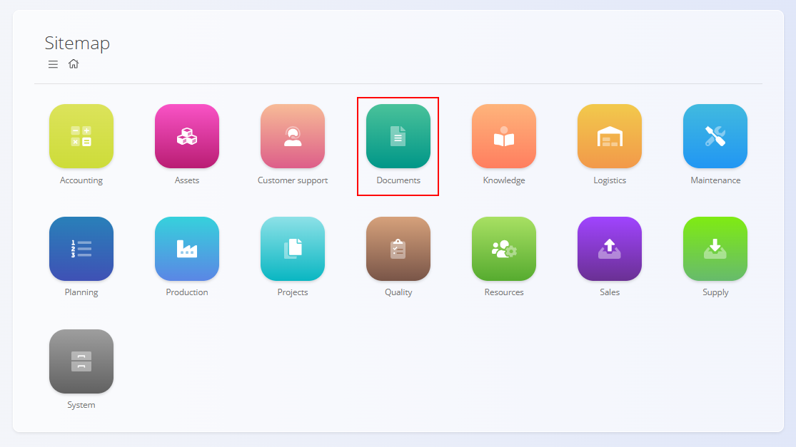
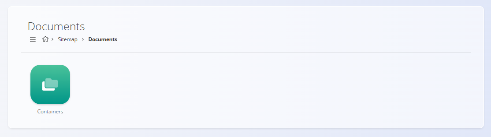

<!-- app_route: /sitemap/documents -->
<!-- app_label: Documents domain -->
<!-- canonical_source_url: https://github.com/Tom-PIT/Connected.Docs/blob/main/en/Domains/Documents/DocumentsDomain.md -->
<!-- canonical_source_title: Documents domain -->

# Documents domain

The **Documents** domain provides a centralized repository for managing **external documents** that are not generated by the system but need to be stored, organized, and accessed within the platform.

Typical examples include:
- certifications  
- permits  
- contracts  
- technical documentation  
- compliance and regulatory files  

Unlike operational documents (e.g. production orders, invoices), the Documents domain is intended for **uploaded files** that support business processes and ensure traceability and compliance.

To access this domain, navigate to **Documents** from the main sitemap.

> [!NOTE]  
> The available domains and features depend on the company configuration and enabled modules.

## What is included in the Documents domain?

The domain is structured around **containers**, which act as top-level repositories for grouping documents.

- **[Containers](Documents/Containers.md)** – define logical document groups (e.g. Certifications, Contracts, Technical documentation).

Each container contains folders and documents organized in a tree structure.