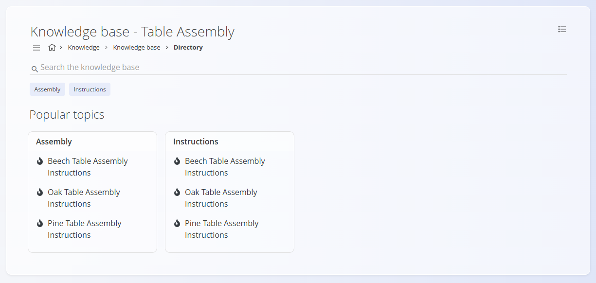
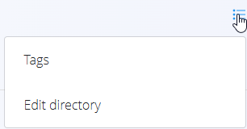
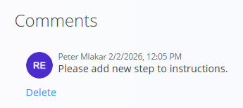

<!-- app_route: /knowledge/ -->
<!-- app_label: Knowledge base -->
<!-- canonical_source_url: https://tom-pit.github.io/Connected.Docs/en/Domains/Knowledge/KnowledgeBase/KnowledgeBase/ -->
<!-- canonical_source_title: Knowledge base -->

# Knowledge base

The **Knowledge base** is the main screen where all **published Knowledge content** is presented. It provides users with a central place to browse, search, and read internal documentation such as instructions, guidelines, procedures, and reference articles.

The **Knowledge base** is primarily used as an **internal documentation library** and supports day-to-day operational work across multiple domains.

To access this screen, go to **Knowledge / Knowledge base** in the [navigation](../../../Common/UI/Navigation.md).

## Overview

The **Knowledge base** home page is designed to help users quickly find relevant content. It combines **search**, **tag-based filtering**, and **visual navigation** to surface commonly used or important articles.

The screen is read-only, except for **comments** on articles where commenting is enabled.

## Search and filters

At the top of the page, a **search bar** allows users to search the **Knowledge base** by:

- Article title
- Article content
- Tags

Below the search bar, **tags** are displayed and can be used as quick filters. Clicking a tag filters the visible content to articles associated with that tag.

Tags are defined in **[Directory tags](../Management/DirectoryTags.md)**.

## Popular topics

The **Popular topics** section groups frequently accessed or highlighted articles by tag.

Each card represents a tag (e.g. *Assembly*, *Quality*, *Instructions*) and contains a list of related articles. Clicking an article opens it directly.

This section helps users quickly access commonly used instructions and guidelines without browsing the full directory structure.

## Browse all topics

The **Browse all topics** section provides a visual overview of Knowledge content, typically represented by directories or curated topics.

Each tile leads to a group of related articles, allowing users to explore the **Knowledge base** by topic rather than by tag or search.

This is useful for on-boarding, training, and general exploration of available documentation.

Clicking a directory tile opens the **directory view**, where users can navigate articles and open the table of contents.

## Directory view

Clicking a directory from **Browse all topics** opens the **directory view**, which displays the articles available inside that directory.

The directory view includes:

- **Search bar** – searches within the **Knowledge base**
- **Tag chips** – filter content by tags
- **Popular topics** – quick access to articles grouped by tag

In the directory view, the menu provides options to: 
- Edit tags and 
- Edit the directory.

### Table of contents

To browse all articles in the directory, open the **table of contents** using the **menu icon** in the top-left corner.

The table of contents shows the directory structure and available articles. Clicking an article opens it in the [article view](#article-view).

The directory structure and table of contents are configured in **[Directories](../Management/Directories.md)** and **[Table of contents](../Management/TableOfContents.md)**.

## Article view

Clicking an article opens the **article view**, where the full content is displayed.

The article view includes:

- **Article title**
- **Author**
- **Publication date**
- **Tags** associated with the article
- **Main content** (formatted text, lists, instructions)
- **Attachments** (if included)
- **Comments section** (if enabled)

### Comments

If commenting is enabled for an article, users can:

- Add comments
- Upload files as part of a comment
- Review comments from other users

Comments can be removed by clicking **Delete**.

## Usage

The **Knowledge base** is typically used for:

- Reading work instructions and procedures
- Accessing internal guidelines and policies
- Supporting production, logistics, quality, and maintenance activities
- Onboarding new employees
- Sharing internal know-how and best practices

> [!NOTE]
> - The **Knowledge base** displays only **published** and **enabled** content.  
> - Visibility of articles depends on directory status and publication settings.  
> - Commenting and attachments depend on how the article was configured.