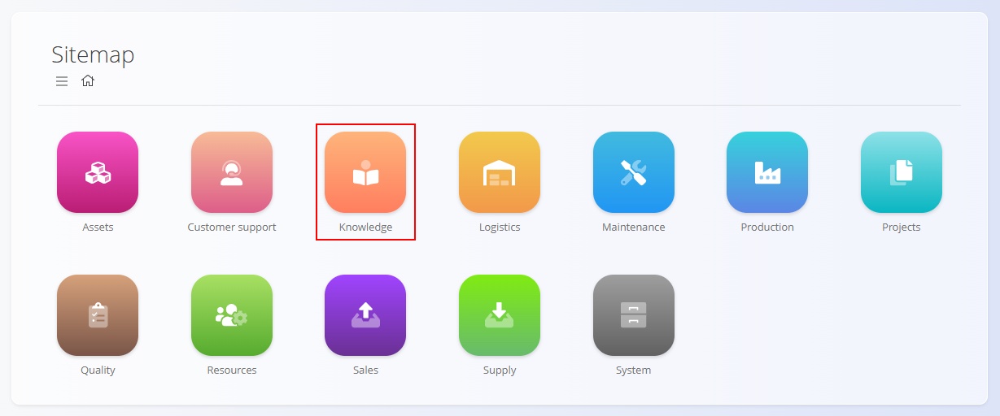
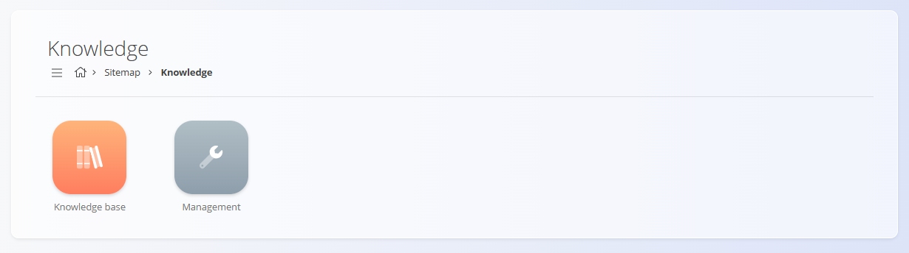
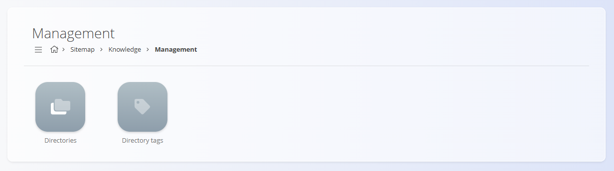

<!-- app_route: /sitemap/knowledge -->
<!-- app_label: Knowledge domain -->
<!-- canonical_source_url: https://github.com/Tom-PIT/Connected.Docs/blob/main/en/Domains/Knowledge/KnowledgeDomain.md -->
<!-- canonical_source_title: Knowledge domain -->

# Knowledge

The **Knowledge** domain provides a centralized **knowledge base library** used for internal documentation such as instructions, guidelines, procedures, and announcements. It allows organizations to structure, publish, and maintain written content that supports daily operations and knowledge sharing.

This domain is typically used for **internal documentation**, onboarding materials, operational instructions, and reference content.

To access this domain, navigate to **Knowledge** in the [navigation](../../Common/UI/Navigation.md).

> [!NOTE]  
> The available domains depend on each company’s configuration and business model.

## What is included in the Knowledge domain?

The domain is organized into two main functional areas:

- **[Knowledge base](KnowledgeBase/KnowledgeBase.md)** – end-user access to published articles and documentation  
- **[Management](#management)** – configuration and content structure setup  

## Knowledge base

The **Knowledge base** is the primary user-facing area of the Knowledge domain. It provides access to all **published articles and files**, organized by directories and tags.

It is intended for:

- Operators and employees
- Supervisors and team leaders
- Internal support and administration
- Knowledge sharing across departments

Typical usage includes:

- Reading internal procedures and work instructions  
- Browsing guidelines and best practices  
- Searching for documentation by keyword or tag  
- Reviewing announcements or reference materials  

Articles in the **Knowledge base** may include:

- Text content
- Attachments (documents, images, files)
- Comments (if enabled)

The **Knowledge base** is **read-only for most users**, except for commenting where permitted.

## Management

The **Management** section is used to configure and maintain the structure of the Knowledge domain. It defines **how content is organized**, not the content itself.

Management includes the following configuration areas:
- [**Directories**](Management/Directories.md)
- [**Directory tags**](Management/DirectoryTags.md)
> [!TIP]
> See all management entries in the **[Management Index](../../ManagementIndex.md)**.

### Directories

**Directories** define the main structure of the **Knowledge base**. Each directory represents a **topic or category** and can contain:

- [Articles](Management/Articles.md)
- [Table of contents](Management/TableOfContents.md) (structured groupings)
- Attachments

Directories allow organizations to group related content logically (e.g. HR guidelines, Production instructions, IT documentation).

Typical configuration includes:

- Title and description
- Status (enabled / disabled)
- Articles and indexes within the directory

### Directory tags

**Directory tags** are used to classify and filter Knowledge content. They provide an additional way to organize and search articles across directories.

Tags are commonly used to:

- Categorize articles by topic
- Enable filtering in the **Knowledge base**
- Highlight related content across different directories

Directory tags are shared across the Knowledge domain and reused by multiple directories and articles. See [Directory tags](Management/DirectoryTags.md).

## Knowledge workflow

The Knowledge domain typically follows this lifecycle:

### **1. Structure setup**
Directories and directory tags are defined in **Management**.

### **2. Content creation**
[Articles](Management/Articles.md) are created and assigned to directories, optionally tagged and enriched with attachments.

### **3. Publishing**
Articles are published and become visible in the **Knowledge base** according to their status and validity settings.

### **4. Usage**
Users browse, search, read, and comment on articles in the **Knowledge base**.

### **5. Maintenance**
Content is updated, disabled, or archived as processes and documentation evolve.

## Summary

The **Knowledge base** serves as the **central documentation hub** of the system.  
It ensures that:

- Internal knowledge is structured and accessible  
- Procedures and guidelines are easy to find  
- Documentation is maintained in a controlled and centralized way  
- Employees have a single source of truth for internal instructions  

It complements operational domains by supporting them with **clear, accessible documentation**.

## Related

- **[**Knowledge base**](KnowledgeBase/KnowledgeBase.md)** – browse published documentation
- **[Directories](Management/Directories.md)** – manage containers and navigation
- **[Articles](Management/Articles.md)** – author and maintain content
- **[Directory tags](Management/DirectoryTags.md)** – define tags for filtering
- **[Table of contents](Management/TableOfContents.md)** – configure directory navigation
