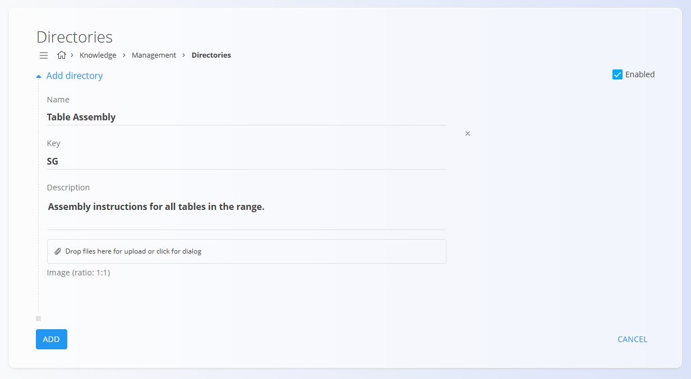
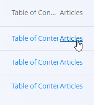

<!-- app_route: /management/knowledge/directories -->
<!-- app_label: Directories -->
<!-- canonical_source_url: https://github.com/Tom-PIT/Connected.Docs/blob/main/en/Domains/Knowledge/Management/Directories.md -->
<!-- canonical_source_title: Directories -->

# Directories

The **Directories** code list defines the main **content containers** used in the **Knowledge base**. Each directory represents a topic or category (for example *Table Assembly*, *Safety Guidelines*, *Quality Inspections*) and contains articles and a table of contents structure.

Directories are used to organize Knowledge content and determine how articles are grouped and navigated in the [**Knowledge base**](../KnowledgeBase/KnowledgeBase.md).

To access this screen, go to **Knowledge / Management / Directories** in the [navigation](../../../Common/UI/Navigation.md).

## Schema

| Field | Description |
|------|-------------|
| **Name** | Display name of the directory (mandatory). |
| **Key** | Short unique identifier for the directory (mandatory). |
| **Description** | Optional description explaining the directory’s purpose. |
| **Image** | Optional image used to visually represent the directory (recommended ratio 1:1). |
| **Enabled** | Indicates whether the directory is visible and available in the [**Knowledge base**](../KnowledgeBase/KnowledgeBase.md). |

## Management

### Directories list

The list view displays all configured directories.

Each row shows:
- **Directory** – directory name
- **Links** to manage:
  - **[Table of contents](TableOfContents.md)**
  - **[Articles](Articles.md)**

A status indicator appears to the left of each directory name:
- **Blue** – enabled/active directory
- **Gray** – disabled/inactive directory

Directories can be searched using the **Search** field in the top-right corner.

Clicking a directory name opens it for editing.

## Actions

### Add a new directory

Click the [action button](../../../Common/UI/ActionButton.md) to add a new directory. Fill in the following fields:

- **Name**
- **Key**
- **Description** (optional)
- **Image** (optional)
- **Enabled** – controls whether the directory is visible in the [**Knowledge base**](../KnowledgeBase/KnowledgeBase.md)

Click **Add** to save the new directory.

Once created, the directory becomes available in the [**Knowledge base**](../KnowledgeBase/KnowledgeBase.md) and can be populated with content.

## Manage the directory content

After a directory is created, additional configuration options become available directly from the list:

- **[Articles](Articles.md)** – manage articles that belong to the directory  
- **[Table of contents](TableOfContents.md)** – define the navigation structure inside the directory  

These options are accessed via the links shown below each directory in the list.

> [!NOTE]
> Directories define **structure only**. Articles and table of contents are managed separately.

## Edit a directory

Click a directory name to open its edit screen.

From the edit screen you can:
- Modify directory metadata (name, key, description)
- Enable or disable the directory
- Update the directory image

Click **Save** to confirm changes.

## Delete a directory

Click **Delete** on the edit screen to open a confirmation dialog:

**Are you sure you want to delete this record?**

If confirmed, the directory is permanently removed.

> [!NOTE]
> A directory can be deleted only if it does not contain articles or table of contents entries.

