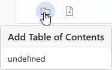
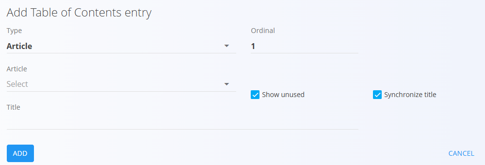
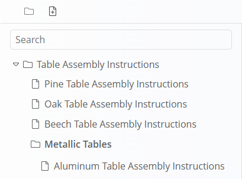

<!-- app_route: /management/knowledge/directories -->
<!-- app_label: Directories -->
<!-- canonical_source_url: https://tom-pit.github.io/Connected.Docs/en/Domains/Knowledge/Management/TableOfContents/ -->
<!-- canonical_source_title: Table of contents -->

# Table of contents

The **Table of contents** defines the **navigation structure** inside a directory in the [**Knowledge base**](../KnowledgeBase/KnowledgeBase.md). It allows directories to organize articles hierarchically and provides users with a clear way to browse content.

A directory can contain **one or more** tables of contents. Each table of contents is displayed as a tree and can include folders, article links, and URLs.

To manage the table of contents, go to **Knowledge / Management / Directories** in the [navigation](../../../Common/UI/Navigation.md) and click **Table of contents** under the desired directory. See [Directories](Directories.md).

### Overview

The table of contents is displayed as a **tree structure** and can contain:

- **Folders** – used to group entries
- **Articles** – links to Knowledge [articles](Articles.md)
- **URLs** – links to external resources

Entries are ordered using an **ordinal value** and can be enabled or disabled.

> [!TIP]
> Reordering entries is done via the **Ordinal** field. Drag-and-drop is not supported.

## Schema

| Field | Description |
|------|-------------|
| **Type** | Defines the entry type: Folder, Article, or URL. |
| **Title** | Display title of the table of contents entry. |
| [**Article**](Articles.md) | Article linked to the entry (available when Type = Article). |
| **Hyperlink** | Displayed hyperlink text for URL entries. |
| **Ordinal** | Position of the entry within its level of the table of contents. |
| **Enabled** | Controls whether the entry is visible in the [**Knowledge base**](../KnowledgeBase/KnowledgeBase.md). |
| **Show unused** | Shows articles not yet used in the table of contents when selecting an [article](Articles.md). |
| **Synchronize title** | Keeps the entry title synchronized with the linked [article](Articles.md) title. |

## Create a table of contents

If a directory does not yet have any table of contents, the screen appears empty.

To create a new table of contents, click the **folder icon**.

A directory can contain multiple tables of contents.  
To create a new table of contents (root), make sure you are **not focused on an existing table of contents** in the sidebar, then click the **folder icon**.

## Create a table of contents entry

To add entries, first select the target **table of contents** in the sidebar, then click the **file icon** to add a new entry.

When creating an entry, select the desired **Type** and fill in the relevant fields.

Click **Add** to create the entry.

## Edit entries

Click an existing folder or entry in the tree to open its edit screen.

From the edit screen you can:

- Change the **title**
- Update the **ordinal**
- Enable or disable the entry
- Change the linked **article** or **URL**, depending on the type
- For **Article** entries, the title can optionally be synchronized with the [article](Articles.md) title.

If a **folder** is selected in the tree, new entries created will be added **inside that folder**, allowing you to build a nested table of contents structure.

## Ordering and hierarchy

- Entries are displayed according to their **ordinal** value
- Folders can contain other folders or entries
- The hierarchy defines how users navigate content in the [**Knowledge base**](../KnowledgeBase/KnowledgeBase.md)

Changes to the table of contents are reflected immediately in the selected directory.

> [!NOTE]
> The table of contents controls **navigation only**. Article content is managed separately in **[Articles](Articles.md)**.

## Delete a table of contents or entry

Click **Delete** on a table of contents or entry to open a confirmation dialog:

**Are you sure you want to delete this record?**

If confirmed, the table of contents or entry is permanently removed.

## Using the table of contents in the Knowledge base

Once configured, the table of contents is used when browsing a directory in the [**Knowledge base**](../KnowledgeBase/KnowledgeBase.md).

Inside a directory, click the **hamburger icon** to open the table of contents panel. This panel allows users to navigate between folders and articles defined in the table of contents.

