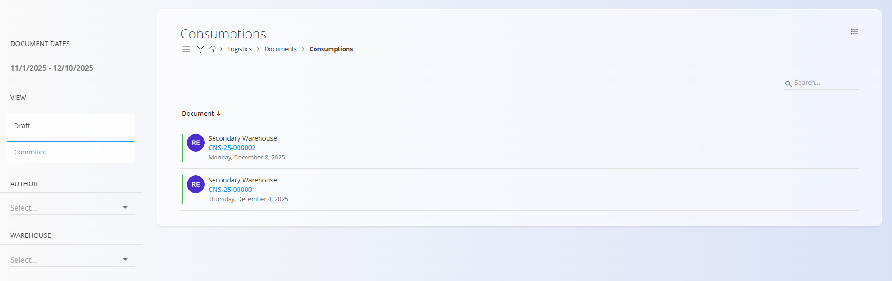

<!-- app_route: /production/documents/consumptions --> 
<!-- app_label: Consumptions --> 
<!-- canonical_source_url: https://github.com/Tom-PIT/Connected.Docs/blob/main/en/Domains/Logistics/Documents/Consumptions.md --> 
<!-- canonical_source_title: Consumptions -->

# Consumptions

A **Consumption** document records materials that were consumed during the execution of a **Production order**. Consumption documents are created automatically from the [**Execution**](../../Production/Documents/Execution.md) module when a production worker records material consumption. They reduce stock for the consumed materials and provide traceability of what was used. 

For the production-side entry of consumed materials, see **[Consumed](../../Production/Documents/Consumed.md)** — the two are closely linked: recording consumed material in production creates the corresponding consumption document in logistics.

To access this page, go to **Logistics / Documents / Consumptions** in the [navigation](../../../Common/UI/Navigation.md).

## Schema

<strong>Document</strong>

| Field | Description |
|-------|-------------|
| [**Code**](../../../Common/UI/DocumentCodes.md) | Unique identifier of the consumption document (system-generated). |
| **Created** | Timestamp when the document was created. |
| [**Warehouse**](../Management/Warehouses.md) | Warehouse where the consumed materials were taken from. |

<strong>Details</strong>

| Field | Description |
|-------|-------------|
| [**Material**](../../Assets/Materials.md) | Consumed material ([product](../../Assets/Materials/Products.md), [semi product](../../Assets/Materials/SemiProducts.md), [raw material](../../Assets/Materials/RawMaterials.md), or [repro material](../../Assets/Materials/ReproMaterials.md)). |
| **Source** | Source identifier of the consumed item (for example, a serial number or packaging code, depending on the material tracking method). |
| **Quantity** | Consumed quantity recorded for the material line. |

## List of consumption documents

The **Consumptions** page displays all consumption documents created through production execution. You can filter the list using:

- **Document dates**
- **View**
  - *Draft* — consumption in progress (still being recorded in execution)
  - *Committed* — finalized consumption document
- **Author**
- **Warehouse**

## Actions

Consumption documents are **not** created manually from this page (there is no [action button](../../../Common/UI/ActionButton.md)). They are created from the [**Execution**](../../Production/Documents/Execution.md) module while recording consumption for a production order. See **[Consumed](../../Production/Documents/Consumed.md)** for the production entry that triggers these documents.

Workflow notes:
- When a production worker starts recording consumption, a **Draft** consumption document is created automatically.
- When the [**Execution**](../../Production/Documents/Execution.md) process is completed, the document moves to **Committed** and can be reviewed in the committed list.

## Review a consumption document

A consumption document contains:

### Linked documents
If the consumption was recorded for a production order, the **Linked documents** section shows a link to the related [**Production order**](../../Production/Documents/ProductionOrders.md) (if available).

### Document and Details
The **Details** section lists all consumed materials with their source and recorded quantities.

### Delete a consumption document

Consumption documents cannot be deleted from the system to ensure traceability of material usage in production, but they can be reversed as described above.

## Menu

The menu provides additional actions available on this page.

Available actions:

- **Create a new reversal**

For details about menu actions, see [**Menu actions**](../../../Common/Concepts/MenuActions.md).

