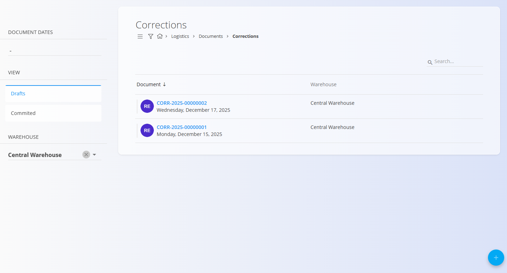

<!-- app_route: /warehouse/documents/corrections --> 
<!-- app_label: Corrections --> 
<!-- canonical_source_url: https://github.com/Tom-PIT/Connected.Docs/blob/main/en/Domains/Logistics/Documents/Corrections.md --> 
<!-- canonical_source_title: Corrections -->

# Corrections

Corrections are logistics documents used to adjust inventory when physical stock does not match system records (e.g., counting differences, wrong material, or labeling errors). Publishing a correction updates warehouse balances to reflect the actual quantities and properties of materials.

Use Corrections to:
- Increase or decrease on-hand quantity for specific serials or items
- Update attributes like best-before dates when mislabeled
- Fix location discrepancies after physical counts

> [!NOTE]
> Corrections affect inventory on publish: the system updates stock levels and attributes based on the entered differences.

To access **Corrections**, go to **Logistics / Documents / Corrections** in the [navigation](../../../Common/UI/Navigation.md).

## Schema

<strong>Document</strong>

| Field | Description |
|-------|-------------|
| [**Code**](../../../Common/UI/DocumentCodes.md) | Auto-generated document identifier. |
| **[Warehouse](../Management/Warehouses.md)** | Warehouse where the correction applies (mandatory). |
| **Document date** | Date of the correction document. |

<strong>Details</strong>

Each detail describes the material and the correction to apply.

| Field | Description |
|-------|-------------|
| **Material type** | Item category, e.g., [Products](../../Assets/Materials/Products.md), [Semi products](../../Assets/Materials/SemiProducts.md), [Raw materials](../../Assets/Materials/RawMaterials.md), [Repro materials](../../Assets/Materials/ReproMaterials.md). |
| **Material** | Selected item (e.g., Pine table) from the [Assets](../../Assets/Assets/Assets.md) catalog. |
| **Serial number** | Serial number to which the correction applies, if the material is serialized. |
| **Best before** | Best-before date, if applicable for perishable materials. |
| **Warehouse location** | Bin/shelf in the warehouse for precise placement. See [Locations](../Management/Locations.md). |
| **Quantity** | Quantity to correct (enter the final quantity or a delta, depending on configuration). |

## List of correction documents

The list shows existing Correction documents, with filters for date, warehouse, and status (Draft/Published). Use search to find by code or material.

## Actions

### Create a correction document

Create a Correction when the counted stock differs from system stock.

1. Go to **Logistics / Documents / Corrections**.
2. Use the [action button](../../../Common/UI/ActionButton.md) to create a draft Correction.

    

3. Fill the **Document** section.

4. Add items into the details section. Type or scan a **serial number**, **EAN**, or **material name** into the Details bar.  
   - The system displays **all matching materials and serial numbers**. If multiple matches exist, select the correct one from the list.
   - Edit the details section, change the **Material**. **Serial number** or **Quantity** as required.

   
 
5. Click **Save** the confirm added details. Repeat step 4 to add more items.

6. Click **Publish** to apply the corrections.

Publishing the correction updates inventory to reflect the new quantities and attributes. The correction document moves to the Committed view.

> [!IMPORTANT]
> On publish, inventory is adjusted: quantities increase/decrease to match the correction, and serial/location attributes are updated accordingly.

## Edit a correction document

1. Click the document **Code** to open it.
2. In **Draft** status, modify header and details as needed.
3. Use **Save** to confirm changes.

## Delete a correction document

- Draft correction documents can be deleted freely from the edit screen, using the **Delete** button. After confirmation, the document is removed from the system without affecting inventory.
- Published corrections cannot be deleted.

