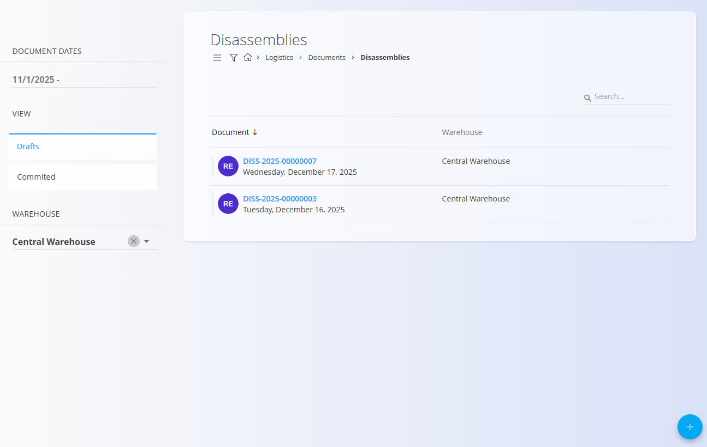

<!-- app_route: /warehouse/documents/disassemblies --> 
<!-- app_label: Disassemblies --> 
<!-- canonical_source_url: https://tom-pit.github.io/Connected.Docs/en/Domains/Logistics/Documents/Disassemblies/ --> 
<!-- canonical_source_title: Disassemblies -->

# Disassemblies

Disassemblies are logistics documents used to break down a [set (combined material)](../../Assets/Materials/Sets.md) into its individual components. They provide traceability, update stock correctly, and make the parts available for further use in production, supply, or sales.

Use a Disassembly when you receive or store sets (bundled materials) but need to consume or sell their components separately. Publishing a Disassembly reduces the set’s stock and increases the stock of its parts according to the structure defined on the set.

> [!TIP]
> For a full demonstration, see the **[Disassemblies](https://www.youtube.com/watch?v=0BWXVj_RUlY)** video tutorial.

> [!NOTE]
> - Disassembly affects inventory on publish: parts become available and the set quantity decreases accordingly.
> - In order to create a disassembly, we need to first define a set structure in the **[Sets](../../Assets/Materials/Sets.md)** code list.

To access **Disassemblies**, go to **Logistics / Documents / Disassemblies** in the [navigation](../../../Common/UI/Navigation.md).

### Example scenario

You receive furniture sets, for example a dining set (one table and four chairs) packaged as a single set. To use or sell the items individually, create a Disassembly for the dining set and publish it. The set quantity decreases, and the component parts (table and chairs) appear in stock, ready for picking.

## Schema

<strong>Document</strong>

| Field | Description |
|-------|-------------|
| [**Code**](../../../Common/UI/DocumentCodes.md) | Auto-generated document code. |
| **Document date** | Date of the disassembly document. |
| [**Warehouse**](../Management/Warehouses.md) | Warehouse where disassembly occurs (mandatory). |
| **Details** | List of sets to be disassembled (mandatory). |

<strong>Details</strong>

| Field | Description |
|-------|-------------|
| **[Set](../../Assets/Materials/Sets.md) (material)** | The combined material (e.g., a furniture set) you are disassembling (required). |
| **Quantity** | How many sets to disassemble (required). |
| **Serial number** | Item serial number, if applicable. |
| **Best before** | Best before date for perishable sets/components, if applicable. |
| **Warehouse location** | Bin/shelf used during disassembly or where parts are placed. See [Locations](../Management/Locations.md). |

### List of disassembly documents

The Disassemblies list shows existing documents with status indicators (Draft/Published). A search bar and filters help locate records by warehouse, date, or code.

## Actions

### Create a disassembly document

Create a Disassembly to split sets into their parts.

1. Go to **Logistics / Documents / Disassemblies**.
2. Use the action button to create a draft Disassembly.

    

3. Fill the **Document** section.

4. Add items into the details section. Type or scan a **serial number**, **EAN**, or **material name** into the Details bar.  
   - The system displays **all matching materials and serial numbers**. If multiple matches exist, select the correct one from the list.
   
   

   - Enter the **Quantity** of sets to disassemble.

    

 
5. Click **Save** the confirm added details. Repeat step 4 to add more items.
   - After saving a detail, click the arrow to expand and see the list of parts that will be disassembled, with their calculated quantities. 

   

6. Click **Publish** to commit the disassembly. The document is available for review in the committed list.

> [!IMPORTANT]
> On publish, stock is updated: the set disappears (decreases by the disassembled quantity) and parts become available (increase according to the set structure). Locations are respected if provided.

### Alternative creation path (from Receives)

If you already published a **[Receive](Receives.md)**, you can create a disassembly directly from it:
- Open the committed Receive.
- Use **Document connections → + Disassemble**.

This creates a Disassembly draft prefilled from the received packages, useful to record disassemblies directly at receipt.

### Edit a disassembly document

1. Click a document **Code** to open it.
2. In **Draft** status, you can modify header fields and details.
3. Use **Save** to confirm changes.

### Delete a disassembly document

- Draft disassemblies can be deleted freely from the edit screen, using the **Delete** button. After confirmation, the document is removed from the system without affecting inventory.
- Published disassemblies cannot be deleted.

## Menu

The menu provides additional actions available on this page.

Available actions:

- **Print received serial number labels**

For details about menu actions, see [**Menu actions**](../../../Common/Concepts/MenuActions.md).

