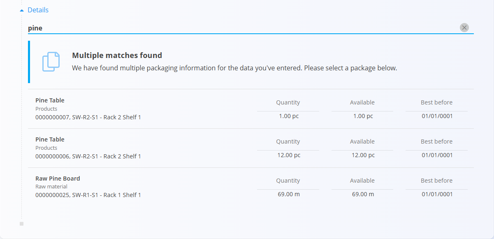

<!-- app_route: /warehouse/documents/loans --> 
<!-- app_label: Loans --> 
<!-- canonical_source_url: https://github.com/Tom-PIT/Connected.Docs/blob/main/en/Domains/Logistics/Documents/Loans.md --> 
<!-- canonical_source_title: Loans -->

# Loans

A **Loan** document is used to record items that are temporarily lent out—for example, equipment lent to a customer, tools used off-site, or products provided for evaluation.  
When items are loaned, they become **reserved** and unavailable for other operations until the loan is reversed (returned).

> [!TIP]  
> For a full demonstration, see the **[Loans](https://www.youtube.com/watch?v=V0QfOaBJ4Rk)** video tutorial.

To access Loans, go to **Logistics / Documents / Loans** in the [navigation](../../../Common/UI/Navigation.md).

## Schema

  
<strong>Document</strong>

| Field | Description |
|-------|-------------|
| [**Code**](../../../Common/UI/DocumentCodes.md) | System-generated unique identifier for the loan document. |
| **Document date** | Date when the loan is created. |
| [**Warehouse**](../Management/Warehouses.md) | Warehouse from which the item is loaned (mandatory). |
| **Contact** | Customer or partner receiving the item, selected from the [Business directory](../../../Common/Management/BusinessDirectory.md) (mandatory). |
| **Notes** | Optional remarks related to the loan. |

  
<strong>Details</strong>

| Field | Description |
|-------|-------------|
| [**Material**](../../Assets/Materials.md) | Item being loaned (product, raw material, semi product, etc.). |
| **Serial number** | Selected serial number for serialized items. |
| **Best before** | Expiration date if applicable. |
| [**Warehouse location**](../Management/Locations.md) | Storage location from which the item is taken. |
| **Quantity (pc)** | Quantity being loaned. Must be edited before saving. |

## List of loan documents

The Loans page displays all loan documents. You can search for a specific document using the search bar or narrow the list with the left-side filters:

- **Document dates**
- **View:**  
  - *Drafts* — documents not yet published  
  - *Committed* — published and finalized documents  
- **Author**
- **Warehouse**

A color indicator shows status:  
- **Green** — committed  
- **Gray** — draft

Click any loan to open and review its details.

## Actions

### Create a new loan

1. Click the [action button](../../../Common/UI/ActionButton.md) and start a new loan draft. Select the **Warehouse** and **Contact**.

   

2. In the **Details** section, type or scan a **serial number**, **EAN**, or **material name**.

   The system displays:
   - **Exact matches**
   - **All items matching your input**
   - If multiple matches exist, a **selection list** appears:

   

3. Choose the correct item.  
   The system fills in known information (material, serial number, location).

4. Enter the **quantity** you want to loan.  
   Quantity must be edited in the detail form:

   

   For information about working with document details, see [**Document details**](../../../Common/Concepts/DocumentDetails.md).

5. Click **Save** to add the detail.  
   Repeat the process to add additional loaned items.

6. Click **Publish** to commit the document.  
   When a loan is published, it moves to the **Committed** status and can be reviewed in the *Committed* list.

Once published, items in the loan become **reserved** and unavailable for other processes.

## Return a loan (reversal)

When the customer returns the loaned items, create a **reversal** from the document menu.

At the top-right, open the **menu (hamburger icon)** and select **Create a new reversal**.

This opens a reversal document that returns the items back to stock. For more details see **[Reversals](Reversals.md)**.

For details about menu actions, see [**Menu actions**](../../../Common/Concepts/MenuActions.md).

## Edit a loan document

Click on the document code in the main list to open it. When you open a loan document:

- The **Document** section displays header information  
- The **Details** list shows all loaned items  
- Draft documents can be edited  
- Committed documents are read-only except for reversal creation  
- Printing and exporting are available from the menu

## Delete a loan document

Draft loan documents can be deleted **only if no material lines remain**.

To delete:

1. Open each detail line  
2. Click **Delete** inside the Edit detail screen  
3. Once all details are removed, use **Delete** on the document header

> [!NOTE]  
> Committed loans **cannot** be deleted — only **reversed**.

