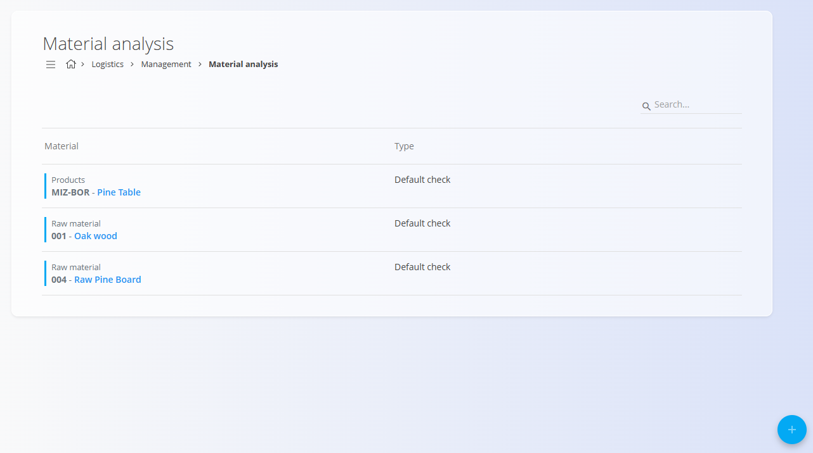
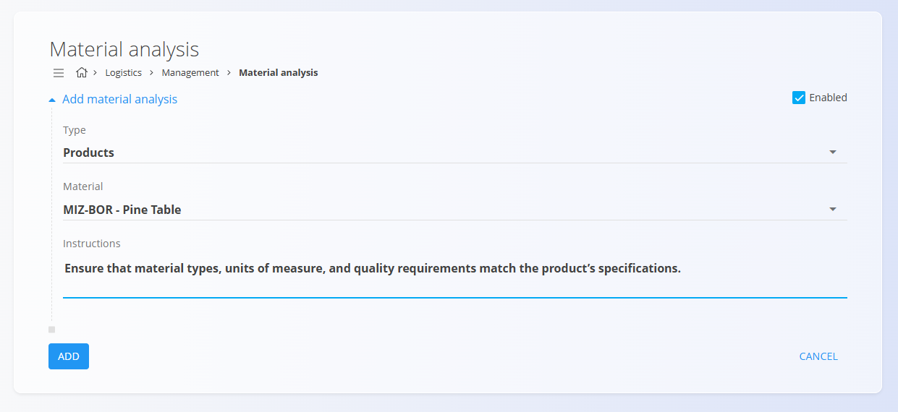

<!-- app_route: /management/warehouse/material-analysis -->
<!-- app_label: Material analysis management -->
<!-- canonical_source_url: https://github.com/Tom-PIT/Connected.Docs/blob/main/en/Domains/Logistics/Management/MaterialAnalysisManagement.md -->
<!-- canonical_source_title: Material analysis management -->

# Material analysis management

Define the analyses or tests that can be performed on materials (e.g., chemical, visual, dimensional checks). These entries are reused wherever a material analysis must be selected.

> [!NOTE]
> New records are enabled by default so they can be used immediately.

> [!TIP]
> For a full demonstration, see the **[Material analysis management](https://www.youtube.com/watch?v=AgCVA8labrw)** video tutorial.

To access **Material analysis management**, go to **Logistics / Management / Material analysis** in the [navigation](../../../Common/UI/Navigation.md).

## Schema

| Field | Description |
|-------|-------------|
| **Type** | Type of material (product, semi product, raw or repro material) (mandatory). |
| **[Materials](../../Assets/Materials/README.md)** | The specific material that the analysis applies to (mandatory). |
| **Instructions** | Procedure and acceptance criteria for performing the analysis (mandatory). |
| **Enabled** | Whether the analysis is available for selection. Checked by default. |

## List view

The list shows all defined analyses with their Type, Material, and Enabled status. Use the search to filter by type or material.

Each record includes a status indicator to the left of its name:
- **Blue** indicates the analysis is active
- **Gray** indicates the analysis is inactive

## Actions

1. Click the [action button](../../../Common/UI/ActionButton.md) to add a new analysis.

   

2. Fill in the form:
   - **Type** – choose the analysis category.
   - **Material** – select the target material.
   - **Instructions** – describe how to execute and evaluate the analysis.
   - **Enabled** – leave checked to make it available immediately.

3. Click **Add** to save or **Cancel** to return to the list.

## Editing

Click an entry in the list to open it in edit mode. Update fields and click **Save**, or **Cancel** to discard changes.

## Deletion

Click **Delete** on the edit screen to remove an analysis.
