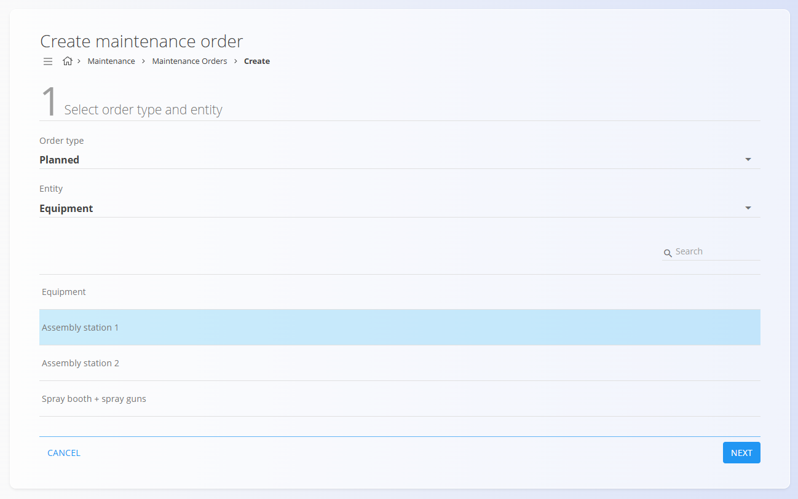
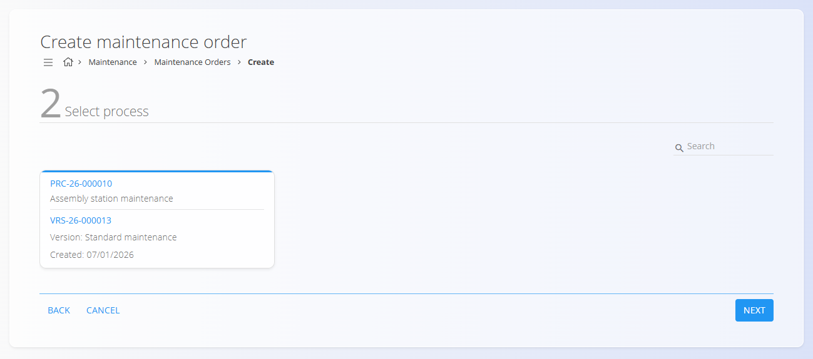
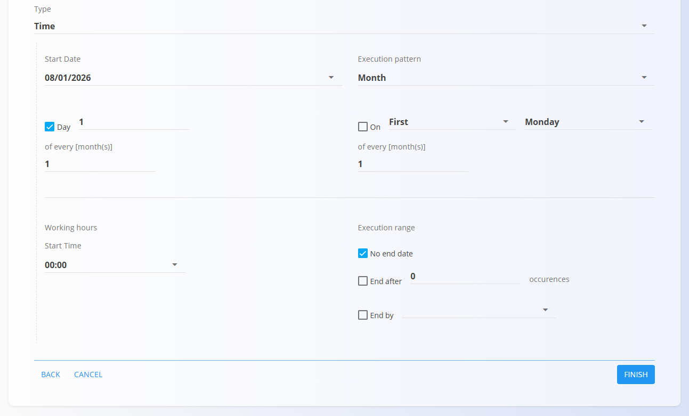

<!-- app_route: /maintenance-orders/create -->
<!-- app_label: Create a new maintenance order -->
<!-- canonical_source_url: https://tom-pit.github.io/Connected.Docs/en/Domains/Maintenance/Documents/MaintenanceOrderCreate/ -->
<!-- canonical_source_title: Create a new maintenance order -->

# How to create a new maintenance order

Click the [action button](../../../Common/UI/ActionButton.md) to create a new maintenance order.

The creation wizard consists of **three steps**, similar to production orders.

## Configuration steps

### Step 1 — Select order type and entity

Select as **Entity** the equipment to be maintained

> [!NOTE]
> When creating a maintenance order manually, the order type is always **Planned**.
>
> **Curative** maintenance orders are created from **reported malfunctions**.

Then choose the specific equipment from the list.

### Step 2 — Select process

- Select the **maintenance [process](../../Production/Management/Processes.md)** 
- Select the **process version** that defines the maintenance operations.

> [!NOTE]
> If no processes are available in this step, verify that:
> - The process has the **Maintenance** tag assigned
> - **Non-human resources** are defined and assigned in the process operations
> - The process has at least one **active version**

### Step 3 — Create schedule

Define how and when the maintenance order should be executed. Two scheduling modes are available:

- **Time** — Schedule maintenance for a specific date or recurring interval

  

- **Count** — Schedule maintenance based on usage or counters

  

> [!NOTE]
> Usage-based schedules rely on resource and equipment counters (e.g., pieces, meters, grams, hours). For configuring counters, see **[Resource work hours & counters](ResourceWorkHours&Counters.md)**.

If a **recurring execution pattern** is selected (for example *Monthly*, *Every X days*, or *Yearly*), a **maintenance schedule** is created automatically.  
This schedule will generate maintenance orders according to the defined pattern.

Click **Finish** to create the maintenance order in **Pending** state.