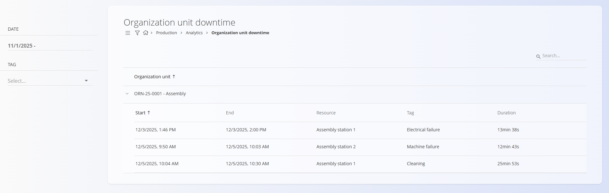

<!-- app_route: /production/analytics/organization-unit-downtime -->
<!-- app_label: Organization unit downtime -->
<!-- canonical_source_url: https://tom-pit.github.io/Connected.Docs/en/Domains/Production/Analytics/OrganizationUnitDowntime/ -->
<!-- canonical_source_title: Organization unit downtime -->

# Organization unit downtime

The **Organization unit downtime** page provides a detailed list of all downtime events recorded within selected organizational units. It allows supervisors and planners to review when downtime started and ended, which resource was affected, the downtime classification tag, and the total duration.

To access this page, go to **Production / Analytics / Organization unit downtime** in the [navigation](../../../Common/UI/Navigation.md).

## Filters

Use the filters on the left to refine the results:

- **Date** — Select a date or date range for which downtime events should be displayed.  
- **Tag** — Filter events by downtime classification tag (see [Downtime tags](../Management/DowntimeTags.md)).

## Downtime overview

The main table displays downtime grouped by **Organization unit**.

For each downtime entry, the following information is shown:

- **Start** — Timestamp when the downtime began  
- **End** — Timestamp when the downtime ended  
- **Resource** — The affected non human resource or workstation  
- **Tag** — Downtime classification (e.g., electrical failure, machine failure, cleaning)  
- **Duration** — Total downtime duration automatically calculated by the system  

Downtime entries within each organization unit can be expanded or collapsed for easier navigation.

## Usage notes

- Only downtime events recorded through the *Execution* module are shown here.  
- Use tags to quickly identify recurring issues and support root-cause analysis.  
- Durations are automatically calculated based on start and end times.

