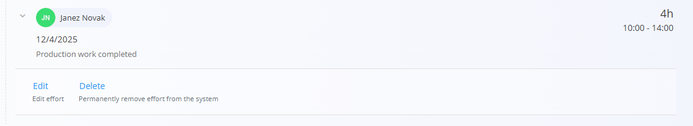

<!-- app_route: /production-orders/execution -->
<!-- app_label: Execution -->
<!-- app_navigation_hint: In Execution, tap the action button and select Effort. -->
<!-- canonical_source_url: https://tom-pit.github.io/Connected.Docs/en/Domains/Production/Documents/Effort/ -->
<!-- canonical_source_title: Effort -->

# Effort

The **Effort** activity records working time spent on an operation. Use it to track operator time either automatically (Start/Stop) or manually (entering times or duration).

Open **Effort** from the [**Execution**](Execution.md) screen via the activity selection menu (tap the [action button](../../../Common/UI/ActionButton.md), then choose **Effort**).

## Record effort

1. Open the **Effort** page from the [**Execution action menu**](Execution.md#action-menu-and-activities).  
2. Choose one of the methods below and record time.  
3. Click **Add effort** to save.  
4. Repeat as needed.

### Automatic (Start/Stop)

- Tap **Start** to begin tracking.  
- Work on the operation.  
- Tap **Stop** to end tracking.  

This records the time interval automatically.

### Manual entry

Enter the details directly:

- Date  
- Start and End time or total Duration  
- Tags (optional)  
- Description (optional)  

Click **Add effort** to save the record.

## Edit effort entries

Recorded efforts appear in a list below the form.

- Select an entry to edit its times, duration, tags, or description.  
- Delete an entry if added by mistake.  

> [!NOTE]
> The **Stop** button inside the Effort page finishes the effort’s time tracking only; it does not finish the [execution](Execution.md).

