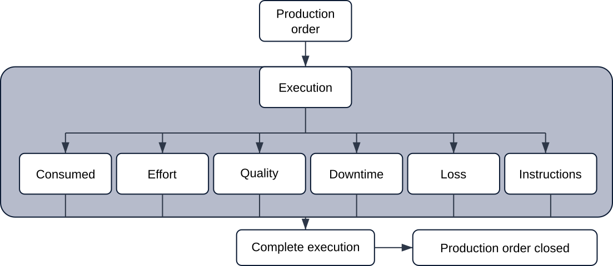
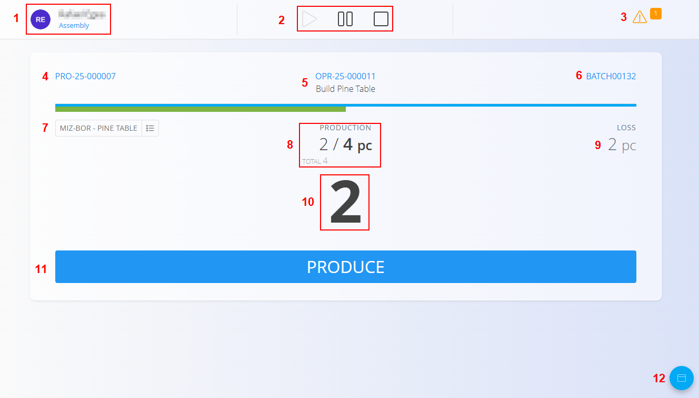
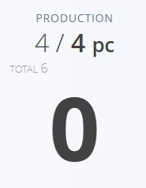

<!-- app_route: /production-orders/execution -->
<!-- app_label: Execution -->
<!-- canonical_source_url: https://tom-pit.github.io/Connected.Docs/en/Domains/Production/Documents/Execution/ -->
<!-- canonical_source_title: Execution -->

# Execution

The **Execution** module is used by production workers to perform and record work on assigned production orders. It provides real-time tracking of progress, produced quantities, [downtime](Downtime.md), [losses](Loss.md), [quality checklists](Quality.md), and other activities.

Most production workers are automatically redirected to the **Execution** view upon login.

> [!TIP]
> For a full demonstration, see the **[Executions](https://www.youtube.com/watch?v=qf0Ftar4hAg&list=PLH4LYaWds6h8kspUco0t_MaFPNbL0zj1D&index=28)** video tutorial.

To access this page manually, go to **Production / Execution** in the [navigation](../../../Common/UI/Navigation.md).

> [!NOTE]
> - The screen usually shows any assigned production orders automatically when opened. If none appear, click **Select production orders** to choose one.
>   
>   
> - If the production order list is empty, there are no available orders for the selected unit (not created yet or no active operations). Create orders in [**Production orders**](ProductionOrders.md) and ensure an operation is assigned to the chosen unit.
> - If the organization unit list is empty, the code list is not defined yet. Define units in [**Organization Units**](../Management/OrganizationUnits.md).

## Execution interface overview

The main execution screen shows key information for the current production order and operation.

| No. | Description |
|-----|-------------|
| **1** | Logged-in user and **organization unit**.  • Click user image → logout  • Click organization unit → change it (see [**Organization Units**](../Management/OrganizationUnits.md)) |
| **2** | Operation control buttons:  • **Start** – begins the operation  • **Pause** – temporarily suspends work  • **Stop** – completes the operation |
| **3** | Shortcuts:  • **Yellow bin** – record defective items  • **Orange triangle** – view open bottlenecks or issues |
| **4** | Current production order |
| **5** | Current operation |
| **6** | Batch / lot information |
| **7** | Current output of the operation and label printing |
| **8** | Production progress (produced / planned) |
| **9** | Current recorded losses |
| **10** | Quantity remaining to complete the production task (editable) |
| **11** | **Produce** button — records produced quantity |
| **12** | Activity (action) button leading to the activity selection page |

### Operation controls

## Execution process 

### Start production

You can start an operation in two ways:

#### **1. Press Start**

Click **Start** to begin the operation.

#### **2. Press Produce (starts automatically)**

If you press **Produce**, the system:

- Starts the operation automatically  
- Records the quantity shown above the button  
- Updates the remaining quantity
- If the default number equals the planned quantity and you do not change it, the system records **all remaining pieces as produced**.
  
  

### Pause production

Press **Pause** to temporarily stop the operation. This does **not** finish production — it only pauses it until resumed.

### Checklists and quality controls

Quality [**checklists**](../../Quality/Management/Checklists.md) help ensure safety and product quality. If a checklist is required for the operation, it appears automatically at the right moment (at start, during execution, or before completion).

Workers confirm each step as defined in the checklist.

> [!NOTE]
> If you try to stop the operation while a required checklist is incomplete, the system will ask you to complete it first.

## Action menu and activities

The floating [action button](../../../Common/UI/ActionButton.md) in the bottom-right corner opens the activity selection menu.

From here, you can choose:

- **Produced** – open the main execution screen  
- **[Consumed](Consumed.md)** – record input consumption
- **[Loss](Loss.md)** – record defective or unusable items  
- **[Downtime](Downtime.md)** – record time losses and interruptions  
- **[Quality](Quality.md)** – review and complete quality checklists  
- **[Effort](Effort.md)** – record working time  
- **[Instructions](Instructions.md)** – view operation instructions  

Each option is described below.

### Produced (main production screen)

The **Produced** option returns to the main execution screen where production items are recorded.

### Consumed

Record input consumption for the current operation. See [**Consumed**](Consumed.md) for a full, step-by-step guide and validations.

### Loss

Record defective or unusable items for the current operation. See [**Loss**](Loss.md) for a detailed guide.

### Downtime

Record interruptions during production. See [**Downtime**](Downtime.md) for a detailed guide.

### Quality

Review and repeat quality checklists as needed. See [**Quality**](Quality.md) for a detailed guide on checklist usage, status, and repetition.

### Effort

Record working time for the operation. See [**Effort**](Effort.md) for detailed methods (automatic Start/Stop or manual entry) and editing tips.

### Instructions

View operation instructions linked to the current operation. See [**Instructions**](Instructions.md) for a detailed guide.

## Complete execution

Press **Stop** to complete the current operation.

Before completing the operation, ensure that:

- All required quantities are produced
- All losses and downtimes are recorded
- All quality checkpoints are completed

Once the operation is completed, it is marked as **Finished**.

If the operation is stopped before the planned quantity is produced, it is completed with partial production.

When all operations in the production order are completed, the production order moves to the **Closed** status.

### Card-based effort registration

Some execution stations may include a **card registration panel** that allows workers to register or unregister themselves on the current operation by scanning an employee card.

When a card is scanned:

* If the worker is not currently registered on the operation, the system starts a new effort record.
* If the worker already has an active effort record on the operation, the system stops the effort record.

> [!IMPORTANT]
> Only the worker's effort time is affected. Scanning a card does **not**:
>
> * Start or stop the operation
> * Change the operation status
> * Pause the operation
> * Complete the operation

The operation remains controlled through the normal **Start**, **Pause**, and **Stop** buttons.

### Typical usage

A shift leader starts the operation and logs into the execution screen.

As workers arrive at the workstation, they scan their cards to start recording effort time on the current operation. When they leave the workstation, they scan their cards again to stop recording effort time.

Multiple workers can register effort time against the same operation independently.

