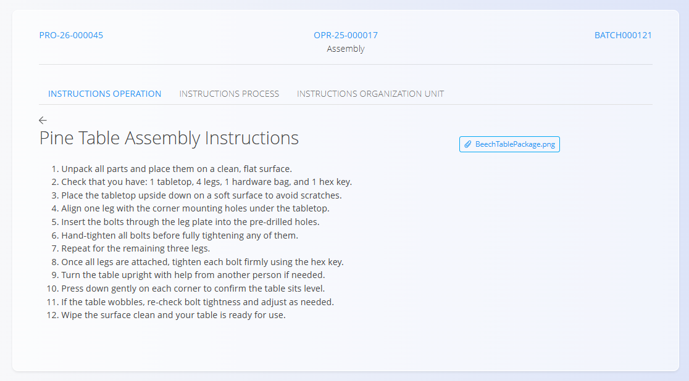
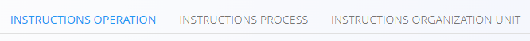

<!-- app_route: /production-orders/execution -->
<!-- app_label: Execution -->
<!-- app_navigation_hint: In Execution, tap the action button and select Instructions. -->
<!-- canonical_source_url: https://github.com/Tom-PIT/Connected.Docs/blob/main/en/Domains/Production/Documents/Instructions.md -->
<!-- canonical_source_title: Instructions -->

# Instructions

The **Instructions** activity displays knowledge base articles associated with the current operation, process, or organizational unit. Use it to quickly review guidance while working.

Open **Instructions** from the [**Execution**](Execution.md) screen via the activity selection menu (tap the [action button](../../../Common/UI/ActionButton.md), then choose **Instructions**).

## View instructions

1. Open the **Instructions** page from the [**Execution action menu**](Execution.md#action-menu-and-activities).  

   

4. Read, zoom images, and follow the guidance.  
5. Return to the [**Execution**](Execution.md) screen via Action button → Produced when done. 

## Types of instructions

Different types of instructions are available through separate tabs:

- **Instructions operation** – instructions specific to the current operation, such as work steps, machine settings, or operation-specific requirements.
- **Instructions process** – instructions that apply to the entire production process.
- **Instructions organization unit** – instructions associated with the organizational unit where the operation is being performed.

Each instruction type is managed independently and can contain different articles from the [**Knowledge base**](../../Knowledge/KnowledgeBase/KnowledgeBase.md).

## Typical content

Instruction articles may include:

- Assembly steps
- Safety procedures and warnings  
- Visual guidelines (photos, drawings)  
- Notes specific to the operation or product  

> [!NOTE]
> Articles themselves can be updated by authorized staff in the [**Knowledge base** domain](../../Knowledge/KnowledgeBase/KnowledgeBase.md).

## Edit and update instructions

Instruction content can be managed at the operation, process, or organizational unit level.

To update instructions, link the appropriate articles from the [**Knowledge base**](../../Knowledge/KnowledgeBase/KnowledgeBase.md) in the configuration of the [operation](../Management/Operations.md), [process](../Management/Processes.md), or [organizational unit](../Management/OrganizationUnits.md).

