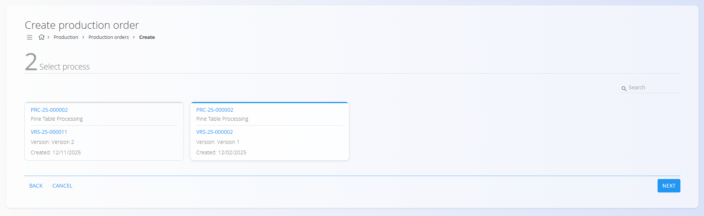
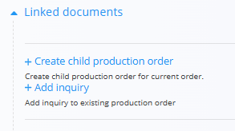
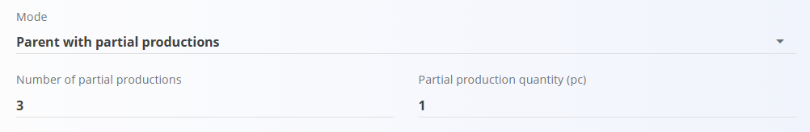

<!-- app_route: /production-orders/create -->
<!-- app_label: Create a new production order -->
<!-- canonical_source_url: https://tom-pit.github.io/Connected.Docs/en/Domains/Production/Documents/ProductionOrderCreate/ -->
<!-- canonical_source_title: Create a new production order -->

# How to create a new production order

To create a new production order, click the [action button](../../../Common/UI/ActionButton.md) on the [**Production orders**](ProductionOrders.md) page and follow the guided three-step wizard:

## Configuration steps

### **Step 1 — Select material**

Choose the **Material type** (e.g., Products or Semi products), then select the specific [**material**](../../Assets/Materials/README.md) and quantity to be manufactured.

### **Step 2 — Select process**

Choose the **[Process](../Management/Processes.md)** and **Process version** that defines how the material will be produced.

> [!NOTE]
> If no processes are listed in this step, verify configuration in the **[Processes](../Management/Processes.md)** code list. Ensure the process includes the “Production” tag and has an active version. Missing the tag is a common reason the process does not appear here.

### **Step 3 — Provide additional information**

This step defines scheduling and order type.

#### **Production order mode**

Determines how the production order will behave:

- **Standard** — Creates a single production order for the total quantity.
- **Parent** — Creates a parent (master) order that acts only as a container for subordinate orders. The parent order has **no operations** and is not executed. Child orders are created manually and can have different [process versions](../Management/Processes.md#versions) than the parent. To create a child order go to **Linked ducuments** →  **Create child production order**.

   

- **Parent with partial productions** — Creates a parent order and automatically generates several subordinate production orders that each produce part of the total quantity.  
  Two fields appear:
  - **Number of partial productions** — how many subordinate orders should be created  
  - **Partial production quantity** — automatically calculated based on the total quantity
- **Partial productions** — Automatically generates several production orders that each produce part of the total quantity, without creating a parent order. The same two fields appear as with the previous mode.

**Example:**  
If total quantity = **6 pieces**  
- 3 partial productions → each = **2 piece**  
- 2 partial productions → each = **3 pieces**

#### Dates

Specify scheduling details for [planning](../../Planning/Views/Planning.md) purposes (optional):
- **Deadline date** - the date by which production should be completed.
- **Planned start date** - when production is scheduled to begin.
- **Planned end date** - when production is scheduled to end, filled automatically based on the selected [process](../Management/Processes.md) and its timings.

Click **Finish** to create the **Draft** production order.