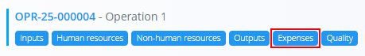
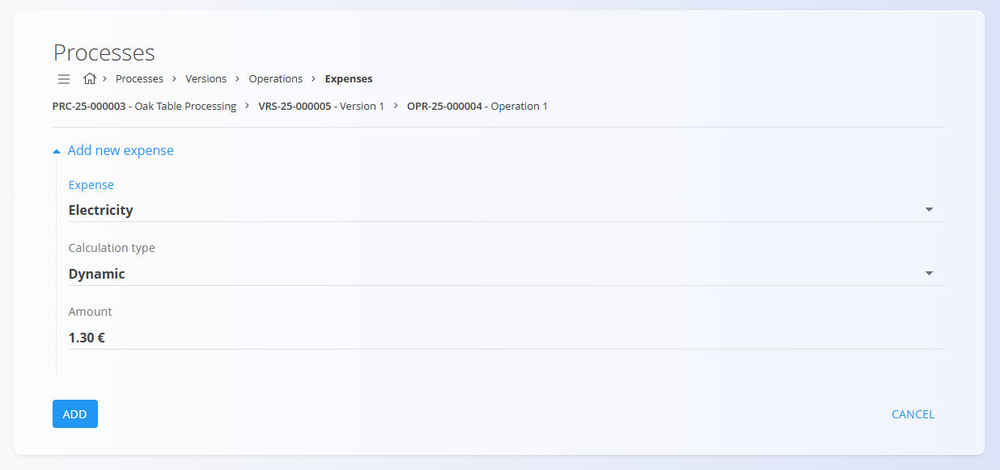

<!-- app_route: /management/processes -->
<!-- app_label: Processes -->
<!-- app_navigation_hint: Open a process, select a version, click Operations, then open Expenses for the relevant operation. -->
<!-- canonical_source_url: https://github.com/Tom-PIT/Connected.Docs/blob/main/en/Domains/Production/Management/OperationExpenses.md -->
<!-- canonical_source_title: Operation expenses -->

# Operation expenses

Expenses define additional **costs** applied to an **operation** within a process version. These costs contribute to the overall production cost calculation of the item.

To access this page, open a process version from **Production / Management / [Processes](Processes.md)**, click [**Operations**](Operations.md), then select **Expenses** for a specific operation.

## Schema

| Field | Description |
|-------|-------------|
| **Expense** | The type of cost applied (e.g. electricity, transport, etc.). |
| **Calculation type** | Defines how the cost is calculated: **Dynamic** or **Static**. |
| **Amount** | The monetary value of the expense. |

## List view

The list displays all expenses linked to the selected operation. Each row shows the expense name, calculation type, and amount.

## Add a new expense

1. Click the [action button](../../../Common/UI/ActionButton.md) in the bottom-right corner.
2. Fill in the required fields.

    

3. Click **Add** to save the expense.

## Edit an expense

1. Click an existing expense in the list.  
2. Modify any of the fields.  
3. Click **Save**.

## Delete an expense

Click an existing expense in the list and select **Delete**. 

If confirmed, it is removed from the operation.