# How to create a process

Processes define how materials, resources, operations, and quality controls are combined to perform a specific activity.

Processes are used throughout the system in both **Production** and **Maintenance**. They define the sequence of operations, required resources, consumed materials, produced outputs, and quality requirements that will later be used when creating production or maintenance orders.

This tutorial explains how to create a complete process, configure its version and operations, assign resources and materials, and prepare it for execution.

The example in this tutorial focuses on a **production process** for manufacturing an **Oak Wood Chair**, but the same principles apply when creating maintenance processes.

> [!NOTE]
> - This tutorial assumes that the required materials, resources, and quality checklists have already been created. For more information, see:
>    * [**Materials**](../../Assets/Materials/README.md)
>    * [**Resources**](../../Resources/Management/Resources.md)
>    * [**Quality Checklists**](../../Quality/Management/Checklists.md)
> - For more information on processes and their components, see the dedicated documents listed in the [**Next steps**](#next-steps) section at the end of this tutorial.

## Step 1: Create a new process

Open **Production / Management / Processes**.

1. Click the [action button](../../../Common/UI/ActionButton.md).

2. Select **New**.

3. Enter the following information:

   * **Name**
   * **Description**
   * **Tags**

4. Click **Add**.

The process is now created.

> [!IMPORTANT]
> Make sure the **Production** tag is assigned, otherwise the process will not be available when creating production orders.

### Example

* **Name**: *Oak Wood Chair*
* **Description**: *Production process for manufacturing oak wood chairs*
* **Tags**: *Production*

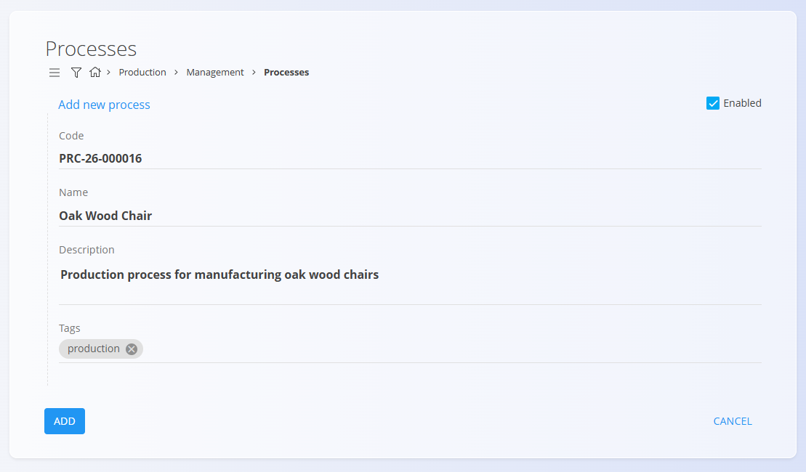

## Step 2: Create a process version

Each process can contain one or more versions.

For this example, create a version called **Standard version**.

1. In the **Processes** list, find the newly created process.

2. Click **Versions** under the process name.

   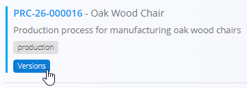

   A screen with all versions of the process is displayed. Since this is a new process, the list is initially empty.

3. Click the [action button](../../../Common/UI/ActionButton.md).

4. Enter:

   * **Name**
   * **Description**
   * **Article (optional)**: Use this field to link the process to a specific [knowledge base article](../../Knowledge/KnowledgeBase/KnowledgeBase.md), e.g. assembly instructions.

5. Click **Add**.

The version is now ready to be configured.

### Example

* **Name**: *Standard version*
* **Description**: *Standard oak chair production process*

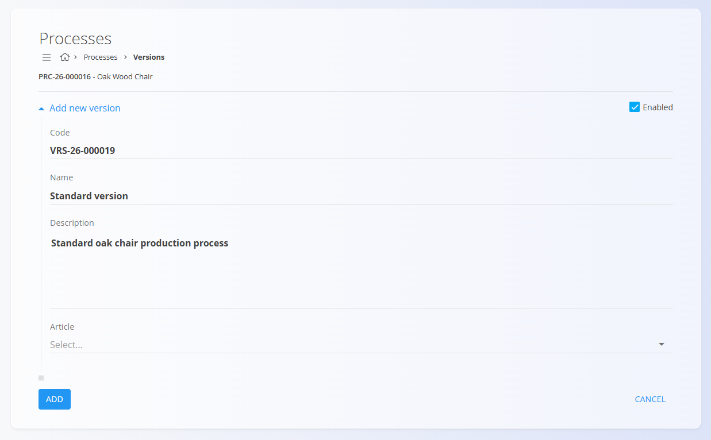

## Step 3: Add operations

Operations define the individual steps that make up a process version.

To add operations:

1. Go back to the process version list.

2. Click **Operations** under the newly created version.

   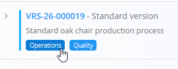

   The operations list is displayed. Since this is a new version, the list is initially empty.

3. Click the [action button](../../../Common/UI/ActionButton.md) and select **New**.

4. Enter the operation information:

   * **Name**
   * **Description** (optional)
   * **Ordinal**
   * **Start condition**
   * **Activation sub-status**
   * **Default organization unit**
   * **Article** (optional)

5. Click **Add**.

6. Repeat until all required operations have been created.

The operations are displayed in the order defined by the **Ordinal** field.

### Example

For this example we created the following operations:

| Ordinal | Operation        |
| ------- | ---------------- |
| 0       | Cut components   |
| 1       | Assemble chair   |
| 2       | Sand surfaces    |
| 3       | Final inspection |
| 4       | Packaging        |

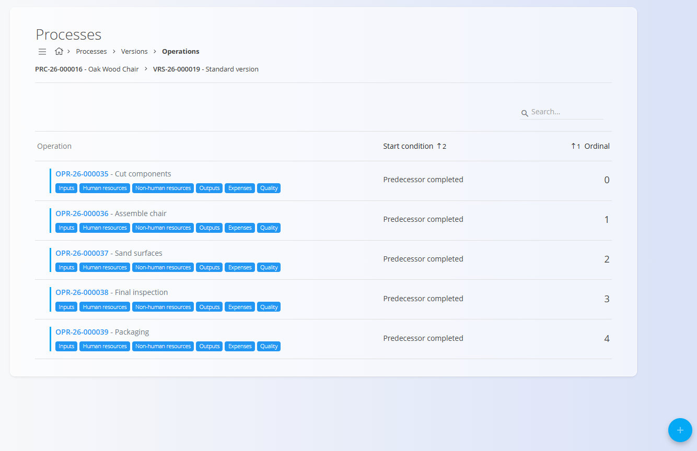

## Step 4: Configure operation inputs

Inputs define the materials or items consumed by an operation.

To add inputs:

1. On the operation list screen, find the operation you want to configure.
2. Click **Inputs** under the operation name. A list of all inputs for that operation is displayed. Since this is a new operation, the list is initially empty.
3. Click the [action button](../../../Common/UI/ActionButton.md) and select **New**.
4. Select the required material.
5. Define the quantity to be consumed.
6. Click **Add**.

Repeat for all required materials.

### Example

For the **Cut components** operation, we will add:

* *Raw oak board*
* *Oak wood*

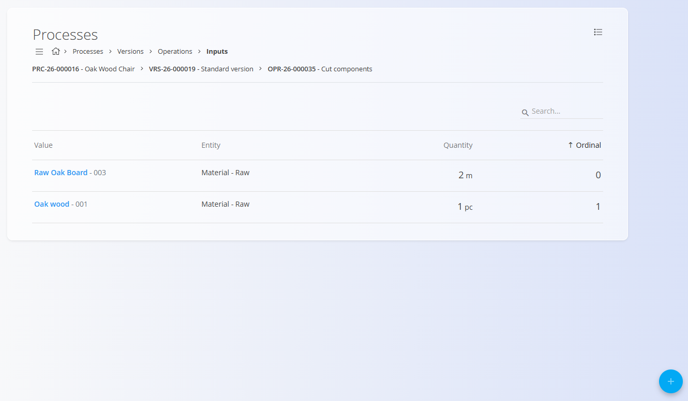

## Step 5: Configure resources

Resources define the people and equipment required to perform an operation. To add resources go to the operation list screen and find the operation you want to configure.

### Human resources

To add human resources:

1. Click **Human resources** under the operation name. A list of all human resources for that operation is displayed. Since this is a new operation, the list is initially empty.
2. Click the [action button](../../../Common/UI/ActionButton.md) and select **New**.
3. Select the required resource type and resource. Add the estimated time required for the operation
4. Click **Add**.

### Non-human resources

To add non-human resources:

1. Click **Non-human resources** under the operation name. A list of all non-human resources for that operation is displayed. Since this is a new operation, the list is initially empty.
2. Click the [action button](../../../Common/UI/ActionButton.md) and select **New**.
3. Select the required resource type and resource. Add the estimated time required for the operation.
4. Click **Add**.

### Example

For the **Assemble chair** operation:

Human resources:

* *Operator*

Non-human resources:

* *Assembly station 1*

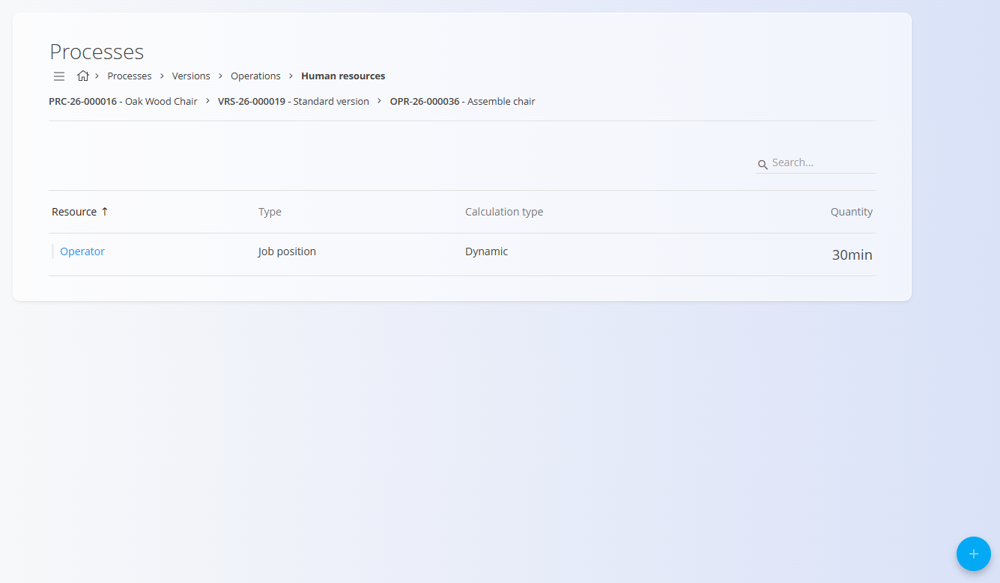

## Step 6: Configure outputs

Outputs define the items produced by an operation.

To add outputs:

1. Select the operation you want to configure from the operations list.
2. Click **Outputs** under the operation name. A list of all outputs for that operation is displayed. Since this is a new operation, the list is initially empty.
3. Click the [action button](../../../Common/UI/ActionButton.md) and select **New**.
4. Select the output material.
5. Define the produced quantity.
6. Click **Add**.

### Example

For the final operation, we will add:

* *Oak Wood Chair*

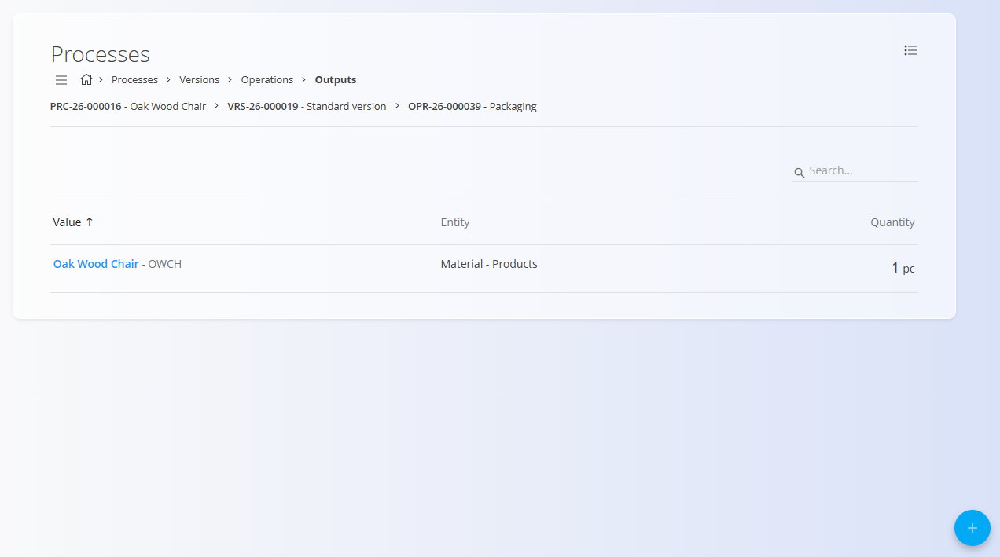

## Step 7: Add quality controls

Quality controls can be assigned either to the process version or to individual operations.

To assign quality controls:

1. Find the process version or operation you want to configure.
2. Click **Quality** under the operation name. A list of all quality controls for that operation is displayed. Since this is a new operation, the list is initially empty.
3. Click the [action button](../../../Common/UI/ActionButton.md).
4. Select the desired checklist and the execution mode.
5. Click **Add**.

### Example

For the **Final inspection** operation, assign:

* *Final product inspection*

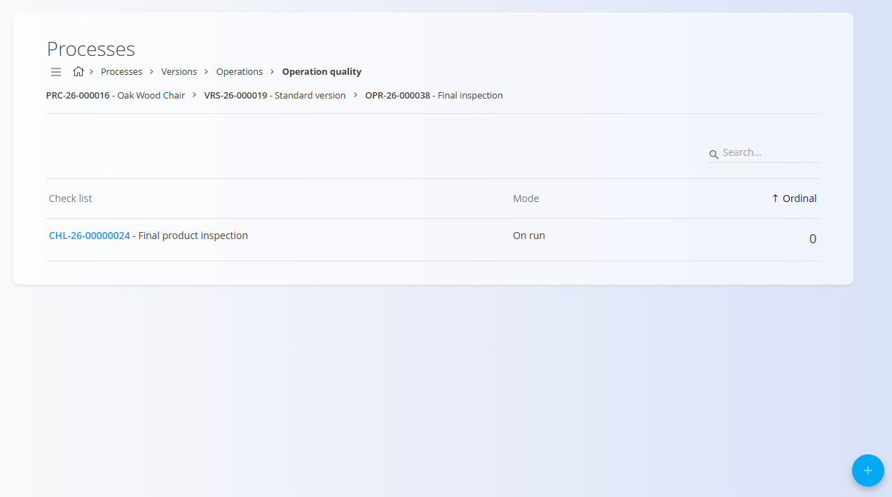

## Step 8: Calculate version costs

After materials, resources, outputs, and expenses have been configured, the estimated cost of the process version can be calculated.

1. Return to the **Versions** screen.
2. Click **Calculate** in the **Cost** column.

The system calculates the estimated cost based on:

* Material costs
* Human resource costs
* Non-human resource costs
* Additional expenses

### Example

Calculate the cost of producing one **Oak Wood Chair** using the **Standard version**.

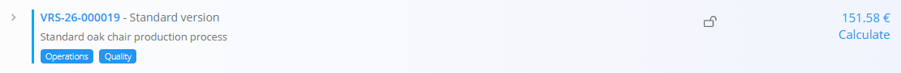

## Step 9: Use the process

The process is now ready to be used in operational documents.

Depending on the assigned tags, the process can be selected when creating:

* [Production orders](../Documents/ProductionOrders.md)
* [Maintenance orders](../../Maintenance/Documents/MaintenanceOrders.md)

### Example

Create a new production order and select:

* Process: Oak Wood Chair
* Version: Standard version

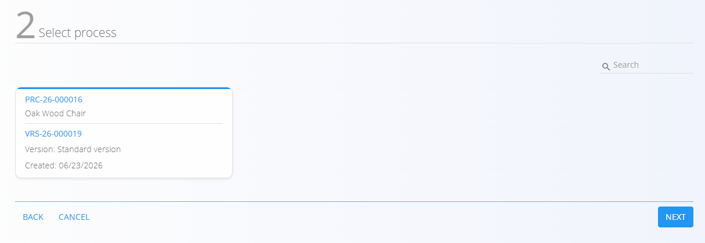

The system automatically generates the operations defined in the process version.

## Next steps

For detailed information about process configuration, see:

* [**Processes**](Processes.md)
* [**Operations**](Operations.md)
* [**Inputs**](Inputs.md)
* [**Outputs**](Outputs.md)
* [**Human resources**](HumanResources.md)
* [**Non-human resources**](NonHumanResources.md)
* [**Quality**](QualityChecklists.md)
