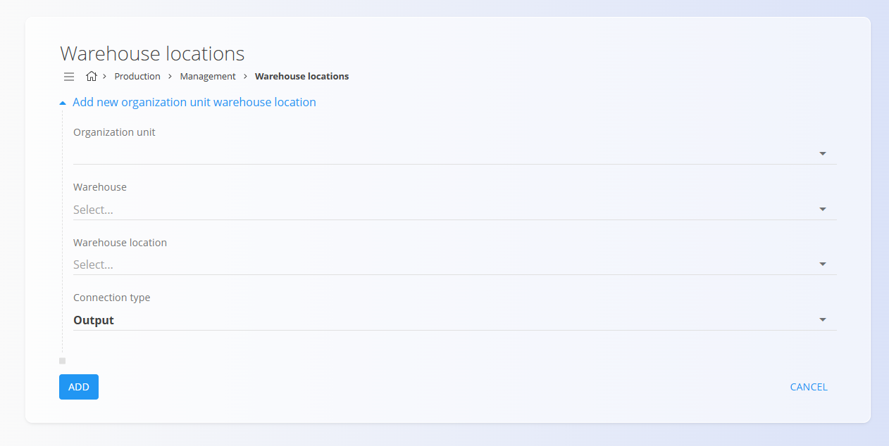

<!-- app_route: /management/organization-units/warehouse-locations -->
<!-- app_label: Warehouse locations -->
<!-- canonical_source_url: https://github.com/Tom-PIT/Connected.Docs/blob/main/en/Domains/Production/Management/WarehouseLocations.md -->
<!-- canonical_source_title: Warehouse locations -->

# Warehouse locations

The **Warehouse locations** list maps [organization units](OrganizationUnits.md) to physical warehouse locations so
production workflows can source materials and store produced items. Use this page to manage which
locations Production may use for input and output and to enforce connection rules between
organization units and warehouse locations.

To access Warehouse locations, go to **Production / Management / Warehouse locations** in the [navigation](../../../Common/UI/Navigation.md).

> [!TIP]
> For a full demonstration, see the **[Warehouse locations](https://www.youtube.com/watch?v=qR3o0CpIGpo)** video tutorial.

## Schema

| Field | Description |
|-------|-------------|
| [**Organization unit**](OrganizationUnits.md) | Reference to the Production organization unit (mandatory). |
| [**Warehouse**](../../Logistics/Management/Warehouses.md) | Warehouse where the physical location exists (mandatory). |
| [**Warehouse location**](../../Logistics/Management/Locations.md) | Physical location (aisle / rack / level / bin) (mandatory). |
| **Connection type** | Type of connection: **Input** or **Output** (mandatory). Determines how Production uses the location. |

## Management

Open this screen to view, add, edit and delete Production-specific warehouse locations for organization units.

### Warehouse locations list

The list displays the **Organization unit**, **Warehouse location** and **Connection type**. Use the
search box in the header to find records.

Click an **Organization unit** name to open the edit form for that record. 

## Actions

Click the [action button](../../../Common/UI/ActionButton.md) to show the following actions:
- **Import** 
- **New**.

### Import warehouse locations

Click the action button and select **Import** to bulk-create records.

### Create a new warehouse location
 
Click the action button and select **New** to create a new record.

Fill in the fields shown on the form:

- [**Organization unit**](OrganizationUnits.md)
- [**Warehouse**](../../Logistics/Management/Warehouses.md)
- [**Warehouse location**](../../Logistics/Management/Locations.md)
- **Connection type** — choose **Input** or **Output**

Click **Add** to save the record.

> [!NOTE]
> - A single [**Warehouse location**](../../Logistics/Management/Locations.md) cannot be assigned as both **Input** and **Output** for the same
  [**Organization unit**](OrganizationUnits.md). The UI prevents selecting the same location for both roles.  
> - Only one `**Output** connection is permitted per [**Organization unit**](OrganizationUnits.md). Adding a second
  **Output** for the same unit is blocked by validation.  
> - [**Organization unit**](OrganizationUnits.md), [**Warehouse**](../../Logistics/Management/Warehouses.md), and [**Warehouse location**](../../Logistics/Management/Locations.md) are sourced from their respective
  code lists; keep those lists in sync with Logistics and Common domains.

### Edit warehouse location

Click a warehouse location name in the list to open the edit form.

Validation prevents invalid combinations as described in the creation process.

## Delete a warehouse location

Click a warehouse location name in the list to open the edit page, then select **Delete**. After confirming the deletion, the record is removed from the Production Warehouse locations list.

> [!NOTE]  
> Deleting a record removes the mapping only from the Production configuration. The referenced [warehouse](../../Logistics/Management/Warehouses.md) and [warehouse location](../../Logistics/Management/Locations.md) remain intact in the Logistics domain and are not deleted.
