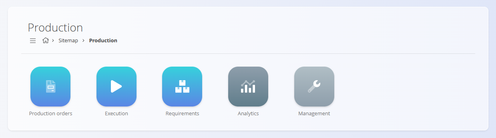
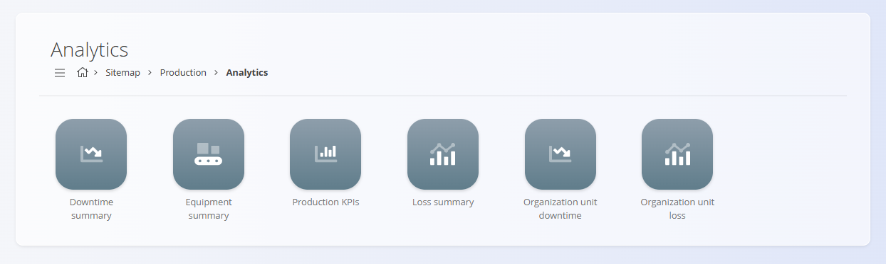

<!-- app_route: /sitemap/production -->
<!-- app_label: Production -->
<!-- canonical_source_url: https://github.com/Tom-PIT/Connected.Docs/blob/main/en/Domains/Production/README.md -->
<!-- canonical_source_title: Production -->

# Production

The **Production** domain manages all processes related to manufacturing, shop-floor execution, and production analysis. It includes tools for planning and issuing production orders, executing operations, tracking consumption and production, and reviewing performance analytics.

Where the **[Supply](../Supply/README.md)** domain ensures material availability, the Production domain ensures that these materials are transformed into finished or semi-finished goods through controlled and traceable workflows.

To access Production, navigate to **Production** in the [navigation](../../Common/UI/Navigation.md).

> [!NOTE]  
> The availability of production features depends on the company’s manufacturing configuration, processes, and resource setup.

## What is included in the Production domain?

The domain is organized into the following functional areas:

- **[Production orders](Documents/ProductionOrders.md)** – definition and execution of manufacturing work  
- **[Execution](Documents/Execution.md)** – real-time shop-floor activity reporting  
- **[Requirements](Documents/Requirements.md)** – aggregated material needs for planned production  
- **[Analytics](#analytics)** – insights into downtime, performance, loss, OEE, and KPIs  
- **[Management](#management)** – configuration, process design, and master data  

## Production orders

The **[Production orders](Documents/ProductionOrders.md)** section contains the core documents used to plan and execute manufacturing. It provides definition of what needs to be produced, based on which process version, in what quantity, and under which conditions.

Production orders move through the life cycle **Draft → Pending → Active → Closed** and form the basis of all execution activity.

> [!TIP]
> For a step-by-step overview of the creation of a new production order, see the [**How to create a production order**](Documents/ProductionOrderCreate.md).

## Execution

The **[Execution](Documents/Execution.md)** module is used by production workers to perform real-time reporting: produced quantities, consumed materials, downtimes, losses, checklists, and effort.

Execution ensures accurate data collection, enabling reliable analytics and traceability.

> [!TIP]
> Check the [**Execution – Quick User Guide**](../../GettingStarted/ExecutionQuickUserGuide.md) for a step-by-step overview of the execution workflow.

## Requirements

The **[Requirements](Documents/Requirements.md)** page aggregates all planned material inputs across production orders within a selected period. It displays:

- Required vs. available material quantities  
- Requirements grouped by material  
- Direct links to production orders and operations that consume those materials  

## Analytics

The **Analytics** section provides insight into production performance, downtime, quality, loss distribution, and OEE.

Available analytical views include:

- **[Downtime summary](Analytics/DowntimeSummary.md)** – Overview of downtime causes, durations, and impact.
- **[Equipment summary](Analytics/EquipmentSummary.md)** – Machine availability, uptime, and utilization metrics.
- **[Production KPIs](Analytics/ProductionKPIs.md)** – Throughput, yield, cycle time, and efficiency indicators.
- **[Loss summary](Analytics/LossSummary.md)** – Distribution of losses (scrap, rework, inefficiency) by category.
- **[Organization unit downtime](Analytics/OrganizationUnitDowntime.md)** – Downtime analysis by organization unit.
- **[Organization unit loss](Analytics/OrganizationUnitLoss.md)** – Loss analysis by organization unit.
- **[Version cost view](Analytics/VersionCostView.md)** – Estimated production cost per item for a specific process version, including materials, effort, and expenses.
These insights support production planning, continuous improvement, and operational decision-making.

## Management

The **Management** section contains configuration, process definitions, and production-related code lists required for smooth operation.

Available configuration and code lists include:

- **[Configuration](Management/ProductionConfiguration.md)** – Global production settings for numbering and behavior.
- **[Checklists](../Quality/Management/Checklists.md)** – Quality and process checklists used during execution.
- **[Downtime tags](Management/DowntimeTags.md)** – Classification of downtime reasons for analysis.
- **[Loss classification tags](Management/LossClassificationTags.md)** – Standard categories for loss recording and reporting.
- **[Job positions](Management/JobPositions.md)** – Roles and positions for shop-floor personnel.
- **[Measure units](../../Common/Management/MeasureUnits.md)** – Unified measurement units across production.
- **[Organization units](Management/OrganizationUnits.md)** – Hierarchical production units used for planning and analytics.
- **[Processes](Management/Processes.md)** and **[Operations](Management/Operations.md)** – Definitions of production processes, versions, operations, inputs, and outputs.
- **[Protocol operation instance templates](Management/ProtocolOperationsInstanceTemplates.md)** – Templates for step-by-step operation protocols.
- **[Resources](../Resources/Management/Resources.md)** – Human and non-human resources used in production.
- **[Human resources](Management/HumanResources.md)** – People and roles assigned to production operations.
- **[Non-human resources](Management/NonHumanResources.md)** – Machines, tools and equipment used in production operations.
- **[Inputs](Management/Inputs.md)** – Material inputs and consumption definitions for operations.
- **[Outputs](Management/Outputs.md)** – Produced items and by-products configured per operation.
- **[Operation expenses](Management/OperationExpenses.md)** – Costing and expense categories for operations.
- **[Quality checklists](Management/QualityChecklists.md)** – Production-specific checklists and quality controls.
- **[Warehouse locations](Management/WarehouseLocations.md)** – Logistics-backed staging and storage locations for production.

These elements define how production behaves: resource availability, process structure, operation setup, quality checks, and analytics classification.

> [!NOTE]
> For a step-by-step overview of the configuration required to start production, see the [**How to create a production process**](Management/ProcessCreate.md) guide.

> [!TIP]
> See all management entries in the **[Management Index](../../ManagementIndex.md)**.

## Production process lifecycle

Production activities typically follow this sequence:

### **1. Process design**  
Processes and versions are configured, including operations, inputs, outputs, resources, and checklists.

### **2. Production order creation**  
A production order is created based on product demand or planning.

### **3. Execution**  
Workers report real-time progress, downtimes, losses, and material consumption.

### **4. Completion**  
Operations finish, results are recorded, and the production order closes.

### **5. Analysis**  
Analytics provide insight into efficiency, quality, downtime causes, and resource performance.

## Production and other domains

Production integrates with several other operational domains:

| Area | Interaction |
|------|-------------|
| **[Materials](../Assets/Materials/README.md)** | Defines what is being produced and consumed. |
| **[Supply](../Supply/README.md)** | Provides materials needed for production. |
| **[Logistics](../Logistics/README.md)** | Handles warehouse movements of consumed and produced items. |
| **[Maintenance](../Maintenance/README.md)** | Shares processes, organization units, resources, and checklists; maintenance orders can use time/count-based schedules and link back to production resources and counters. |

