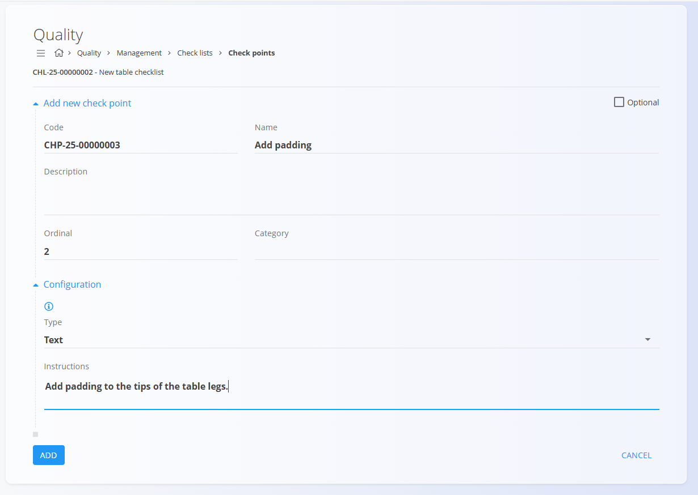
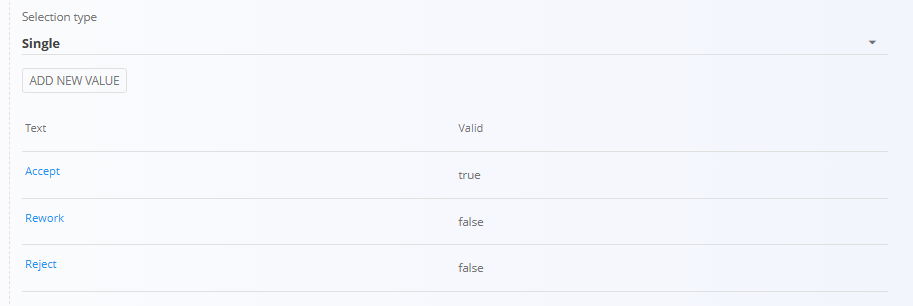
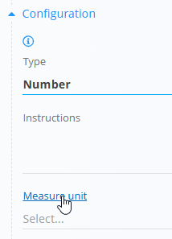

<!-- app_route: /management/check-lists -->
<!-- app_label: Checklists -->
<!-- canonical_source_url: https://github.com/Tom-PIT/Connected.Docs/blob/main/en/Domains/Production/Management/CheckPoints.md -->
<!-- canonical_source_title: Check points -->

# Check points

Check points belong to a specific [**Checklist**](../../Production/Management/QualityChecklists.md) and define the individual steps, controls, or verifications that operators must perform during production or quality checks.  They ensure consistent process execution and provide structured data for audit trails and reporting.

To access the check points for a checklist, open **Production / Management / Checklists**, and click the **Check points** button of the desired checklist.

> [!TIP]
> For a full demonstration, see the **[Quality checkpoints](https://www.youtube.com/watch?v=EB7WktBCFC4)** video tutorial.

> [!TIP]
> For a step-by-step example of creating and using a checklist, see [**How to create a quality checklist**](ChecklistCreate.md).

## Schema

| Field | Description |
|-------|-------------|
| [**Code**](../../../Common/UI/DocumentCodes.md) | Auto-generated unique identifier for the check point. |
| **Name** | Name of the check point (mandatory). |
| **Description** | Additional details or context for the check point. |
| **Ordinal** | Number defining the order in which the check point appears in the checklist. |
| **Category** | Optional classification used to group or filter check points. |
| **Optional** | Indicates whether the check point may be skipped during execution. |
| **Type** | Defines the operator input required: • **[Check](#type-check)** – Simple checkbox confirmation • **File upload** – Requires attaching a file (image, PDF…) • **[List](#type-list)** – Choose single or multiple values from a predefined list • **[Number](#type-number)** – Numerical input • **Text** – Free-text field |
| **Confirm text** | Text displayed next to the checkbox for **Check** type. |
| **Instructions** | Additional guidelines shown to the operator performing the check. |

## List view

The list displays all check points belonging to the selected checklist, sorted by **Ordinal**.

Use the search bar to filter check points by name or code.

## Create a new check point

1. Click on the [action button](../../../Common/UI/ActionButton.md) in the bottom-right corner.  
2. Fill in the fields described in the schema:  
   - **Name** (mandatory)  
   - **Description** (optional)  
   - **Ordinal** – Determines position in the checklist  
   - **Category** – Select a category if applicable  
   - **Optional** – Mark if the check point is not required  
   - **Type** – Select the input type required from the operator  
   - **Instructions** – Provide process guidelines

   

3. Click **Add** to save the check point.

> [!NOTE]
> Some specifics may appear based on the selected **Type**. See [Specifics by Type](#specifics-by-type) for details.

## Edit an existing check point

1. Select a check point from the list.  
2. Modify any field, including **Type**, **Category**, or **Instructions**.  
3. Click **Save**.

## Delete a check point

Check points can be deleted freely unless restricted by a workflow configuration. To remove one, open the check point and click **Delete**.

## Specifics by Type

Certain fields are displayed or become required depending on the selected **Type**.

### Type: Check

When selecting the **Check** type, an additional field appears:

| Attribute | Type | Description |
|----------|------|-------------|
| **Confirm text** | Text | Text displayed next to the checkbox. |

### Type: List

When selecting the **List** type, additional settings appear:

| Attribute | Type | Description |
|----------|------|-------------|
| **Selection type** | Dropdown | Defines whether **single** or **multiple** values can be selected. If **single**, only one value can be chosen. If **multiple**, several values can be selected. |

The user can add list values:

- Clicking **Add new value** opens input fields:
  - **Text** - The text displayed next to the checkbox for this value
  - **Valid** (checkbox) - Indicates whether this value is valid or not. This is useful for quality checks where certain conditions may be marked as invalid, for **single** types, only one value can be valid.

- Clicking **Add** saves the value to the list

Added values are displayed in a table:
- **Text**
- **Valid**

### Type: Number

When selecting the **Number** type, additional fields appear:

| Attribute | Type | Description |
|----------|------|-------------|
| **Measure unit** | Dropdown | Selection of the measurement unit. |
| **Min value** | Number | Minimum allowed value. |
| **Default value** | Number | Default value for the check point. |
| **Max value** | Number | Maximum allowed value. |

> [!NOTE]
> For your convenience there is a link to the [**Measure units**](../../../Common/Management/MeasureUnits.md)  management screen, where you can add or edit measure units.
>
> 
