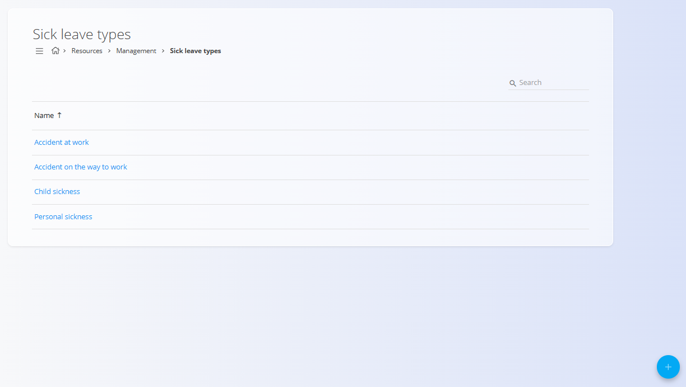

<!-- app_route: /management/resources/sick-leave-types -->
<!-- app_label: Sick leave types -->
<!-- canonical_source_url: https://github.com/Tom-PIT/Connected.Docs/blob/main/en/Domains/Resources/Management/SickLeaveTypes.md -->
<!-- canonical_source_title: Sick leave types -->

# Sick leave types

Sick leave types define the **reasons for sickness absence** that employees can select when creating a sick leave entry. They standardize sick leave reporting and ensure consistent categorization across time logs, attendance tracking, and leave management.

To access **Sick leave types**, go to **Resources / Management / Sick leave types** in the [navigation](../../../Common/UI/Navigation.md).

## Schema

| Field | Description |
|------|------------|
| **Name** | The name of the sick leave reason shown to users when reporting sick leave (for example: *Accident at work*, *Flu*, *Child sickness*). |

## Management

### List view

The list displays all defined sick leave types.

- Each row represents one sick leave reason  
- Clicking a row opens the edit view  
- The action button allows creating a new sick leave type  

This list is typically maintained by administrators or HR managers.

## Actions

### Create a new sick leave type

1. Click the [action button](../../../Common/UI/ActionButton.md) to create a new entry.
2. Enter a **Name** and set the **Status** (enabled or disabled) for the sick leave type.
3. Click **Save** to make the type available system-wide. 

Changes take effect immediately and apply wherever sick leave is recorded.

### Edit a sick leave type

To modify an existing sick leave type, click its **Name** in the list. The edit screen allows changing the **Name** and **Status** of the type.

Click **Save** to apply changes. Updated types are immediately reflected in all relevant areas of the system.

### Delete a sick leave type

Click on a sick leave type in the list to open the edit view, then click **Delete** and confirm the action.

> [!NOTE]
>Deletion may be restricted if the type is referenced by existing records (e.g., time logs, attendance, or leave entries). In such cases, disable the type instead of deleting it to preserve historical consistency.
