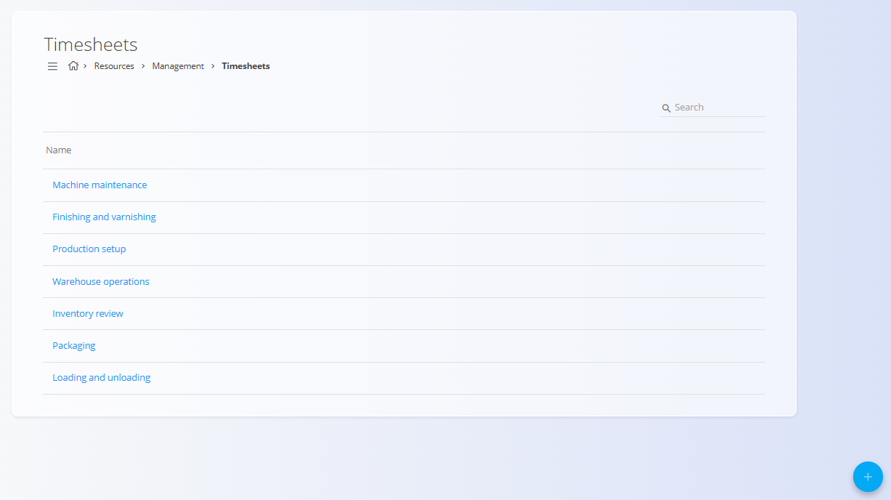
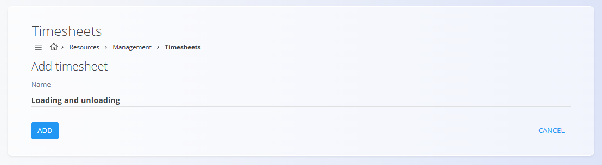

<!-- app_route: /management/resources/timesheets -->
<!-- app_label: Timesheets -->
<!-- canonical_source_url: https://tom-pit.github.io/Connected.Docs/en/Domains/Resources/Management/Timesheets/ -->
<!-- canonical_source_title: Timesheets -->

# Timesheets

Timesheets define predefined work activity categories that can be used when recording time and effort across the system.

To access **Timesheets**, go to **Resources / Management / Timesheets** in the [navigation](../../../Common/UI/Navigation.md).

These entries are typically used to standardize how work is categorized when logging time, enabling consistent reporting and analysis.

## Schema

| Field | Description |
|------|-------------|
| **Name** | The name of the timesheet category. This is shown to users when selecting how their time is categorized (for example: *Machine maintenance*, *Packaging*, *Warehouse operations*). |

## Management

### List view

The timesheets list displays all defined timesheet categories.

### Using timesheets

Timesheets act as **reference categories** and are used in various time and effort recording workflows, such as:

- Logging work time
- Recording effort on tasks or operations
- Grouping and reporting working hours by activity type

By defining timesheets centrally, organizations ensure consistent naming and classification of work activities across teams.

## Actions

### Create a new timesheet 

To create a new timesheet:

1. Click [action button](../../../Common/UI/ActionButton.md).
2. Enter a **Name** that clearly describes the work activity.
3. Click **Add** to save.

The new timesheet becomes immediately available for selection in time and effort recording screens.

### Edit a timesheet

1. Click on a timesheet in the list to open it for editing.
2. Update the **Name** as needed.
3. Save the changes.

> [!NOTE]  
> Timesheets are configuration data. Changes should be made carefully, especially if the timesheet is already widely used in historical records.

### Delete a timesheet

1. Click on a timesheet in the list to open it for editing.
2. Click **Delete** and confirm the action.

Deleted timesheets are no longer available for selection in time and effort recording screens.