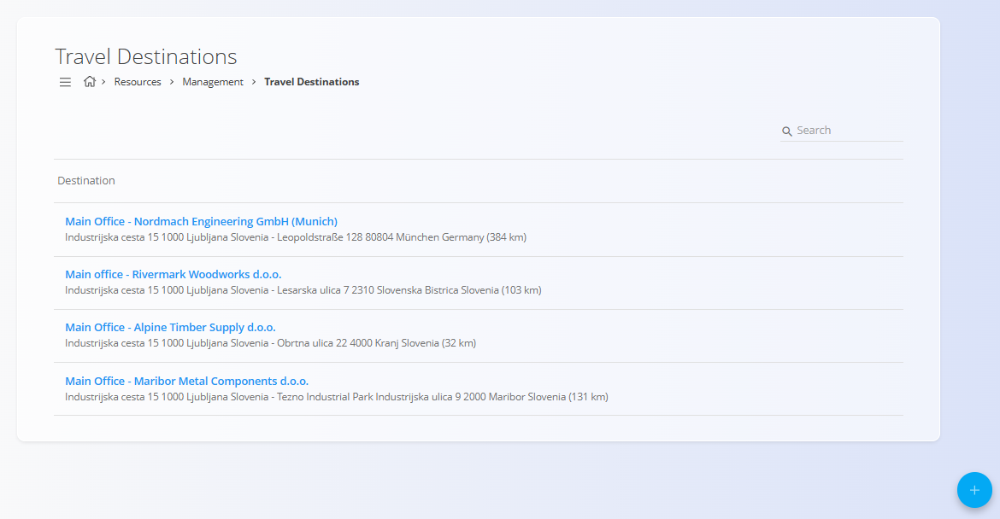
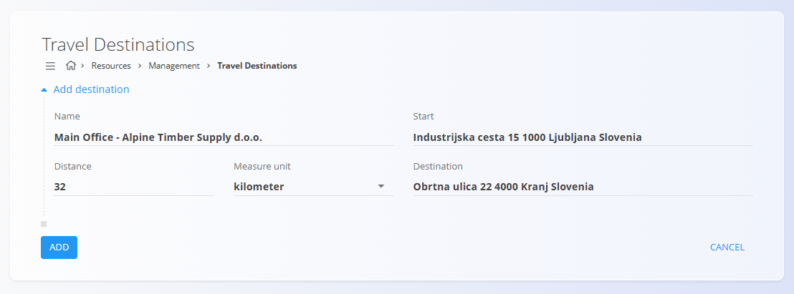

<!-- app_route: /management/resources/destinations -->
<!-- app_label: Travel destinations -->
<!-- canonical_source_url: https://tom-pit.github.io/Connected.Docs/en/Domains/Resources/Management/TravelDestinations/ -->
<!-- canonical_source_title: Travel destinations -->

# Travel destinations

Define **predefined travel destinations** used when creating travel orders.  
Travel destinations store start and destination addresses together with distance information, allowing consistent and repeatable travel order creation.

To access **Travel destinations**, go to **Resources / Management / Travel destinations** in the [navigation](../../../Common/UI/Navigation.md).

## Schema

| Field | Description |
|------|-------------|
| **Name** | Descriptive name of the destination (for example: *Main Office – Alpine Timber Supply d.o.o.*). |
| **Start** | Starting address of the trip, usually the company’s main location. |
| **Destination** | Target address of the trip. |
| **Distance** | Distance between start and destination. |
| [**Measure unit**](../../../Common/Management/MeasureUnits.md) | Unit used for the distance (for example kilometers). |

## Management

### List view

The list view displays all configured travel destinations.

Each line shows:
- Destination name
- Start and destination addresses
- Calculated distance with unit

Clicking a destination opens it for editing.

## Actions

### Add a new travel destination

1. Click the [action button](../../../Common/UI/ActionButton.md) to create a new travel destination.
2. Fill in the fields described in the [**Schema**](#schema).
3. Click **Add** to save.

### Edita travel destination

1. Click a destination in the list.
2. Modify the required fields.
3. Click **Save**.

> [!NOTE]
> - Destinations can be reused across multiple travel orders.
> - Changes to a destination affect future travel orders, not already created ones.

### Delete a travel destination

1. Click a destination in the list to open it for editing.
2. Click **Delete** and confirm the action.

Deleted travel destinations are no longer available when creating new travel orders.