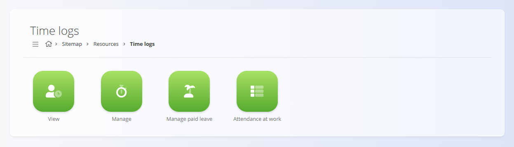

<!-- app_route: /sitemap/resources.timeLogs -->
<!-- app_label: Time logs -->
<!-- canonical_source_url: https://github.com/Tom-PIT/Connected.Docs/blob/main/en/Domains/Resources/Views/TimeLogs.md -->
<!-- canonical_source_title: Time logs -->

# Time logs

The **Time logs** section provides access to all time-related views for resources.  
It is used to review recorded working time, manage time entries and absences, and monitor attendance at work.

## Available views

The Time logs area consists of several dedicated views, each covering a specific aspect of time tracking and attendance:

- **[View](TimeLogsView.md)** - Overview of recorded time entries, allowing users to review logged work and time-related records.

- **[Manage](TimeLogsManage.md)** - Management of time logs, including editing, correcting, or administrating recorded entries.

- **[Manage paid leave](TimeLogsManagePaidLeave.md)** - Administration of paid leave entries, such as vacations or other approved absences.

- **[Attendance at work](TimeLogsAttendanceAtWork.md)** - Attendance overview, showing presence and working patterns for resources.

Each view focuses on a specific workflow, keeping time tracking, leave management, and attendance monitoring clearly separated.