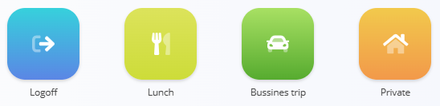
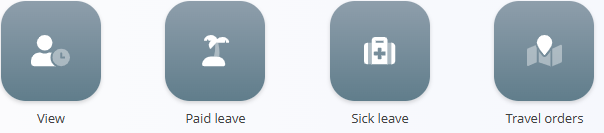
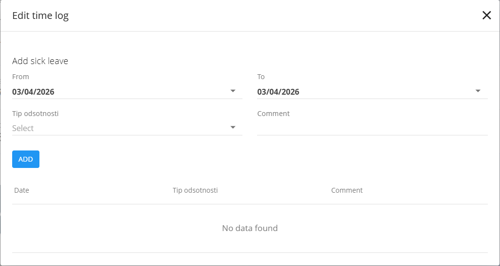

<!-- app_route: /time-logs/management -->
<!-- app_label: Time logs – Manage -->
<!-- canonical_source_url: https://github.com/Tom-PIT/Connected.Docs/blob/main/en/Domains/Resources/Views/TimeLogsManage.md -->
<!-- canonical_source_title: Time logs – Manage -->

# Time logs – Manage

The **Time logs – Manage** view is used for **real-time attendance tracking and daily time logging**. It allows workers to record when they start and end work, take breaks, go on business trips, or log private time.

Typical use cases include:

- Logging the start and end of the working day
- Recording lunch breaks and other interruptions
- Tracking business trips and private time
- Providing an immediate overview of today’s attendance
- Giving quick access to leave-related actions ([paid leave](#paid-leave), [sick leave](#sick-leave), [travel orders](#travel-orders))

To access **Time logs – Manage**, go to **Resources / Time logs / Manage** in the [navigation](../../../Common/UI/Navigation.md).

> **Note**  
> Time logging actions may not be available to all users **from their work computers**. In many environments, workers record attendance primarily via a **physical card reader** (for example at the entrance).  
>
> In some setups (for example remote work), the same actions may also be available through the application.

## Header information

At the top of the screen, the following information is displayed:

- **Worker name**
- **Current status** (for example *Active – Work*)
- **Current date**
- **First login time**
- **Last logout time**
- **Today’s total time**
- **Total time for the selected period**

This section provides a quick overview of attendance and working progress.

## Time logging actions

The **Login** button is used to start the working period. 

Once pressed, **working time starts recording**, and additional actions become available:

- **Logoff** – End the current working session
- **Lunch** – Record a lunch or break period
- **Business trip** – Log time spent on a business trip
- **Private** – Log private time during the working day

Selecting an action immediately updates the worker’s status and records the corresponding time entry.

> [!NOTE]
> The **Login** button is not available to all users. In some working environments, it is **replaced by a card-based sign-in** using a physical card reader (for example at the entrance).  
> In setups where workers log time directly from their computers (for example remote or office-based work), this button may also be available in the application.

### How it works

- Pressing **Login** starts recording **working time**
- Additional action buttons (such as **Lunch**, **Business trip**, **Private**) become available
- Selecting one of these actions:
  - **Stops the current working time**
  - Starts recording the selected activity (for example **Lunch**)
- Pressing **Login** again:
  - Ends the current activity (for example lunch)
  - Resumes recording **working time**

> [!NOTE]
> The exact actions available may vary based on the organization’s configuration and policies.

#### Example

1. The worker presses **Login** → working time starts  
2. The worker presses **Lunch** → working time stops and lunch time is recorded  
3. After lunch, the worker presses **Login** again → lunch ends and working time resumes  
4. When the worker finishes the day, he presses **Logoff** → working time stops and closes the day

## Leave and travel actions

From this view, users can also access actions related to absences and travel. These actions allow users to manage attendance, vacation, medical absences, and travel orders, directly from the time logging context.

The following actions are available:
- **View**
- **Paid leave**
- **Sick leave**
- **Travel orders**

### View

Clicking **[View](TimeLogsView.md)** opens the detailed time log overview for the selected period:

### Paid leave

Clicking on **Paid leave** opens a dialog where the user can submit a request for time off as holiday. 

#### Create a paid leave request

To send a paid leave request:

1. Clicking **Paid leave**
2. In the dialog:
	- Select the **from** and **to** dates  
	- Add an optional **comment**  
3. Click **Add** to submit the request

The request is then processed according to the organization’s leave management workflow (for example it may require approval from a manager).

> [!NOTE]
> The history of leave requests and their status can be viewed in the same dialog.

### Sick leave

Clicking on **Sick leave** opens a similar dialog for recording sick leave.

### Create a sick leave request

To send a sick leave request:

1. Click **Sick leave**
2. In this dialog, the user can perform similar actions as with paid leave, but with the option to select the reason for the sick leave (if applicable).
3. Click **Add** to submit the sick leave request.

Recorded leave entries are then reflected in the user’s time logs and summaries.

### Travel orders
Clicking **Travel orders** opens the **[Travel orders](../Documents/TravelOrders.md)** screen, where business trips are created and managed.

## Typical on-site workflows 

The following examples show how time logging is typically performed in different environments.

### Card reader

In many setups, this view is used together with a **physical card reader** (for example at the entrance of a facility).

A typical on-site workflow looks like this:

1. The worker **scans their card** when arriving at work  
2. The system registers the **start of the working day**
3. When the worker scans the card again, **time logging buttons** appear on the card reader screen
4. The worker selects an action (for example **Lunch**)
5. After lunch, the worker scans the card again, which ends lunch and resumes **Work**
6. At the end of the day, the worker scans the card and selects **Logoff**, closing the working day

In this scenario, the worker **does not interact with the application UI directly**, but the same actions are reflected in the **Time logs – Manage** view.

### Remote or computer-based usage

In other setups (for example **remote work or office-based users**), the same time logging actions can be performed directly from a computer.

In this case:

- The worker opens **Time logs – Manage**
- Uses the available buttons to:
  - Start work
  - Record lunch or private time
  - End the working day

This allows the same attendance logic to be used consistently, regardless of whether the worker is on-site or remote.

